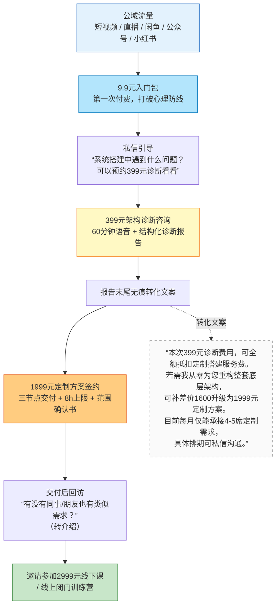

> **当前版本**：v4.1
> **唯一考核指标**：第4个月单月营收 ≥40,000元。未达标即终止项目。
> **核心逻辑**：前3个月只做一件事——攒够300个愿为知识管理系统付费的精准用户。第4个月集中转化，12单定制方案守住基本盘，线下课做弹性增量。
> **迭代原则**：执行中发现问题随时修改。

## 一、核心约束

| 约束项 | 标准 | 容错机制 |
|:---|:---|:---|
| 团队配置 | A + B | — |
| 单人日工时 | ≤4小时 | 超时即违规 |
| 双人日总工时 | ≤8小时 | — |
| 周日直播补偿 | 周日多投入1小时 | 周一调休补偿1小时 |
| 月末减负 | 每月最后一周周一 | 停更短视频，仅做基础维护 |

## 二、产品矩阵与第4月收入模型

### 2.1 产品体系

| 产品 | 定价 | 定位 | 交付边界 |
|:---|:---|:---|:---|
| Obsidian入门包 | 9.9元 | 信任钩子，全自动交付 | 拍下自动发网盘+FAQ，零人工 |
| 四体系融合基础版 | 99元 | 填价格断层 | 录播+模板，不含1v1答疑 |
| AI运维标准版 | 199元 | 自动收入，零交付成本 | 录播+脚本，自动发货 |
| **架构诊断咨询** | **399元/60min** | **定制方案唯一入口** | 严格计时，报告模板化 |
| **个人知识库定制** | **1,999元** | **第4月绝对压舱石** | 8h上限，三节点验收 |
| **线下/线上小班课** | **2,999元/人** | **第4月弹性增量** | 工作室纯实操，<3人转线上 |

所有低价产品的终极目的是让用户走上399元咨询→1999元定制的转化路径。

### 2.2 第4月收入模型

| 产品 | 单价 | 目标 | 收入 | 属性 |
|:---|:---|:---|:---|:---|
| **定制方案** | 1,999元 | **12单** | 23,988元 | 🔴 压舱石，必须完成 |
| 线下/线上课 | 2,999元/人 | 4人 | 11,996元 | 🟡 弹性增量 |
| 架构诊断咨询 | 399元 | 15单 | 5,985元 | 辅助（转化引擎） |
| AI运维标准版 | 199元 | 30份 | 5,970元 | 辅助（自动收入） |
| 基础版+入门包 | 99/9.9元 | 若干 | ≈2,000元 | 辅助 |
| **合计** | | | **≈49,939元** | |

**容错**：线下课只招到2人（5,998元），定制补至14单（27,986元），合计仍可守住4万。

**交付验证**：12单定制×8h=96h。第4月砍内容生产释放40h + B分担咨询整理每单节省1h。总交付工时约84h，可执行。

## 三、399→1999转化漏斗

**漏斗转化率**：精准线索→咨询8%（300条→24单）。咨询→定制50%（24单→12单）。定制→线下课30%（12单→4人）。

**动态监控**：每完成5单咨询复盘一次实际转化率。连续两个周期低于40%，第3月中旬启动咨询产品微调。

## 四、前3月蓄水倒推

### 4.1 双轨蓄水指标

| 时间 | 核心KPI：精准线索（A+B类） | 辅助监控：私域总好友 |
|:---|:---|:---|
| **第1月末** | ≥60人 | ≥200人 |
| **第2月末** | ≥150人 | ≥500人 |
| **第3月末** | **≥300人** | **≥800人** |

核心KPI权重90%，辅助监控权重10%。不本末倒置、不盲目堆泛流量。

### 4.2 精准线索定义与三层标签

精准线索 = 微信内完成自测题且7天内有二次互动的用户。纯自测无互动者不计入转化基数。

B每日维护：

| 标签 | 定义 | 处理规则 |
|:---|:---|:---|
| **C类（围观）** | 仅完成自测，7天内无二次互动 | 不计入转化基数，不占用保温资源 |
| **B类（有效）** | 完成自测+7天内有二次互动 | 计入正常漏斗，每2周推送1条轻量干货保温 |
| **A类（高意向）** | 主动提问架构/咨询价格/询问定制 | 优先锁单，第2-3月捂盘，第4月集中转化 |

A每周六只看A+B类数量。第2月末A+B类不足80人，立即调整内容钩子。

**线索保温**：B每2周向B类用户推送1条轻量级干货。纯价值内容，无推销，不提及高价产品。每次推送对标题和开篇话术做小幅微调，避免批量群发相同内容触发微信限流。每周30分钟批量发送，不占A时间。

### 4.3 前3月累计目标

| 时间 | 精准线索 | 累计咨询 | 累计定制 | 核心动作 |
|:---|:---|:---|:---|:---|
| **第1月末** | ≥60人 | 5单 | 1单（验证闭环） | 闲鱼出单+直播首测+前12集素材录制 |
| **第2月末** | ≥150人 | 15单 | 4单 | 短视频起量+小红书日更+线下课早鸟预售 |
| **第3月末** | **≥300人** | 30单 | 8单 | 咨询冲刺周+定制签约+线下课预售确认≥3人 |
| **第4月** | — | 15单（当月） | **12单** | 集中交付+线下课执行 |

## 五、四个月执行节奏

### 第1月：基建与最小闭环验证

**目标**：A+B类线索≥60人。5单咨询，1单定制。

| 周次 | 核心任务 |
|:---|:---|
| **W1** | 闲鱼3链接上架+首周3单人工交付。微信私域承接流程配置。小红书弹药库10篇建成。前12集素材集中录制。公众号2篇 |
| **W2** | 短视频#1-#3发布（抖音+视频号）。小红书日更启动。**周日首场直播**（仅挂9.9元和99元） |
| **W3** | 短视频#4-#6发布。直播固定每周2场。开始接收首批399元咨询 |
| **W4** | 私域集中转化推送。首月收入≥3,000元。月度复盘 |

**W1每日执行**：

| 日期     | A                                                                     | B                                                     |
| :----- | :-------------------------------------------------------------------- | :----------------------------------------------------- |
| **周一** | 注册全平台账号+制作统一头像/封面（1-2h） 完成三个产品全部交付物。录制99/199元核心讲解视频。**前12集台本全部定稿** | 闲鱼上架3条链接。**首周3单全部人工私信交付，不触发自动回复、不发送网盘链接**。准备微信私域承接话术模板 |
| **周二** | **集中录制前12集真人出镜素材（#1-#6）**。Obsidian演示环境早上搭建完毕                          | 微信公众号第一篇排版发布。搭建小红书弹药库（前5篇）。微信承接话术定稿                    |
| **周三** | **集中录制前12集真人出镜素材（#7-#12）**                                            | 精剪#1+#2。小红书弹药库补充至10篇。**3天无咨询→种子用户破零**                  |
| **周四** | **集中录制前12集Obsidian录屏素材**                                              | 精剪#3+#4。公众号排版发布第二篇。完成#1-#2发布物料                         |
| **周五** | 写第一篇公众号文章。准备周日直播大纲                                                    | 精剪#5+#6。打包下周物料。**若进度允许，晚间空降#1至抖音+视频号**                 |
| **周六** | 本周复盘。下周内容规划                                                           | 本周数据汇总。优化闲鱼主图。全平台数据周报                                  |
| **周日** | 休息                                                                    | 休息                                                     |

**W1弹性规则**：#1精剪完成后，周五晚间可空降发布为周日直播引流。最晚周日直播前完成发布。

**闲鱼风控兜底**：首周3单全部人工私信交付，不触发任何自动回复、不发送任何网盘链接。3单真实成交无风控拦截后，第2周起切换为图片形式发送网盘链接和提取码，规避文字检测。

### 第2月：流量放大与咨询跑量

**目标**：A+B类线索≥150人。累计15单咨询，4单定制。

| 周次 | 核心任务 |
|:---|:---|
| **W5-W6** | 短视频#7-#12发布。小红书弹药库动态补充。公众号每周2篇。直播周三答疑+周日带货 |
| **W7-W8** | 短视频#13-#15发布。**第2月末启动线下课早鸟预售**（1999元/人，限3人）。**主动问定制的用户引导至399元咨询，不在本月直接成交** |

### 第3月：密集筛选与定制锁单

**目标**：A+B类线索≥300人。累计30单咨询，8单定制。

| 周次 | 核心任务 |
|:---|:---|
| **W9-W10** | 短视频#16-#20发布。公众号发布用户案例复盘（脱敏） |
| **W11-W12** | **咨询冲刺周**：开放双倍咨询名额（每周8个）。本月新签4单定制。**线下课预售<3人即转线上闭门训练营**。短视频#21-#24发布 |

### 第4月：集中交付与冲刺

**目标**：单月营收≥40,000元。

**内容产能调整**：短视频降至每周1条（仅周日）。公众号降至每周1篇（仅案例/倒计时）。直播保持每周2场，内容改为已交付定制方案成果展示。

**A时间优先级**：定制方案交付 > 咨询 > 直播 > 内容创作。

| 周次 | 核心任务 |
|:---|:---|
| **W13** | 交付定制×3。咨询×4。公众号发布线下课倒计时 |
| **W14** | 交付定制×3。咨询×4。**执行线下课/线上闭门营**（周六） |
| **W15** | 交付定制×3。咨询×4。私域全量推送最后定制名额 |
| **W16** | 交付定制×3。咨询×3。月末核算。**未达标→启动48小时返场：标准版+基础版+30天答疑群=499元，目标18单≈9,000元。仍未达标→项目终止** |

## 六、两人分工

### A（日均4h+周日晚1h直播）

| 时段 | 周一/三/五（发布日） | 周二/四（制作日） | 周六（复盘+转化日） | 周日 |
|:---|:---|:---|:---|:---|
| **上午2h** | 发布视频+回复评论。私信引导咨询 | 写公众号。集中录制下周素材 | 全平台数据复盘。**只关注A+B类线索数**。高客单私聊转化 | 准备直播大纲+产品上架 |
| **下午2h** | 写公众号。**交付定制/咨询（最高优先级）** | **交付定制/咨询（最高优先级）** | 下周规划。回访已交付用户，问转介绍 | 休息 |
| **晚间1h** | — | — | — | **直播** |

### B（日均4h+周日晚1h直播）

| 时段        | 每日固定动作                                                    |
| :-------- | :-------------------------------------------------------- |
| **上午2h**  | 视频精剪（套用固定模板）+闲鱼上新/回复+小红书图文发布（从弹药库取用微调）                    |
| **下午2h**  | 公众号排版+**微信私域用户分层标签维护（A/B/C三类）**+数据记录+**16:00-16:20多平台同步** |
| **周日晚1h** | 直播场控+技术支持                                                 |

**微信私域承接流程**：B每日下午固定时段集中处理微信好友添加请求，通过后按以下话术模板回复：

> “你好，我是XXX的小助手。需要9.9元入门包请回复1，想做系统自测题请回复2。”

用户回复后，B手动发送对应资料。对于回复2的用户，引导填写自测题表单，完成后在微信备注中标记对应标签（A/B/C类）。

**第4月分工调整**：A上午时间全部优先交付定制方案。B承接更多咨询录音转文字和报告初稿整理。

## 七、咨询排期缓冲池

对外页面固定话术：

> “每周开放4个一对一架构诊断咨询名额。如需加急可私信沟通排期，按实际交付工时依次预约。”

实际后台预留6个可执行时段。

- 精力充沛、交付无积压周：B私下确认6单
- 连续交付产生倦怠、精力不足周：只确认4个，2个时段自动留白

用户看到的信息始终一致。A拥有静默调控权，无需解释、无需改页面。宁少接2单，不让疲惫毁掉剩余转化质量。

## 八、防崩盘机制

### 8.1 内容生产

- **素材工业化前置**：第1周集中录制前12集全部素材（周一晚台本定稿，周二早Obsidian环境就绪）。第1月末集中录制第13-24集
- **小红书弹药库**：第1周集中生产10篇备用图文（7篇常青痛点+3篇热点框架），每日取用微调。每周六复制本周互动最高那条的框架，下周照发。补充3-5篇新弹药
- **同源异形表达**：短视频展示实操过程和画面流，小红书提炼痛点结论和金句。规避平台查重限流
- **素材迭代固定窗口**：小红书弹药库版式、短视频剪辑模板、闲鱼主图模板——仅每周六复盘结束后统一调整更新。工作日任何人不得私自修改版式、配色、封面模板

### 8.2 私域防人力消耗

- **微信人工承接**：B每日下午固定时段集中通过好友请求，按固定话术模板回复。引导用户回复1或2，根据回复手动发送对应资料
- **线索分层标签**：B每日维护A/B/C三类标签。A每周六只看A+B类数量
- **线索保温**：B每2周向B类用户推送1条纯干货内容。每次推送微调标题和开篇话术，避免批量群发相同内容触发微信限流。每周30分钟批量发送。无推销，不提及高价产品
- **咨询排班缓冲池**：如上
- **9.9元全自动交付**：首周3单人工交付。第2周起图片形式自动发货

### 8.3 高客单交付

- **咨询时间控制**：预设《诊断报告》结构化模板。语音结束后30分钟内填空完成。B负责语音转文字并整理初稿。咨询预约时明确告知60分钟严格计时，超时另约付费
- **定制方案范围锁定**：签署《定制服务范围确认书》。拆分为三节点签字确认。总工时上限8小时，超出按200元/小时计费
- **能量熔断机制**：交付过载导致明显倦怠，启用缓冲池限流
- **线下课极简托底**：工作室/咖啡厅包间，不包餐，不送重物料。第3月末预售<3人，转为2999元线上周末闭门训练营（2天连麦指导），价格不变。人数上限6人
- **线上闭门营交付边界**：不含个人系统一对一全盘重构。交付内容为现场答疑、通用架构演示、通用模板发放。如需专属底层重构，需单独预约399元咨询+1999元定制方案

### 8.4 售后防纠纷

免责声明全链路嵌入——闲鱼详情页、公众号购买须知、微信私信统一固定：

> “9.9/99元产品为模板与基础教程，不含1v1答疑指导。”
> “1999元定制方案不含历史笔记迁移、长期维护与内容代写。虚拟产品一经交付不支持无理由退款。”

返场产品交付边界：499元套餐中的30天答疑群为异步答疑，工作日每天集中1小时统一回复，非全天候1v1陪聊。

### 8.5 启动期防翻车

- **闲鱼风控兜底**：首周3单全部人工私信交付。3单跑通无风控后，第2周起切换为图片形式自动交付
- **首场直播托底**：开场白固定“测试系统搭建链路，回放发主页”。无人也走完60分钟SOP。首场只挂9.9元和99元。开播前3天发预热图文/视频
- **第1周任务时序优化**：前3天完成模板搭建+弹药库+公众号。后4天完成素材录制。平台注册与头像前置至周日。闲鱼首发精简至3条

### 8.6 长期运营防衰竭

- **逐月KPI止损**：当月未达标触发三渠道复盘，次月资源倾斜高转化渠道
- **双倍减负日**：每月最后一周周一停更短视频，只做基础维护
- **线下课心智前置**：第2月起每周预埋1条高阶架构深度内容
- **第4月营收对冲**：第3月下旬启动咨询冲刺周，用中端营收对冲线下课不确定性
- **全平台同步时序**：B每日16:00-16:20统一同步分发

## 九、认知预警（A内部监控）

1. **活跃精准线索**：完成自测≠付费意愿。关注7天内二次互动比例。第2月末A+B类不足80人，立即调整内容钩子，不等第4月才发现问题
2. **滚动转化率**：50%是动态阈值，不是静态常数。每5单咨询复盘一次实际转化率。连续两个周期低于40%，第3月中旬启动咨询产品微调
3. **能量值=隐性资源**：A不是机器。连续交付3单定制后身心疲惫会降低对新咨询用户的热情。倦怠时启用缓冲池，宁可少接2单

## 十、核心风险与预案

| 风险 | 概率 | 预案 |
|:---|:---|:---|
| 前3月精准线索<200人 | 中 | 第3月加开免费诊断直播+2场答疑直播；调整内容钩子 |
| 第3月末定制<8单 | 中 | 第4月第一周启动老客回访，推送专属升级优惠 |
| 第4月交付过载 | 中 | 严格8h上限+三节点验收；超限排至下月；可完全停更短视频 |
| 线下课预售<3人 | 中 | 转为2999元线上闭门训练营，营收不变 |
| 第4月最后一周仍差8,000元 | 中 | 48小时返场：标准版+基础版+30天答疑群=499元，18单≈9,000元 |
| 第4月末未达标且无增长趋势 | 低 | 项目终止。已付费用户服务完毕，产品转自动发货被动收入 |

## 十一、线上平台矩阵

| 平台                | 优先级  | 定位        | 更新频率      | 核心规则                      |
| :---------------- | :--- | :-------- | :-------- | :------------------------ |
| **闲鱼**            | 🔴最高 | 冷启动现金牛    | 每日1-2条    | 标题堆搜索词；9.9元全自动交付；首周3单人工兜底 |
| **公众号**           | 🔴最高 | 私域信任底座    | 每周2-3篇    | 选题绑定产品层级；文末固定产品导航卡片+微信二维码 |
| **小红书**           | 🔴最高 | 199元核心转化场 | 每日1条      | 弹药库模式；同源素材差异化输出           |
| **视频号**           | 🟡高  | 私域转化+直播   | 每周3条+2场直播 | 周三答疑+周日带货                 |
| **抖音**            | 🟡高  | 公域流量放大器   | 每周3条      | 展示实操过程+画面流                |
| **知乎/B站/YouTube** | ⚪低   | 长尾同步分发    | 每周1-3条    | 每日16:00-16:20统一同步，零独立创作   |

小红书与短视频差异化：短视频展示实操过程和画面流，小红书提炼痛点总结、金句和避坑结论。素材同源，表达不同。

## 十二、直播体系

| 场次 | 时间 | 主题 | 内容 | 带货产品 |
|:---|:---|:---|:---|:---|
| **周三场** | 20:00-21:00 | 答疑+诊断 | 前30分钟回复高频问题，后30分钟现场诊断1-2位用户系统 | 9.9元/99元 |
| **周日场** | 20:00-21:00 | 系统演示+带货 | 前30分钟从零搭建四层目录，后30分钟产品介绍 | 199元/399元咨询/1999元定制 |

首场直播（第2周周日）：仅挂9.9元和99元，测试购买链路。开场兜底话术：“今天是账号首场实操直播，主要做系统完整搭建链路测试，内容全程干货留存，回放会发主页，有需要的可以停留。”无论多少人在线，完整走完60分钟SOP。

第4月直播内容调整：改为已交付定制方案成果展示——展示往期定制用户系统搭建前后对比。既是内容，也是二次转化。

## 十三、启动前验收清单

- [ ] 9.9元产品自动发货流程测试通过
- [ ] 闲鱼3个链接文案+主图制作完成（含免责声明）
- [ ] 微信私域承接话术模板定稿（“回复1领9.9元入门包，回复2做系统自测题”）
- [ ] 《常见问题FAQ》文档上传网盘并生成分享链接
- [ ] 399元咨询预约表单创建完成
- [ ] 《定制服务范围确认书》模板起草完成
- [ ] 《诊断报告》结构化模板建立完成
- [ ] 小红书弹药库首批10篇选题规划完成（7常青痛点+3热点框架）
- [ ] 公众号选题-产品映射表列出前10篇选题
- [ ] 视频号直播权限开通+推流调试完毕
- [ ] 剪映模板+Canva模板+闲鱼主图模板建立完成
- [ ] 线下课预售文案+早鸟价策略备好

## 十四、今日启动指令

1. 闲鱼上架3条9.9元链接（不同标题+主图AB测试）
2. 微信私域承接话术模板定稿（“回复1领9.9元入门包，回复2做系统自测题”）
3. 承接首单用户，引导完成自测题，在微信备注中标记第一条分层精准线索标签（A/B/C）

前3个月的核心KPI不是收入，是A+B类精准线索数量。第1月末低于50人、第2月末低于120人、第3月末低于200人，第4月的4万就悬了。

如果第4月末核算未达标，按计划终止。这不是失败——是在确定的资源约束下，验证了这个商业模型的天花板。