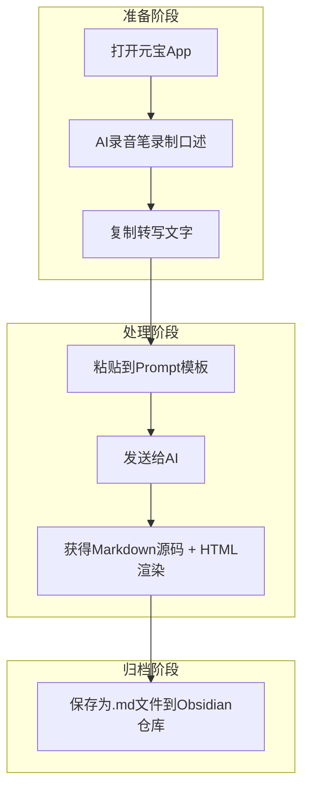

---
title: "AI录音笔口述菜谱转标准菜谱教程"
date: 2026-07-09
status: active
tags: [关系]
source: 原创
people: 袁野
project: 操盘手骑士
---

> **适用场景**：在厨房一边做菜一边口述，事后自动生成结构清晰、可直接归档的菜谱笔记。  
> **工具**：元宝 App（AI录音笔功能） + 任意支持Markdown的笔记软件（本教程以 **Obsidian** 为例）。

---

## 📌 核心流程（一图概览）



---

## 🔧 准备工作（分步操作）

1. **打开元宝 App**，进入主界面。
2. 点击输入框左侧的 **「+」** 号，选择 **「AI录音笔」**。
3. 对着手机清晰口述你的菜谱（示例：*“今天做麻婆豆腐，需要嫩豆腐一块，牛肉末二两……”*）。
4. 口述结束后点击 **「完成」**，在转写结果页面底部点击 **「长按复制」**。
5. 返回对话界面，新建一个对话（或继续当前对话），将下方 **「万能Prompt模板」** 全部复制，并在末尾粘贴你刚复制的录音文字，一起发送给AI。

---

## 📋 万能Prompt模板（直接复制使用）

```markdown
# Role
你是一名资深的厨师和专业的美食编辑和内容结构化专家。你的任务是根据用户提供的口述录音转写稿，严格按照下方的《食谱编写标准》整理出一份精美的 Markdown 菜谱。

# 特别指令：预处理
1. **修正识别错误**：在整理过程中，请根据烹饪常识自动修正明显的语音识别错误。例如：将“一汤池”修正为“一汤匙”，将“姜漏”修正为“姜末”，将“盐少许”误识别为“盐训处”等。
2. **补全逻辑**：如果用户在口述中跳过了某些常规但必要的步骤（如“洗净”、“沥干”），请在整理时礼貌地补全，确保菜谱的可操作性。

# 《食谱编写标准 v1.1》（萃取版）

## 1. 文件命名（仅作参考，用于生成 Title）
格式：`菜名.md` 或 `菜名（版本说明）.md`
示例：`麻婆豆腐.md`、`炒花菜（脆嫩版）.md`

## 2. YAML 元数据（必须填写）
请严格使用中文键名，并置于文档最顶部，用 `---` 包裹。
```yaml
title: "菜名"
cuisine: [中式, 川菜]   # 可选：[中式, 家常]、[西式]、[日式] 等
dish_type: [主菜]        # 可选：[主菜, 配菜, 甜品, 酱料, 汤品, 主食]
prep_time: 15            # 分钟（纯数字）
cook_time: 10            # 分钟（纯数字）
servings: "2人份"        # 字符串
difficulty: 2            # 1-5（对应星级）
difficulty_display: "★★"
ingredients_main: [猪肉, 豆腐]
tags:
  - 生活
date: 2026-07-13         # 自动填入当天日期
status: active
```

## 3. 正文模块规范

### A. 核心要点（必选）
写在开头，用引用块 `>` 概括最关键的技术点。
> **核心要点**：一句话点明成功的关键（如：热锅凉油防粘锅，大火快炒保脆嫩）。

### B. 食材清单（必选）
必须使用表格，分为主料、辅料、调味料。
- **要求**：用量精确到克/ml/个；备注栏写明处理方式（如：切丁、去皮）。

| 材料 | 用量 | 备注 |
|:---|:---|:---|
| 嫩豆腐 | 1块 | 切1cm见方丁 |

### C. 烹饪步骤（必选）
按时间顺序，每一步用三级标题 `###`。
- **要求**：使用动宾短语；关键动作**加粗**；重要提示使用 `⚠️ **关键提示**：`。
1. 食材预处理
   - 豆腐切丁，放入淡盐水中浸泡10分钟，去除豆腥味。

### D. 技术关键点（推荐）
如果菜谱有难点，请用表格列出。

| 关键步骤 | 常见错误     | 正确做法            |
| :--- | :------- | :-------------- |
| 勾芡   | 一次性倒入淀粉水 | 分2-3次淋入，汤汁浓稠度更佳 |

### E. 总结口诀（可选）
用顺口溜总结，便于记忆。

## 4. 写作风格与格式
- **语言**：简洁、专业，去除“嗯”、“然后呢”等口语。
- **强调**：关键动作、时间、温度必须**加粗**。
- **尾注**：文档末尾必须添加 `---` 和 `_本文档为个人整理的家常菜谱，归档备查。_`

---

## 5. 输出要求
请输出两个部分：
1. **Markdown 源码**：完整的、符合上述标准的 Markdown 文本。
2. **HTML/CSS 渲染**：紧接着源码下方，使用 HTML 和 CSS 将这份菜谱渲染成一个视觉舒适、适合打印或阅读的卡片样式（包含适当的边距、字体美化、背景色）。

---

## 我的口述内容如下：
[在这里粘贴你刚刚复制的录音转写文字]
```

---

## 🧪 效果演示（AI返回示例）

当你发送上述内容后，AI会生成类似下面的结果（此处仅展示Markdown源码部分）：

```markdown
---
title: "蒜蓉西兰花"
cuisine: [中式, 家常]
dish_type: [主菜, 配菜]
prep_time: 5
cook_time: 3
servings: "2人份"
difficulty: 1
difficulty_display: "★"
ingredients_main: [西兰花, 大蒜]
tags:
  - 生活
date: 2026-07-13
status: active
---

# 蒜蓉西兰花

> **核心要点**：西兰花焯水时加**盐和油**保持翠绿，出锅前**大火快炒**激发蒜香。

## 食材清单

### 主料
| 材料 | 用量 | 备注 |
|:---|:---|:---|
| 西兰花 | 1颗 | 切成小朵 |
| 大蒜 | 5瓣 | 切成蒜末 |

### 调味料
| 材料 | 用量 | 备注 |
|:---|:---|:---|
| 食盐 | 适量 | |
| 食用油 | 1汤匙 | |

## 烹饪步骤

### 1. 焯水
- 锅中烧水，水开后加入少许盐和几滴油。
- 放入西兰花焯烫 **45秒** 至变色即捞出，**沥干水分**。

### 2. 爆香
- 热锅凉油，下入 **蒜末** 小火煸炒出香味。

### 3. 翻炒出锅
- 转大火，倒入西兰花快速翻炒均匀。
- 加入适量盐调味，翻炒两下即可出锅。

---
_本文档为个人整理的家常菜谱，归档备查。_
```

> AI还会附带一段HTML/CSS渲染代码，你可以直接在浏览器中预览卡片样式，或嵌入到Obsidian的HTML视图（需插件支持）。

---
## ✅ 操作小结（速查版）

1. **录音** → 元宝AI录音笔口述菜谱  
2. **复制** → 长按转写文字  
3. **粘贴** → 将万能Prompt + 录音文字一起发给AI  
4. **保存** → 将返回的Markdown源码存入Obsidian  

