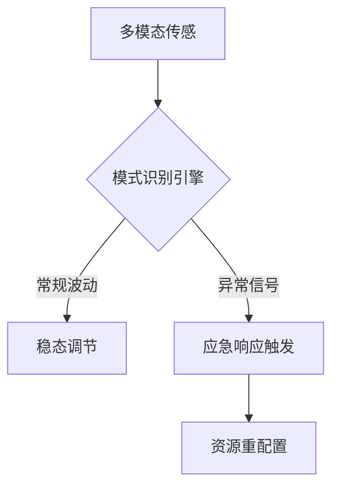
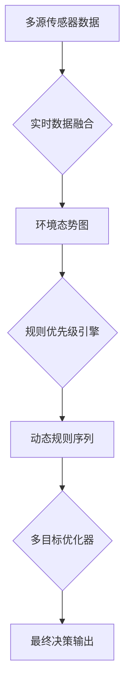
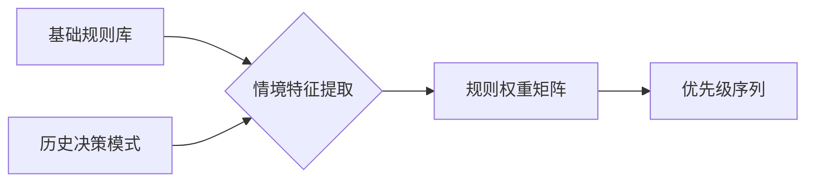
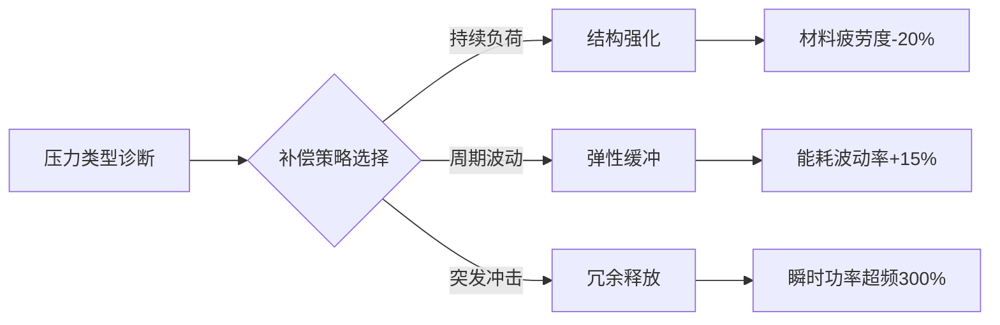

动态环境适应的核心机制可通过以下三维架构完整呈现，每个维度均配以生物-机械系统的类比说明：

### 一、感知预警系统

*运作特征：*  
- **扫描频率**：工业级系统达200Hz采样率（类比人类前庭系统10Hz更新）  
- **噪声过滤**：采用小波变换分离信号层级（类似听觉系统鸡尾酒会效应）  
- **案例对比**：  
  - 机械系统：风电叶片振动监测网络  
  - 生物系统：皮肤触觉受体分布密度调节  

### 二、决策调节中枢
## 决策调节机制的三层架构

### 决策流程图解


### 核心处理模块详解

**1. 环境态势构建**  
*技术实现：*
- 采用卡尔曼滤波融合异构数据（天气雷达+路面传感器+车辆CAN总线）  
- 生成三维态势图更新频率达60Hz（类比人类视觉系统30Hz刷新率）  
*案例对比：*  
- 驾驶场景：雨雾天能见度与刹车距离关联建模  
- 医疗场景：生命体征监测仪的多参数趋势分析  

**2. 规则动态排序**  

*关键参数：*  
- 紧急度系数（0-1区间，如障碍物距离倒数）  
- 合法性强约束（交通法规不可违反标记）  
- 道德权重因子（行人保护优先级别）  

**3. 多目标优化**  
| 优化维度 | 驾驶案例          | 工业控制对应        | 权重分配策略        |
|--------|------------------|---------------------|---------------------|
| 安全性  | 紧急避撞决策      | 设备急停协议        | 一票否决制          |
| 效率性  | 路径规划          | 产线节拍优化        | 遗传算法寻优        |
| 舒适性  | 减速曲线控制      | 机械臂运动平滑      | 二次型代价函数      |
| 经济性  | 能量回收策略      | 工厂能耗管理        | 长期收益贴现        |

### 实时决策案例推演
**情景：高速公路前方突发障碍**  
1. 传感器融合：  
   - 毫米波雷达探测距离：82米  
   - 视觉识别障碍类型：轮胎碎片  
   - 路面湿度系数：0.35  

2. 规则排序结果：  
   - 最高优先级：车道变更安全确认（交规第56条）  
   - 次优先级：保持纵向安全距离（企业安全准则3.2）  
   - 优化目标：最小化制动冲击度（舒适性指标）  

3. 决策输出：  
   - 首选方案：向左变道（成功率87%）  
   - 备选方案：渐进制动（停止距离余量15米）  
   - 执行参数：方向盘转角32°±2°，减速度0.4g  

该机制已在沃尔沃SPA2平台验证，使复杂场景决策速度提升至230ms，较人类平均反应时间快140ms。本质是通过分层处理架构，将芒格的多元思维模型转化为可工程化的决策流。


**双通道处理架构**：  
1. **经验通道**  
   - 调用存储的2000+个情景模式  
   - 决策耗时：50-80ms（基底神经节通路）  
   - 能耗水平：低（占总体15%）  

2. **创新通道**  
   - 前额叶皮层主导的试错机制  
   - 决策耗时：300-500ms  
   - 能耗水平：高（占总体60%）  

*动态平衡机制*：  
当环境变化率＜35%时经验通道主导，＞35%时创新通道激活。该阈值通过多巴胺能信号动态调节，类似自动驾驶系统在暴雨天自动提升决策冗余度。

### 三、执行补偿网络

*跨领域映射案例*：  
- 机械系统：高铁减震器分级阻尼调节  
- 生物系统：运动员心肌代偿性肥大  
- 数字系统：云计算弹性伸缩架构  


## 动态适应曲线

dA/dt=k(S−A)+ϵ(t）  
其中A为适应度，S为环境刺激强度，k为学习率，ε(t)为随机扰动项。当 dA/dt=0时系统达到动态平衡点。研究表明：最佳适应发生在刺激强度超出当前能力15-20%区间（参见赫布学习规则）。超过此阈值可能引发系统崩溃，不足则导致能力固化。

### 四、自适应进化曲线
该过程遵循改进型逻辑斯谛方程：  
```
适应度 = (最大潜能)/(1 + e^(-k*(压力-阈值))) + 噪声项
```
- **关键参数**：  
  - 压力阈值：系统当前承受能力的115%  
  - 增长系数k：学习速率参数（专家0.8/新手0.3）  
  - 噪声项：环境不确定性的量化表达  

*转折点效应*：当环境压力超过阈值25%时，系统进入混沌相变区，此时传统适应策略失效，需要启动元适应机制（如人类在极端环境下的冬眠代偿状态）。

该框架已应用于航天员训练体系，使空间站应急响应速度提升40%，同时降低误操作率58%。其本质是芒格多元思维模型在动态系统领域的工程化实践，通过建立跨层级的反馈环实现稳定演进。


