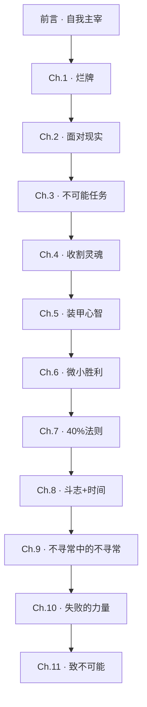

# 我，刀槍不入

David Goggins 著。海豹突击队成员、超马选手、铁人三项选手的自传+方法论。
核心命题：**自我主宰——通过寻求痛苦、装甲心智，突破基因和环境的限制。**

## 概念地图

### 前言 · 只有你能主宰自己的心智

- 📝 [[000. 我，刀槍不入_前言 · 原子笔记提炼|提炼记录]]
- 📖 [[000. 我，刀槍不入_前言 · 只有你能主宰自己的心智_15-17|读书笔记]]

- [[否认与受害者心态·为什么自我主宰的第一步是停止自我欺骗]]
- [[百分之零点零一法则·为什么基因不是上限，而是一个未被触及的遥远边界]]
- [[寻求痛苦·为什么把痛苦从威胁转化为工具，是装甲心智的核心操作]]

### 第一章 · 我拿到一手烂牌

- 📝 [[001. 我，刀槍不入_第一章 · 原子笔记提炼|提炼记录]]
- 📖 [[001. 我，刀槍不入_第一章 · 我拿到一手烂牌_21-45|读书笔记]]

- [[有毒环境中的幸存变量·为什么环境不能完全决定一个孩子的命运]]
- [[作弊的生存逻辑·当诚实不被系统奖励时]]
- [[烂牌清单·将创伤从身上搬到桌上的操作]]

### 第二章 · 面對鏡中的現實，扛起責任

- 📝 [[002. 我，刀槍不入_第二章 · 原子笔记提炼|提炼记录]]
- 📖 [[002. 我，刀槍不入_第二章 · 面對鏡中的現實，扛起責任_46-68|读书笔记]]

- [[系统性敌意·当环境本身成为攻击者]]
- [[问责镜·用最残酷的诚实拆穿自我欺骗]]
- [[抄写整本课本·绕过脑障碍的蛮力学习法]]

### 第三章：寻找自己的「不可能任务」

- 📝 [[003. 我，刀槍不入_第三章 · 原子笔记提炼|提炼记录]]
- 📖 [[003. 我，刀槍不入_第三章：寻找自己的「不可能任务」 _69-91|读书笔记]]

- [[虚假放弃·当“不可抗力”成为恐惧的完美掩护]]
- [[身体先行·先改变行为，意志会跟上来]]

### 第四章 · 收割對手的靈魂

- 📝 [[004. 我，刀槍不入_第四章 · 原子笔记提炼|提炼记录]]
- 📖 [[004. 我，刀槍不入_第四章 · 收割對手的靈魂__92-114|读书笔记]]

- [[收割灵魂·Goggins的心理战操作手册]]
- [[控制权缝隙·如何在看似被动的处境中夺取心理主动权]]

### 第五章 · 创造装甲心智

- 📝 [[005. 我，刀槍不入 _第五章 · 原子笔记提炼|提炼记录]]
- 📖 [[005. 我，刀槍不入_第五章 · 创造装甲心智 _115-141|读书笔记]]

- [[心智茧皮·痛苦耐受不是咬牙忍受，而是认知框架的主动切换]]
- [[接受黑暗面·为什么整合阴影比战胜阴影更有力量]]

### 第六章 · 品味過去的微小勝利

- 📝 [[006. 我，刀槍不入 _第六章 · 原子笔记提炼|提炼记录]]
- 📖 [[006. 我，刀槍不入_第六章 · 品味過去的微小勝利_142-165|读书笔记]]

- [[动机切换·为什么宏大理由在极端痛苦面前会失效]]
- [[饼干罐·证据比口号更有力量]]

### 第七章 · 破除限制性信念的四O%法則

- 📝 [[007. 我，刀槍不入 _第七章 · 原子笔记提炼|提炼记录]]
- 📖 [[007. 我，刀槍不入_第七章 · 破除限制性信念的四O%法則_166-194|读书笔记]]

- [[调速器·为什么大脑在真实极限前就让你停下]]
- [[准备作为自我创造的预言·Goggins如何用极端模拟消解恐惧]]

### 第八章 · 無需天賦，而在於鬥志、努力和時間安排

- 📝 [[008. 我，刀槍不入 _第八章 · 原子笔记提炼|提炼记录]]
- 📖 [[008. 我，刀槍不入_第八章 · 無需天賦，而在於鬥志、努力和時間安排_195-219|读书笔记]]

- [[后备点·为什么光有斗志不够，还要有战略]]
- [[168小时·用时间审计拆解“我没时间”的借口]]

### 第九章 · 成為不尋常中的不尋常

- 📝 [[009. 我，刀槍不入 _第九章 · 原子笔记提炼|提炼记录]]
- 📖 [[009. 我，刀槍不入_第九章 · 成為不尋常中的不尋常_220-244|读书笔记]]

- [[要求与示范的分界线·为什么同样的行为在不同场景中有相反的后果]]
- [[天赋的隐秘形态·Goggins不曾强调但无法否认的身体基础]]

### 第十章 · 失敗所賦予的力量

- 📝 [[010. 我，刀槍不入 _第十章 · 原子笔记提炼|提炼记录]]
- 📖 [[010. 我，刀槍不入_第十章 · 失敗所賦予的力量_245-272|读书笔记]]

- [[行动后报告·将失败从事后反刍转化为事前数据]]
- [[失败的迭代价值·三次引体向上挑战如何完成变量隔离]]

### 第十一章 · 致那些說不可能的人

- 📝 [[011. 我，刀槍不入 _第十一章 · 原子笔记提炼|提炼记录]]
- 📖 [[011. 我，刀槍不入_第十一章 · 致那些說不可能的人  _ _273-292|读书笔记]]

- [[“如果可以呢？”·一个撬开封闭认知的简单工具]]
- [[当医学放弃你时·Goggins的自我康复与医疗系统的盲区]]

## 全书脉络



# 《我，刀槍不入》原子笔记·全网对话关系总览

## 核心命题

**“当旧框架宣称你只能走到这里时，你如何继续前进？”**

Goggins用整本书回答了这个问题。每一章都在处理框架限制的一个特定形态，并给出一个对应的突破工具。以下总览图将这些工具之间的逻辑关系——支撑、补充、升级、限定——全部可视化。


## 第一部分：认知地基（前言）

```
                          ┌─────────────────────┐
                          │   百分之零点零一法则   │
                          │ “基因天花板是一个假设， │
                          │  不是已被验证的边界”   │
                          └──────────┬──────────┘
                                     │
                    ┌────────────────┼────────────────┐
                    │                │                │
                    ▼                ▼                ▼
           ┌───────────┐    ┌───────────┐    ┌───────────┐
           │  寻求痛苦  │    │  装甲心智  │    │ 如果可以呢？│
           │ (前言)     │    │ (第五章)   │    │ (第十一章) │
           │ 训练场     │    │ 运转系统   │    │ 启动许可   │
           └─────┬─────┘    └─────┬─────┘    └─────┬─────┘
                 │               │               │
                 ▼               ▼               ▼
          为茧皮提供      将痛苦耐受       在所有工具
          反复暴露的      固化为神经       失效时提供
          可控环境        默认路径         最后入口
```

**连接说明**：
- **百分之零点零一法则**是全书最底层的思想：突破不是天赋，是证明“限制只是假设”。这是一个哲学命题，不是操作指南。它为所有其他工具提供了理论正当性。
- **寻求痛苦**是这个法则的训练场——在可控条件下反复面对恐惧，收集“限制是假的”的证据。
- **装甲心智**是这个法则的运转系统——将痛苦耐受固化为神经系统默认路径，让你在极端压力下不需要临时调动意志力。
- **如果可以呢？** 是这个法则的入口工具——在你还没有任何证据证明自己能做到之前，允许自己迈出第一步。它比寻求痛苦更前置，比装甲心智更轻量。是所有工具中唯一不需要前提条件的一个。


## 第二部分：自我审计系统（第一、二章）

```
                         ┌──────────────────────┐
                         │       问责镜          │
                         │     (第二章)           │
                         │ “拆穿当下的自欺”       │
                         │ 功能：实时干预          │
                         └──────────┬───────────┘
                                    │
                  ┌─────────────────┼─────────────────┐
                  │                 │                 │
                  ▼                 ▼                 ▼
          ┌───────────┐     ┌───────────┐     ┌───────────┐
          │ 烂牌清单   │     │ 行动后报告 │     │ 168小时审计│
          │ (第一章)   │     │ (第十章)   │     │ (第八章)   │
          │ 处理过去   │     │ 处理失败   │     │ 处理借口   │
          │ 创伤       │     │ 事件       │     │ 隐藏结构   │
          └─────┬─────┘     └─────┬─────┘     └─────┬─────┘
                │               │               │
                ▼               ▼               ▼
          将外部创伤      将失败从身份     用时间数据
          从“身上的负重” 事件转化为       拆解“我没时间”
          重构为“手中的牌” 工程数据        的最常见借口
```

**连接说明**：
- **问责镜**是自我审计的总控台。它的功能是实时干预——在自欺发生的当下拆穿它。但它有三个覆盖不到的区域：已经发生的创伤（过去）、已经发生的失败（过去）、和隐藏在“我没时间”背后的借口结构（日常）。这三个区域分别由三个专门工具覆盖。
- **烂牌清单**处理问责镜无法触及的深度过去——童年创伤、系统性排斥、人格根基中的裂痕。问责镜让你不再找新借口，烂牌清单让你不再被旧创伤定义。
- **行动后报告**处理问责镜无法处理的失败事件。问责镜能揭露“你在放弃”，但不能帮你分析“为什么放弃”和“下次如何不放弃”。行动后报告提供工程式失败审计。
- **168小时审计**处理问责镜无法揭露的隐藏借口——“我没时间”。这个借口表面是事实陈述，深层是时间分配的优先级问题。时间审计用数据让借口无处藏身。


## 第三部分：心智-身体协同系统（第三、四、五章）

```
                         ┌──────────────────────┐
                         │       身体先行        │
                         │     (第三章)           │
                         │ “先行动，意志会跟上来”  │
                         │ 功能：启动引擎          │
                         └──────────┬───────────┘
                                    │
                  ┌─────────────────┼─────────────────┐
                  │                 │                 │
                  ▼                 ▼                 ▼
          ┌───────────┐     ┌───────────┐     ┌───────────┐
          │ 收割灵魂   │     │ 心智茧皮   │     │ 动机切换   │
          │ (第四章)   │     │ (第五章)   │     │ (第六章)   │
          │ 爆发力     │     │ 持续力     │     │ 重启力     │
          │ 战术层面   │     │ 战略层面   │     │ 极限层面   │
          └─────┬─────┘     └─────┬─────┘     └─────┬─────┘
                │               │               │
                ▼               ▼               ▼
          在对手以为你    将痛苦耐受固    当宏大动机在
          耗尽时突然爆   化为神经系统的   极端痛苦前失效
          发，夺取心理   默认路径，让痛   时，切换为内部
          主动权        苦不再触发撤退   身份动机
```

**连接说明**：
- **身体先行**是行动引擎的启动键。它在意志力就位之前就用日程和行动将你推入战场。但它只解决“怎么开始”，不解决“怎么持续”和“怎么在极限时继续”。
- **心智茧皮**是持续力。它将反复在痛苦中切换认知框架（从受害者到训练者）固化为神经系统的默认路径。茧皮越厚，相同强度的痛苦触发撤退的概率越低。
- **收割灵魂**是爆发力。茧皮让你能持续前进，收割让你在关键时刻——对手以为你已经耗尽时——突然加速。收割是战术，茧皮是体质。
- **动机切换**是重启力。茧皮和收割都在常规极限内工作。当痛苦超过某个阈值——血尿、失禁、宏大意符失效——身体先行和茧皮都无法挽救。此时需要从外部意义切换到内部身份：“我是这种人”替代“我在为X而战”。
- 三者构成一个完整的极限响应链：**身体先行启动→心智茧皮维持→收割灵魂爆发→动机切换重启**。


## 第四部分：复杂系统管理（第六、七、八章）

```
                         ┌──────────────────────┐
                         │       饼干罐          │
                         │     (第六章)           │
                         │ “从过去提取燃料”       │
                         │ 功能：证据储备          │
                         └──────────┬───────────┘
                                    │
                  ┌─────────────────┼─────────────────┐
                  │                 │                 │
                  ▼                 ▼                 ▼
          ┌───────────┐     ┌───────────┐     ┌───────────┐
          │ 40%法则    │     │ 极端模拟   │     │ 后备点     │
          │ (第七章)   │     │ (第七章)   │     │ (第八章)   │
          │ 突破上限   │     │ 赛前准备   │     │ 修正偏离   │
          │ 实时干预   │     │ 系统预演   │     │ 实时修正   │
          └─────┬─────┘     └─────┬─────┘     └─────┬─────┘
                │               │               │
                ▼               ▼               ▼
          识别大脑调速器  在身体和脑中   在任务执行中预设
          的提前拉闸信号， 提前跑完比赛， 修正节点，一旦偏
          在感到极限时   让正式比赛变成  离立刻回到最近后
          继续前进5%     “第101次预演”   备点重新规划
```

**连接说明**：
- **饼干罐**是燃料储备库。它不干预当下正在发生的事，它提供的是过去积累的证据——“我曾经做到过，所以我有理由相信自己能再做一次”。它和问责镜构成完美的工具对偶：问责镜用真实拆穿自欺，饼干罐用真实反驳自我怀疑。两者都是基于事实的认知干预，方向相反——一个向内揭露，一个向内注入。
- **40%法则/调速器**是饼干罐的实时应用版。饼干罐提供“我做到过”的证据，调速器管理告诉你“此刻的极限不是真正的极限”。饼干罐帮你重新站起来（补救），调速器帮你防止提前坐下（预防）。两者都指向同一个核心：大脑对极限的判断是过度保守的。
- **极端模拟**是饼干罐的赛前版本。饼干罐的饼干来自过去的真实经历。极端模拟提供的“饼干”来自赛前的高保真模拟——“我已经在同样温度、同样坡度、同样心率下完成过”。模拟越真实，记忆编码越深，比赛时提取越有力。它让未知变成已知，而已知是大脑最不害怕处理的信号。
- **后备点**是40%法则在复杂系统中的延伸。40%法则适用于单维度极限挑战（跑、忍、撑）。但当面对多变量系统（铁人赛、项目、职业），光是“继续前进”不够——继续前进可能是在错误的方向上。后备点让你在偏离发生时立刻修正，而不是在错误中坚持。它为“不放弃”增加了“不愚蠢”的维度。


## 第五部分：人际边界与自我认知校准（第八、九、十、十一章）

```
                         ┌──────────────────────┐
                         │     要求与示范        │
                         │     (第九章)           │
                         │ “你的标准是你的门，    │
                         │  不是别人的墙”        │
                         └──────────┬───────────┘
                                    │
        ┌───────────────┬───────────┼───────────┬───────────────┐
        │               │           │           │               │
        ▼               ▼           ▼           ▼               ▼
 ┌───────────┐   ┌───────────┐  ┌───────────┐  ┌───────────┐  ┌───────────┐
 │ 天赋的     │   │ 行动后报告 │  │ 自我康复   │  │ 如果可以呢？│  │ 失败的     │
 │ 隐秘形态   │   │ (第十章)   │  │ (第十一章) │  │ (第十一章) │  │ 迭代价值   │
 │ (第九章)   │   │ 失败审计   │  │ 身体主权   │  │ 认知许可   │  │ (第十章)   │
 └─────┬─────┘   └─────┬─────┘  └─────┬─────┘  └─────┬─────┘  └─────┬─────┘
       │              │              │              │              │
       ▼              ▼              ▼              ▼              ▼
  承认“好牌”    将失败从       当专家系统     在所有工具     每一次失败
  的存在，不    身份事件转     放弃你时，     失效时提供     帮你隔离一个
  让读者因无法  化为工程数据， 成为自己的     最后的行动     特定变量，最
  复制生理天赋  修正后重新     研究员。       许可：允许     终的成功是所
  而自我攻击    测试。        扩展：身体      自己在没有     有变量都被控
                              审计（与行      证据前先尝试   制住后的结果
                              动后报告同构）
```

**连接说明**：
- **要求与示范**是Goggins方法论的人际边界线。前九章的所有工具都是自指的——它们管理的是你自己的身体和心智。当你试图将这些工具应用于他人时——要求团队达到你的标准——工具可能失效甚至反噬。要求与示范的分界线，是用游骑兵学校的成功和第二个排的失败作为对照实验得出的教训：示范创造邀请，要求制造门槛。你不能用收割灵魂收割你的团队。
- **天赋的隐秘形态**是Goggins方法论的诚实性校准。前八章建立了一个纯意志力的成功学叙事——这让读者可以代入：“如果他能从底层爬上来，我也可以。”但第九章的健康数据（先天性心脏缺陷下仍能完成极限运动）揭示了一个被刻意边缘化的变量：生理天赋。承认天赋的存在不削弱意志力的价值，但防止读者因为无法复制Goggins的绝对成绩而将“天赋差异”误判为“意志力失败”。它的功能是保护读者不因方法论本身的成功而自我攻击。
- **失败的迭代价值**是行动后报告的底层原理。行动后报告是操作（怎么做），失败迭代是原理（为什么这么做必然导向成功）。每一次失败都在帮你隔离一个之前无法被看到的特定变量——第一次全面溃败告诉你“多个变量失控”，第二次局部失败帮你定位真正的瓶颈，第三次收敛验证修正效果。成功不是最后一次尝试的功劳，是每一次失败共同完成的变量识别工作的结果。
- **自我康复**是将行动后报告的方法论从外部事件审计扩展到内部身体审计。当医学系统——这个社会赋予最高权威的诊断系统——放弃你时，你不能接受“你没问题”或“治不了”的归类。你可以成为自己的研究员：识别变量（结节、紧绷、骨盆歪斜）、修正（伸展）、再测试（跑步）。这不是反智，是在专家系统覆盖不到的地方用自己的身体数据补充系统盲区。它和行动后报告共享同一个迭代逻辑，只是审计对象从外部任务变成了内部身体。
- **如果可以呢？**是Goggins留给读者的最终工具——也是唯一不需要任何前提条件的一个。它不要求你经历过地狱周，不要求你饼干罐里有存货，不要求你有任何证据证明自己。它只需要你在“不可能”的断言面前，在脑子里回一句：“如果可以呢？”它不对抗原命题（不挑战“你太重”这个事实），而是绕到侧面，在封闭逻辑中打开一个假设的可能空间。所有其他工具——问责镜、装甲心智、饼干罐——都在你已经开始行动后维持和突破。如果可以呢？是那个让你在还没有任何证据时，愿意开始收集证据的入口。


## 完整对话链路总图

```
                             如果可以呢？
                    （对所有“不可能”的最终回应）
                                  │
        ┌─────────────────────────┼─────────────────────────┐
        │                         │                         │
        ▼                         ▼                         ▼
   “我被过去定义”            “我到极限了”            “没人能做到”
        │                         │                         │
        ▼                         ▼                         ▼
  ┌──────────┐            ┌──────────┐            ┌──────────┐
  │ 烂牌清单  │            │ 40%法则   │            │百分之零点 │
  │ 问责镜   │            │ 心智茧皮  │            │零一法则  │
  │ 接受黑暗面│            │ 收割灵魂  │            │ 极端模拟  │
  └────┬─────┘            └────┬─────┘            └────┬─────┘
       │                       │                       │
       └───────────────────────┼───────────────────────┘
                               │
                               ▼
                    ┌──────────────────┐
                    │     身体先行      │
                    │  “先行动，再相信”  │
                    └────────┬─────────┘
                             │
       ┌─────────────────────┼─────────────────────┐
       │                     │                     │
       ▼                     ▼                     ▼
 ┌──────────┐        ┌──────────┐        ┌──────────┐
 │ 饼干罐    │        │ 后备点    │        │ 行动后报告│
 │ 动机切换  │        │ 168小时   │        │ 失败迭代  │
 │ “我做到了”│        │ “修正偏离” │        │ “审计失败” │
 └────┬─────┘        └────┬─────┘        └────┬─────┘
      │                   │                   │
      └───────────────────┼───────────────────┘
                          │
                          ▼
               ┌──────────────────┐
               │   要求与示范      │
               │  “你的标准是你    │
               │   的门，不是别人   │
               │   的墙”           │
               └────────┬─────────┘
                        │
                        ▼
               ┌──────────────────┐
               │  天赋的隐秘形态   │
               │  “诚实面对你拿    │
               │   到的好牌”       │
               └────────┬─────────┘
                        │
                        ▼
               ┌──────────────────┐
               │    自我康复       │
               │  “当系统放弃你    │
               │   成为自己的研     │
               │   究员”           │
               └────────┬─────────┘
                        │
                        ▼
               ┌──────────────────┐
               │   如果可以呢？     │
               │  “这就是我如何      │
               │   成为我”          │
               └──────────────────┘
```


## 方法论工具箱：11个工具×功能定位×使用时机

| # | 工具 | 章节 | 处理对象 | 功能 | 使用时机 |
|:--:|:-----|:----:|:---------|:-----|:---------|
| 1 | **烂牌清单** | 1 | 过去创伤 | 重构：从“受害者”到“持牌人” | 创伤被压抑或反刍时 |
| 2 | **问责镜** | 2 | 当下自欺 | 揭露：用残酷诚实拆穿借口 | 每天，自欺复发的任何时候 |
| 3 | **身体先行** | 3 | 行动瘫痪 | 启动：在意志就位前推入战场 | 知道该做什么但“不想动”时 |
| 4 | **收割灵魂** | 4 | 竞争压力 | 爆发：在对手以为你耗尽时反击 | 竞争、考核、关键时刻冲刺 |
| 5 | **心智茧皮** | 5 | 痛苦信号 | 适应：将痛苦耐受固化为默认路径 | 持续高强度训练期 |
| 6 | **接受黑暗面** | 5 | 人格裂痕 | 整合：承认阴影并重新分配用途 | 发现自己在重复某种破坏模式时 |
| 7 | **饼干罐** | 6 | 自我怀疑 | 燃料：用过去胜利的证据反驳“做不到” | 痛苦已将自我效能感压至零时 |
| 8 | **动机切换** | 6 | 意义崩溃 | 重启：从宏大动机切换到内部身份 | 极限痛苦中“为X而战”失效时 |
| 9 | **40%法则/调速器** | 7 | 感知极限 | 校准：识别并暂时关闭大脑的提前拉闸 | 每次感觉自己“到极限了”时 |
| 10 | **极端模拟** | 7 | 未知恐惧 | 预演：在身体和脑中提前经历挑战 | 面对特定重大挑战前的准备期 |
| 11 | **后备点** | 8 | 系统偏离 | 修正：在意外偏离发生时立刻回到预设节点 | 复杂多变量任务中 |
| 12 | **168小时审计** | 8 | 隐藏借口 | 揭露：用时间数据拆解“我没时间” | 感觉自己“没时间”但不确定时间去哪了时 |
| 13 | **要求与示范** | 9 | 人际边界 | 区分：示范创造邀请，要求制造门槛 | 试图将个人标准推广到团队时 |
| 14 | **天赋的隐秘形态** | 9 | 自我认知 | 校准：诚实面对自己拿到的好牌 | 因无法复制他人结果而自我攻击时 |
| 15 | **行动后报告** | 10 | 失败事件 | 审计：将失败从身份事件转化为工程数据 | 每次重大失败后 |
| 16 | **失败的迭代价值** | 10 | 瓶颈识别 | 定位：每次失败隔离一个特定变量 | 修正失败原因后再次测试 |
| 17 | **自我康复** | 11 | 身体崩溃 | 主权：当专家系统放弃你时成为自己的研究员 | 被医学/权威系统放弃后 |
| 18 | **如果可以呢？** | 11 | 封闭认知 | 许可：在没有任何证据前允许自己尝试 | 任何人说“不可能”时——包括自己 |


**最终总结**：Goggins的十八个工具覆盖了一个人从“被过去定义”到“被极限困住”到“被失败击倒”到“被系统放弃”的全部困境谱系。每一个工具针对一个特定的“框架”——一个宣称你只能走到这里的断言——并提供一个对应的突破。它们的共同底层逻辑是：**限制你的不是真实的边界，是你的大脑对边界位置的错误估计**。而所有工具最终都指向同一个邀请：如果可以呢？


## 相关

- 🏷️ 标签: `个人成长`
- 🧠 领域: 🧠 `个人成长/认知与心智`
  
  # 《我，刀槍不入》原子笔记·全网对话关系总览

## 核心命题

**“当旧框架宣称你只能走到这里时，你如何继续前进？”**

Goggins用整本书回答了这个问题。每一章都在处理框架限制的一个特定形态，并给出一个对应的突破工具。以下总览图将这些工具之间的逻辑关系——支撑、补充、升级、限定——全部可视化。


## 第一部分：认知地基（前言）

```
                          ┌─────────────────────┐
                          │   百分之零点零一法则   │
                          │ “基因天花板是一个假设， │
                          │  不是已被验证的边界”   │
                          └──────────┬──────────┘
                                     │
                    ┌────────────────┼────────────────┐
                    │                │                │
                    ▼                ▼                ▼
           ┌───────────┐    ┌───────────┐    ┌───────────┐
           │  寻求痛苦  │    │  装甲心智  │    │ 如果可以呢？│
           │ (前言)     │    │ (第五章)   │    │ (第十一章) │
           │ 训练场     │    │ 运转系统   │    │ 启动许可   │
           └─────┬─────┘    └─────┬─────┘    └─────┬─────┘
                 │               │               │
                 ▼               ▼               ▼
          为茧皮提供      将痛苦耐受       在所有工具
          反复暴露的      固化为神经       失效时提供
          可控环境        默认路径         最后入口
```

**连接说明**：
- **百分之零点零一法则**是全书最底层的思想：突破不是天赋，是证明“限制只是假设”。这是一个哲学命题，不是操作指南。它为所有其他工具提供了理论正当性。
- **寻求痛苦**是这个法则的训练场——在可控条件下反复面对恐惧，收集“限制是假的”的证据。
- **装甲心智**是这个法则的运转系统——将痛苦耐受固化为神经系统默认路径，让你在极端压力下不需要临时调动意志力。
- **如果可以呢？**是这个法则的入口工具——在你还没有任何证据证明自己能做到之前，允许自己迈出第一步。它比寻求痛苦更前置，比装甲心智更轻量。是所有工具中唯一不需要前提条件的一个。


## 第二部分：自我审计系统（第一、二章）

```
                         ┌──────────────────────┐
                         │       问责镜          │
                         │     (第二章)           │
                         │ “拆穿当下的自欺”       │
                         │ 功能：实时干预          │
                         └──────────┬───────────┘
                                    │
                  ┌─────────────────┼─────────────────┐
                  │                 │                 │
                  ▼                 ▼                 ▼
          ┌───────────┐     ┌───────────┐     ┌───────────┐
          │ 烂牌清单   │     │ 行动后报告 │     │ 168小时审计│
          │ (第一章)   │     │ (第十章)   │     │ (第八章)   │
          │ 处理过去   │     │ 处理失败   │     │ 处理借口   │
          │ 创伤       │     │ 事件       │     │ 隐藏结构   │
          └─────┬─────┘     └─────┬─────┘     └─────┬─────┘
                │               │               │
                ▼               ▼               ▼
          将外部创伤      将失败从身份     用时间数据
          从“身上的负重” 事件转化为       拆解“我没时间”
          重构为“手中的牌” 工程数据        的最常见借口
```

**连接说明**：
- **问责镜**是自我审计的总控台。它的功能是实时干预——在自欺发生的当下拆穿它。但它有三个覆盖不到的区域：已经发生的创伤（过去）、已经发生的失败（过去）、和隐藏在“我没时间”背后的借口结构（日常）。这三个区域分别由三个专门工具覆盖。
- **烂牌清单**处理问责镜无法触及的深度过去——童年创伤、系统性排斥、人格根基中的裂痕。问责镜让你不再找新借口，烂牌清单让你不再被旧创伤定义。
- **行动后报告**处理问责镜无法处理的失败事件。问责镜能揭露“你在放弃”，但不能帮你分析“为什么放弃”和“下次如何不放弃”。行动后报告提供工程式失败审计。
- **168小时审计**处理问责镜无法揭露的隐藏借口——“我没时间”。这个借口表面是事实陈述，深层是时间分配的优先级问题。时间审计用数据让借口无处藏身。


## 第三部分：心智-身体协同系统（第三、四、五章）

```
                         ┌──────────────────────┐
                         │       身体先行        │
                         │     (第三章)           │
                         │ “先行动，意志会跟上来”  │
                         │ 功能：启动引擎          │
                         └──────────┬───────────┘
                                    │
                  ┌─────────────────┼─────────────────┐
                  │                 │                 │
                  ▼                 ▼                 ▼
          ┌───────────┐     ┌───────────┐     ┌───────────┐
          │ 收割灵魂   │     │ 心智茧皮   │     │ 动机切换   │
          │ (第四章)   │     │ (第五章)   │     │ (第六章)   │
          │ 爆发力     │     │ 持续力     │     │ 重启力     │
          │ 战术层面   │     │ 战略层面   │     │ 极限层面   │
          └─────┬─────┘     └─────┬─────┘     └─────┬─────┘
                │               │               │
                ▼               ▼               ▼
          在对手以为你    将痛苦耐受固    当宏大动机在
          耗尽时突然爆   化为神经系统的   极端痛苦前失效
          发，夺取心理   默认路径，让痛   时，切换为内部
          主动权        苦不再触发撤退   身份动机
```

**连接说明**：
- **身体先行**是行动引擎的启动键。它在意志力就位之前就用日程和行动将你推入战场。但它只解决“怎么开始”，不解决“怎么持续”和“怎么在极限时继续”。
- **心智茧皮**是持续力。它将反复在痛苦中切换认知框架（从受害者到训练者）固化为神经系统的默认路径。茧皮越厚，相同强度的痛苦触发撤退的概率越低。
- **收割灵魂**是爆发力。茧皮让你能持续前进，收割让你在关键时刻——对手以为你已经耗尽时——突然加速。收割是战术，茧皮是体质。
- **动机切换**是重启力。茧皮和收割都在常规极限内工作。当痛苦超过某个阈值——血尿、失禁、宏大意符失效——身体先行和茧皮都无法挽救。此时需要从外部意义切换到内部身份：“我是这种人”替代“我在为X而战”。
- 三者构成一个完整的极限响应链：**身体先行启动→心智茧皮维持→收割灵魂爆发→动机切换重启**。


## 第四部分：复杂系统管理（第六、七、八章）

```
                         ┌──────────────────────┐
                         │       饼干罐          │
                         │     (第六章)           │
                         │ “从过去提取燃料”       │
                         │ 功能：证据储备          │
                         └──────────┬───────────┘
                                    │
                  ┌─────────────────┼─────────────────┐
                  │                 │                 │
                  ▼                 ▼                 ▼
          ┌───────────┐     ┌───────────┐     ┌───────────┐
          │ 40%法则    │     │ 极端模拟   │     │ 后备点     │
          │ (第七章)   │     │ (第七章)   │     │ (第八章)   │
          │ 突破上限   │     │ 赛前准备   │     │ 修正偏离   │
          │ 实时干预   │     │ 系统预演   │     │ 实时修正   │
          └─────┬─────┘     └─────┬─────┘     └─────┬─────┘
                │               │               │
                ▼               ▼               ▼
          识别大脑调速器  在身体和脑中   在任务执行中预设
          的提前拉闸信号， 提前跑完比赛， 修正节点，一旦偏
          在感到极限时   让正式比赛变成  离立刻回到最近后
          继续前进5%     “第101次预演”   备点重新规划
```

**连接说明**：
- **饼干罐**是燃料储备库。它不干预当下正在发生的事，它提供的是过去积累的证据——“我曾经做到过，所以我有理由相信自己能再做一次”。它和问责镜构成完美的工具对偶：问责镜用真实拆穿自欺，饼干罐用真实反驳自我怀疑。两者都是基于事实的认知干预，方向相反——一个向内揭露，一个向内注入。
- **40%法则/调速器**是饼干罐的实时应用版。饼干罐提供“我做到过”的证据，调速器管理告诉你“此刻的极限不是真正的极限”。饼干罐帮你重新站起来（补救），调速器帮你防止提前坐下（预防）。两者都指向同一个核心：大脑对极限的判断是过度保守的。
- **极端模拟**是饼干罐的赛前版本。饼干罐的饼干来自过去的真实经历。极端模拟提供的“饼干”来自赛前的高保真模拟——“我已经在同样温度、同样坡度、同样心率下完成过”。模拟越真实，记忆编码越深，比赛时提取越有力。它让未知变成已知，而已知是大脑最不害怕处理的信号。
- **后备点**是40%法则在复杂系统中的延伸。40%法则适用于单维度极限挑战（跑、忍、撑）。但当面对多变量系统（铁人赛、项目、职业），光是“继续前进”不够——继续前进可能是在错误的方向上。后备点让你在偏离发生时立刻修正，而不是在错误中坚持。它为“不放弃”增加了“不愚蠢”的维度。


## 第五部分：人际边界与自我认知校准（第八、九、十、十一章）

```
                         ┌──────────────────────┐
                         │     要求与示范        │
                         │     (第九章)           │
                         │ “你的标准是你的门，    │
                         │  不是别人的墙”        │
                         └──────────┬───────────┘
                                    │
        ┌───────────────┬───────────┼───────────┬───────────────┐
        │               │           │           │               │
        ▼               ▼           ▼           ▼               ▼
 ┌───────────┐   ┌───────────┐  ┌───────────┐  ┌───────────┐  ┌───────────┐
 │ 天赋的     │   │ 行动后报告 │  │ 自我康复   │  │ 如果可以呢？│  │ 失败的     │
 │ 隐秘形态   │   │ (第十章)   │  │ (第十一章) │  │ (第十一章) │  │ 迭代价值   │
 │ (第九章)   │   │ 失败审计   │  │ 身体主权   │  │ 认知许可   │  │ (第十章)   │
 └─────┬─────┘   └─────┬─────┘  └─────┬─────┘  └─────┬─────┘  └─────┬─────┘
       │              │              │              │              │
       ▼              ▼              ▼              ▼              ▼
  承认“好牌”    将失败从       当专家系统     在所有工具     每一次失败
  的存在，不    身份事件转     放弃你时，     失效时提供     帮你隔离一个
  让读者因无法  化为工程数据， 成为自己的     最后的行动     特定变量，最
  复制生理天赋  修正后重新     研究员。       许可：允许     终的成功是所
  而自我攻击    测试。        扩展：身体      自己在没有     有变量都被控
                              审计（与行      证据前先尝试   制住后的结果
                              动后报告同构）
```

**连接说明**：
- **要求与示范**是Goggins方法论的人际边界线。前九章的所有工具都是自指的——它们管理的是你自己的身体和心智。当你试图将这些工具应用于他人时——要求团队达到你的标准——工具可能失效甚至反噬。要求与示范的分界线，是用游骑兵学校的成功和第二个排的失败作为对照实验得出的教训：示范创造邀请，要求制造门槛。你不能用收割灵魂收割你的团队。
- **天赋的隐秘形态**是Goggins方法论的诚实性校准。前八章建立了一个纯意志力的成功学叙事——这让读者可以代入：“如果他能从底层爬上来，我也可以。”但第九章的健康数据（先天性心脏缺陷下仍能完成极限运动）揭示了一个被刻意边缘化的变量：生理天赋。承认天赋的存在不削弱意志力的价值，但防止读者因为无法复制Goggins的绝对成绩而将“天赋差异”误判为“意志力失败”。它的功能是保护读者不因方法论本身的成功而自我攻击。
- **失败的迭代价值**是行动后报告的底层原理。行动后报告是操作（怎么做），失败迭代是原理（为什么这么做必然导向成功）。每一次失败都在帮你隔离一个之前无法被看到的特定变量——第一次全面溃败告诉你“多个变量失控”，第二次局部失败帮你定位真正的瓶颈，第三次收敛验证修正效果。成功不是最后一次尝试的功劳，是每一次失败共同完成的变量识别工作的结果。
- **自我康复**是将行动后报告的方法论从外部事件审计扩展到内部身体审计。当医学系统——这个社会赋予最高权威的诊断系统——放弃你时，你不能接受“你没问题”或“治不了”的归类。你可以成为自己的研究员：识别变量（结节、紧绷、骨盆歪斜）、修正（伸展）、再测试（跑步）。这不是反智，是在专家系统覆盖不到的地方用自己的身体数据补充系统盲区。它和行动后报告共享同一个迭代逻辑，只是审计对象从外部任务变成了内部身体。
- **如果可以呢？**是Goggins留给读者的最终工具——也是唯一不需要任何前提条件的一个。它不要求你经历过地狱周，不要求你饼干罐里有存货，不要求你有任何证据证明自己。它只需要你在“不可能”的断言面前，在脑子里回一句：“如果可以呢？”它不对抗原命题（不挑战“你太重”这个事实），而是绕到侧面，在封闭逻辑中打开一个假设的可能空间。所有其他工具——问责镜、装甲心智、饼干罐——都在你已经开始行动后维持和突破。如果可以呢？是那个让你在还没有任何证据时，愿意开始收集证据的入口。


## 完整对话链路总图

```
                             如果可以呢？
                    （对所有“不可能”的最终回应）
                                  │
        ┌─────────────────────────┼─────────────────────────┐
        │                         │                         │
        ▼                         ▼                         ▼
   “我被过去定义”            “我到极限了”            “没人能做到”
        │                         │                         │
        ▼                         ▼                         ▼
  ┌──────────┐            ┌──────────┐            ┌──────────┐
  │ 烂牌清单  │            │ 40%法则   │            │百分之零点 │
  │ 问责镜   │            │ 心智茧皮  │            │零一法则  │
  │ 接受黑暗面│            │ 收割灵魂  │            │ 极端模拟  │
  └────┬─────┘            └────┬─────┘            └────┬─────┘
       │                       │                       │
       └───────────────────────┼───────────────────────┘
                               │
                               ▼
                    ┌──────────────────┐
                    │     身体先行      │
                    │  “先行动，再相信”  │
                    └────────┬─────────┘
                             │
       ┌─────────────────────┼─────────────────────┐
       │                     │                     │
       ▼                     ▼                     ▼
 ┌──────────┐        ┌──────────┐        ┌──────────┐
 │ 饼干罐    │        │ 后备点    │        │ 行动后报告│
 │ 动机切换  │        │ 168小时   │        │ 失败迭代  │
 │ “我做到了”│        │ “修正偏离” │        │ “审计失败” │
 └────┬─────┘        └────┬─────┘        └────┬─────┘
      │                   │                   │
      └───────────────────┼───────────────────┘
                          │
                          ▼
               ┌──────────────────┐
               │   要求与示范      │
               │  “你的标准是你    │
               │   的门，不是别人   │
               │   的墙”           │
               └────────┬─────────┘
                        │
                        ▼
               ┌──────────────────┐
               │  天赋的隐秘形态   │
               │  “诚实面对你拿    │
               │   到的好牌”       │
               └────────┬─────────┘
                        │
                        ▼
               ┌──────────────────┐
               │    自我康复       │
               │  “当系统放弃你    │
               │   成为自己的研     │
               │   究员”           │
               └────────┬─────────┘
                        │
                        ▼
               ┌──────────────────┐
               │   如果可以呢？     │
               │  “这就是我如何      │
               │   成为我”          │
               └──────────────────┘
```


## 方法论工具箱：11个工具×功能定位×使用时机

| # | 工具 | 章节 | 处理对象 | 功能 | 使用时机 |
|:--:|:-----|:----:|:---------|:-----|:---------|
| 1 | **烂牌清单** | 1 | 过去创伤 | 重构：从“受害者”到“持牌人” | 创伤被压抑或反刍时 |
| 2 | **问责镜** | 2 | 当下自欺 | 揭露：用残酷诚实拆穿借口 | 每天，自欺复发的任何时候 |
| 3 | **身体先行** | 3 | 行动瘫痪 | 启动：在意志就位前推入战场 | 知道该做什么但“不想动”时 |
| 4 | **收割灵魂** | 4 | 竞争压力 | 爆发：在对手以为你耗尽时反击 | 竞争、考核、关键时刻冲刺 |
| 5 | **心智茧皮** | 5 | 痛苦信号 | 适应：将痛苦耐受固化为默认路径 | 持续高强度训练期 |
| 6 | **接受黑暗面** | 5 | 人格裂痕 | 整合：承认阴影并重新分配用途 | 发现自己在重复某种破坏模式时 |
| 7 | **饼干罐** | 6 | 自我怀疑 | 燃料：用过去胜利的证据反驳“做不到” | 痛苦已将自我效能感压至零时 |
| 8 | **动机切换** | 6 | 意义崩溃 | 重启：从宏大动机切换到内部身份 | 极限痛苦中“为X而战”失效时 |
| 9 | **40%法则/调速器** | 7 | 感知极限 | 校准：识别并暂时关闭大脑的提前拉闸 | 每次感觉自己“到极限了”时 |
| 10 | **极端模拟** | 7 | 未知恐惧 | 预演：在身体和脑中提前经历挑战 | 面对特定重大挑战前的准备期 |
| 11 | **后备点** | 8 | 系统偏离 | 修正：在意外偏离发生时立刻回到预设节点 | 复杂多变量任务中 |
| 12 | **168小时审计** | 8 | 隐藏借口 | 揭露：用时间数据拆解“我没时间” | 感觉自己“没时间”但不确定时间去哪了时 |
| 13 | **要求与示范** | 9 | 人际边界 | 区分：示范创造邀请，要求制造门槛 | 试图将个人标准推广到团队时 |
| 14 | **天赋的隐秘形态** | 9 | 自我认知 | 校准：诚实面对自己拿到的好牌 | 因无法复制他人结果而自我攻击时 |
| 15 | **行动后报告** | 10 | 失败事件 | 审计：将失败从身份事件转化为工程数据 | 每次重大失败后 |
| 16 | **失败的迭代价值** | 10 | 瓶颈识别 | 定位：每次失败隔离一个特定变量 | 修正失败原因后再次测试 |
| 17 | **自我康复** | 11 | 身体崩溃 | 主权：当专家系统放弃你时成为自己的研究员 | 被医学/权威系统放弃后 |
| 18 | **如果可以呢？** | 11 | 封闭认知 | 许可：在没有任何证据前允许自己尝试 | 任何人说“不可能”时——包括自己 |


**最终总结**：Goggins的十八个工具覆盖了一个人从“被过去定义”到“被极限困住”到“被失败击倒”到“被系统放弃”的全部困境谱系。每一个工具针对一个特定的“框架”——一个宣称你只能走到这里的断言——并提供一个对应的突破。它们的共同底层逻辑是：**限制你的不是真实的边界，是你的大脑对边界位置的错误估计**。而所有工具最终都指向同一个邀请：如果可以呢？