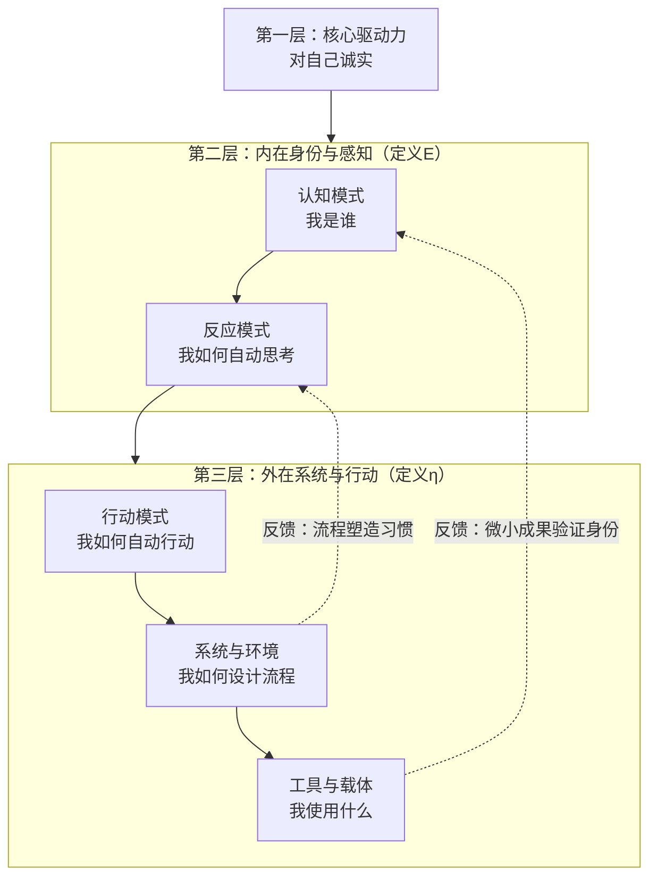

# 认知进化公式：五层动力学系统（V3 终极版）

> 原创思考。将 V2 积分模型中独立的变量 E（能量）和 η（效率）重新定义为互为函数的耦合关系，构成增强回路。在 V1 四层模型之下增设第零层"对自己诚实"，并从公式推导出最小行动原理。这是当前效能体系的终极版本。

---

## 一、核心定义：一个动态反馈的增长模型

该公式描述了一个认知驱动型个体的成长本质：**长期成果，是在时间维度上，由"净认知能量"与"体系转化效率"通过相互催化所形成的增强回路的积分**。

### 1.1 数学表达

$$
S(t) = \int_{0}^{t} \Bigl[ \, E\bigl(\tau, \eta(\tau)\bigr) \times \eta\bigl(\tau, E(\tau)\bigr) \, \Bigr] \, d\tau
$$

### 1.2 概念映射

- **$S(t)$**：**进化状态函数**。时间 $t$ 刻你所处的状态、拥有的成果与资本总和（知识、作品、能力、关系）
- **$E(\tau, \eta)$**：**净认知能量函数**。时刻 $\tau$ 可用于创造性活动的心理能量净值（原始动力 - 内耗）
- **$\eta(\tau, E)$**：**体系转化效率函数**。时刻 $\tau$ 将能量转化为有效行动与成果的系统性效率（0 ≤ η ≤ 1）

---

## 二、公式的深层结构：一个五层动力学系统

公式中的 $E$ 与 $\eta$ 并非抽象变量，它们由下方五个相互锁定的层级动态生成。**下层是上层的支撑，上层对下层有反馈**。与 V1 的四层模型相比，本模型在"工具/系统"层之下增设了"核心驱动力"层，构成更完整的动力链条。

### 2.1 核心驱动层：对自己诚实

**功能**：系统的**能量源**与**选择过滤器**。它通过回答"我真正渴望什么状态？"来设定初始条件，并持续过滤噪声。

**输出**：清晰、具体、有情绪张力的**目标**。

如果没有这一层，整个动力链条从一开始就断电了——你在为一个虚假的目标投入能量，最终要么半途而废，要么到达终点后发现这不是自己想要的。

### 2.2 内在身份层（主要决定 $E$）

1. **认知模式**：由诚实目标塑造的**根本身份信念**（如："我是一个创作者"）
2. **反应模式**：在具体情境下，身份信念触发的**自动化思考与情绪程序**（如：遇到困难→"这需要我创造性地解决"）

### 2.3 外在系统层（主要决定 $η$）

3. **行动模式**：由反应模式驱动的**外在行为序列**（如：坐下、打开笔记、开始写作）
4. **系统与环境**：为固化理想行动模式而设计的**流程、规则与物理环境**（如：每日晨间写作2小时）
5. **工具与载体**：被系统所使用的**外部实体**（如：特定的写作软件、舒适的桌椅）

---

## 三、耦合动力学：$E$ 与 $η$ 如何相互催化

这正是公式 $S(t) = \int[ E(\tau,\eta) \times \eta(\tau,E) ] d\tau$ 的精髓：**能量与效率不是独立变量，而是互为函数，构成增强回路**。

### 3.1 数学阐释

$$
\begin{aligned}
E(\tau, \eta) &= E_{\text{base}}(\tau) + \alpha \cdot \eta(\tau) \\
\eta(\tau, E) &= \eta_{\text{max}} \cdot \left(1 - e^{-\beta \cdot E(\tau)}\right)
\end{aligned}
$$

- $E_{\text{base}}$：原始动力与内耗的净值
- $\alpha$：**"正反馈系数"**。体系效率带来的成功体验对能量的增益强度
- $\eta_{\text{max}}$：在当前系统设计下的理论最大效率
- $\beta$：**"能量敏感系数"**。认知能量对效率提升的转化率

### 3.2 动力学过程

1. **启动**：在 $E$ 极低时，通过一个**最小行动**（如用纸笔写下第一个想法），强行创造一个 **$\eta_{\text{mvs}} > 0$（最小可行系统效率）**
2. **催化**：这个微小的 $\eta$ 通过正反馈系数 $\alpha$，为 $E$ 注入第一份基于实证的能量（"我能行"的感觉）
3. **增强**：提升的 $E$ 使你更有能力优化系统、学习工具，从而提升 $\eta$
4. **飞轮**：更高的 $\eta$ 带来更大成果，进一步强化 $E$……**进化循环就此建立**

---

## 四、进化第一定律：最小行动原理

从公式动力学可直接推导出唯一可行的启动策略：

> **在认知能量 $E$ 低位时，追求体系效率 $η$ 的绝对值毫无意义。必须通过一个"最小可行行动"，首先将一个局部的、微小的 $\eta_{\text{mvs}}$ 从零变为正，以触发耦合回路。**

### 实践启示

"神器"陷阱（在 $η=0$ 时追求完美 $η$）在数学上是一个**死寂点**。唯一的逃生路径是：**放弃选择，立即用最简陋的工具完成一个最小任务。**

- 不要等到找到最好的笔记软件再开始写
- 不要等到设计出完美的系统再开始行动
- 用你现在手边最简陋的工具，完成一件最小的事——这个动作将 η 从零变成正数，触发整个耦合回路

---

## 五、完整叙事：一个认知生命体的进化史诗

> **一个认知生命体，始于对自我内核的诚实洞察（第一层）。由此，它定义了自身的存在状态（第二层），并开始构建外在的表达器官（第三层）。它的成长史诗，并非线性累加，而是其内在能量（E）与外在器官转化效率（η）相互书写、相互促进的增强循环在时间中的积分。每一份成果（S），都是这个循环转动时，在现实世界中刻下的年轮。**

这个公式，便是这部史诗的数学诗篇。

---

## 版本演进

本文是效能体系三部曲的**终极版（V3）**。

| 版本 | 核心突破 | 遗留问题 | 本文的解决 |
|:---|:---|:---|:---|
| |V1 四层模型 | 识别四个层次，定性描述循环强化 | 四者如何量化？如何相互作用？ | — |
| |V2 积分模型 | 相乘关系 + 时间积分——任何一项为零则整体坍塌 | 四个变量真的是独立的吗？ | E和η被重新定义为互为函数的耦合变量 |
| **V3 五层动力学**（本文） | E与η互为函数，构成增强回路；增设诚实层；推导最小行动原理 | — | — |

---

## 在"知行进化"中的位置

| 维度 | 贡献 |
|------|------|
| 知 | 理解认知生命体的进化本质——能量与效率的耦合增强回路在时间中的积分 |
| 行 | 在能量最低时放弃追求完美系统，用一个最小行动触发耦合回路 |
| 进化 | 从"等待完美条件"的静止状态，进化为"从最小行动开始"的进化飞轮 |

---

## 产出总结

| 类型 | 文件名 | 路径建议 | 状态 |
|------|------|---------|:--:|
| 归档笔记 | `认知进化公式：五层动力学系统（V3 终极版）.md` | Resources/智库-思维模型/ | `archived` |
| 原子笔记 | `认知进化公式：E与η的耦合动力学.md` | Resources/智库-思维模型/ | `finished` |

---
