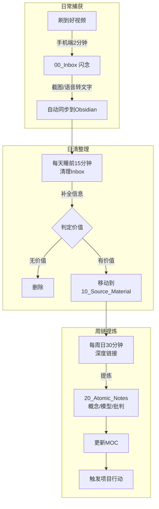

好的，针对您“每天看很多视频、收藏即遗忘、信息无法沉淀”的痛点，我为您设计一套 **轻量、防囤积、有闭环** 的视频素材卡片盒工作流。

核心设计理念：**2分钟捕获 + 15分钟日清 + 30分钟周链**，让信息从“收藏夹尸体”变成“可生长的知识资产”。

---

### 一、工作流全景图



---

### 二、阶段一：闪电捕获（2分钟内完成）

**目标**：用极低成本把视频信息“锚定”下来，不追求完整，只求日后能回忆起。

#### 操作步骤（手机端为主）

| 步骤             | 动作                                          | 工具          | 耗时  |
| :------------- | :------------------------------------------ | :---------- | :-- |
| 1. 截图          | 截取视频**封面+博主ID**那一帧                          | 手机系统截图      | 3秒  |
| 2. 分享到Obsidian | 使用系统分享菜单，选择“Obsidian - 追加到每日笔记”             | Obsidian手机版 | 5秒  |
| 3. 说一句话        | 对着微信“文件传输助手”语音说一句：“刚才看的XX视频讲的是XXX，对我启发是XXX” | 微信          | 15秒 |
| 4. 长按语音转文字     | 复制文字，粘贴到Obsidian那条记录下方                      | 微信+Obsidian | 10秒 |

#### 每日笔记中的记录格式（示例）

```markdown
## 📱 视频闪念 2026-04-17

- [ ] 23:15 [[短视频：女性不主动联系的心理机制分析（亲密关系）]]
  截图：!
  语音转录：这个视频说女性不主动是在评估价值和自我保护，但感觉太博弈论了，缺乏心理学依据。我得找时间反驳一下权力反转那段。
```

#### 为什么不直接新建笔记？
- **降低摩擦**：分享到“每日笔记”比新建文件、选文件夹、命名快得多。
- **集中管理**：所有碎片都落在当天日记里，日清时统一处理，避免Inbox爆满。

---

### 三、阶段二：日清整理（每天睡前15分钟）

**目标**：清空当天的“视频闪念”列表，不让它堆积成心理债务。

#### 操作步骤（电脑端或平板端）

1. **打开今日日记**，找到 `## 📱 视频闪念` 区块。
2. **逐条处理**：
   - 点击链接，用 **T_Video_Source 系统文档** 创建正式素材笔记到 `10_Source_Material/Video/`。
   - 将截图拖入 Obsidian，自动复制到 `90_System/Attachments/`。
   - 补全 YAML 中的 `platform`、`creator` 和 `video_title`（如果文件名没体现的话）。
3. **勾选待办**：处理完一条，就在日记中打勾 `[x]`。

#### 日清检查清单

```
□ Inbox中的视频闪念已全部转为正式素材笔记
□ 无价值的已直接删除（不要手软）
□ 每条素材至少写了一句“个人第一反应”
□ 今日无红色未读数字焦虑
```

---

### 四、阶段三：周链提炼（每周日30分钟）

**目标**：把素材从“知道”变成“知识网络的一部分”，并触发行动。

#### 操作步骤

1. **打开上周新增的素材文件夹**：
   - 路径：`10_Source_Material/Video/`
   - 按创建时间排序，聚焦本周新增内容。

2. **每篇素材问三个问题**（写在素材笔记的“后续加工入口”处）：
   - **反驳什么？** → 生成 `Critiques` 卡片
   - **解释什么？** → 生成 `Concepts` 卡片
   - **能指导做什么？** → 生成 `Models` 或 `Practices` 卡片

3. **创建原子笔记**：
   - 使用 `T_Atomic_Note` 模板在对应子文件夹新建笔记。
   - 在素材笔记中建立双向链接。

4. **更新 MOC**：
   - 打开相关 MOC（如 `MOC 亲密关系中的沉默与博弈`）。
   - 在“关联卡片索引”下手动添加新笔记链接。

5. **触发项目行动**：
   - 如果某概念反复出现（比如这周看了3个关于“回避型依恋”的视频），在 `40_Projects` 下建立一个微项目：
     ```markdown
     # 项目：理解回避型依恋的30天观察
     目标：记录与回避型伴侣的互动模式，每周复盘一次。
     ```

---

### 五、防囤积机制（防止Inbox变黑洞）

| 机制 | 具体做法 |
|:---|:---|
| **数量上限** | `00_Inbox` 文件夹内**未处理笔记不超过7条**（多了就必须日清）。 |
| **物理可见** | 使用 Obsidian 的 **Starred** 插件，将 `00_Inbox` 固定在左侧栏顶部，每次打开都看到数字。 |
| **周回顾触发器** | 在 Obsidian 日记模板中嵌入 Dataview 查询，显示“本周未处理视频数”。 |
| **两周自动归档** | 任何在 `00_Inbox` 停留超过14天的笔记，用 Dataview 查出并**直接删除或移入Archive**（说明它不重要）。 |

#### Dataview 查询示例（嵌入每周复盘笔记）

````markdown
## 📊 本周视频素材处理状态

```dataview
TABLE 
  file.ctime as "创建时间",
  platform as "平台"
FROM "00_Inbox"
WHERE contains(tags, "source/video")
SORT file.ctime DESC
```
````

---

### 六、从卡片到产出：三种轻量输出方式

您不需要写万字长文才算产出。卡片盒的产出是 **自然涌现的**。

| 产出形式 | 触发条件 | 操作 |
|:---|:---|:---|
| **一条朋友圈/微博** | MOC 中积累了3张相关原子卡片 | 复制 `## 核心定义` 段落，加一句个人点评。 |
| **一次深度对话** | 与伴侣/朋友讨论相关话题前 | 打开 MOC，快速浏览“关联卡片索引”，用里面的术语和模型来结构化表达。 |
| **一个行动实验** | 某张实践卡话术用了3次有效果 | 在 `40_Projects` 写一篇 `复盘.md`，记录成功/失败场景。 |

---

### 七、工作流速查卡（打印或存为 Obsidian 笔记）

```markdown
---
tags: workflow/sop
---

# 视频素材→卡片盒 工作流速查

## 每日捕获（随时，2分钟）
1. 截图 → 分享到 Obsidian 日记
2. 微信语音转文字 → 粘贴到日记

## 每日日清（睡前，15分钟）
1. 打开今日日记 → 处理“视频闪念”区块
2. 用 T_Video_Source 模板创建素材笔记到 `10_Source_Material/Video/`
3. 截图移入附件 → 补全信息 → 写一句个人反应
4. 打勾 ✅

## 每周提炼（周日，30分钟）
1. 浏览本周新增素材 → 三问定位
2. 创建原子笔记（概念/批判/模型）
3. 更新 MOC 链接
4. 检查是否需要新建项目

## 红线规则
- Inbox 未处理笔记 **永远 ≤ 7 条**
- 两周未动的视频闪念 **直接删除**
- 每张原子卡 **必须有一个双向链接**
```

---

### 八、预期效果

坚持此工作流 4 周后，您会发现：

1. **不再焦虑收藏**：因为知道每个视频都会经过“日清”这道闸门，要么变素材，要么被删除。
2. **观点会自动碰撞**：当 `20_Atomic_Notes` 里有 30+ 张卡片时，打开 MOC 会自然看到不同视频观点的矛盾与互补。
3. **说话更有底气**：讨论亲密关系时，您能从“我觉得”变成“从依恋理论看，这其实是…”

**现在就可以做的第一步**：把这篇工作流速查卡复制到您的 Obsidian `90_System` 文件夹，命名为 `系统文档 视频素材处理工作流.md`，然后今晚睡前打开今天的日记，看看有没有视频闪念等着您处理。


好的。剥离 Obsidian 的具体操作和视频号的平台特性，以下是适用于任何工具（纸质笔记本、备忘录、Notion、Logseq）和任何内容类型（视频、文章、播客、对话）的 **通用知识转化工作流**。

---

