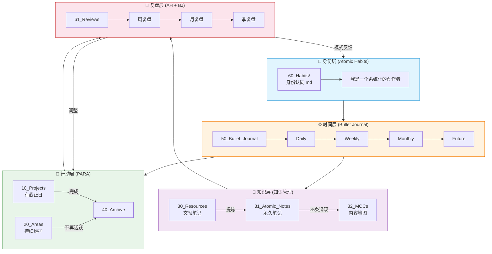
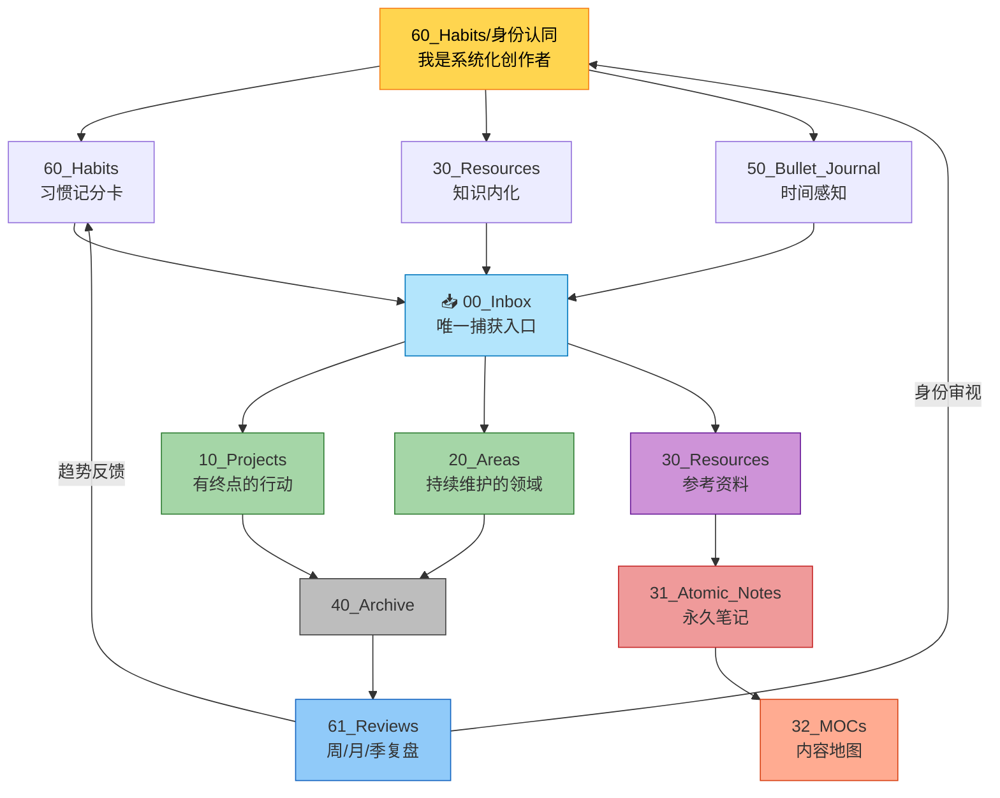
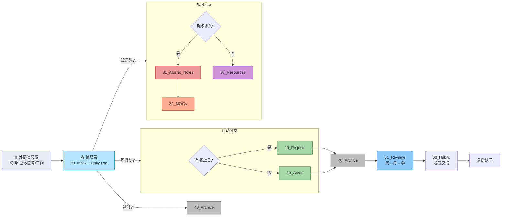
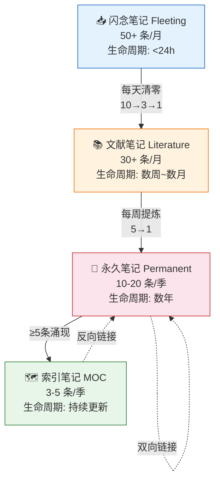
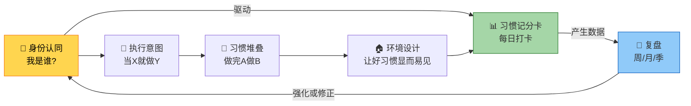
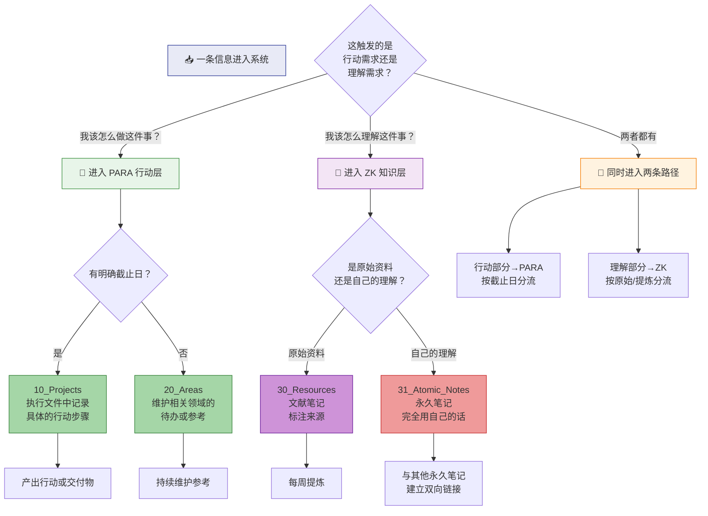

> **🔄 2026-06-28 架构更新说明**：图中 `50_Bullet_Journal/`→`20_Areas/22_个人成长/Bullet Journal/`；`60_Habits/` 概念→`31_Atomic_Notes/个人成长/概念/`；`61_Reviews/`→`91_Templates/`。新增 `习惯追踪/` Area。架构逻辑不变，路径已更新。
> **🆕 说明**：本文件保持原有 Mermaid 代码不变，仅新增第七节"PARA 与 ZK 并行判断模型"。该模型以 Mermaid 流程图形式呈现，回答"同一条信息，什么时候进 PARA，什么时候进 ZK"。

```
---
aliases: [架构图, Mermaid架构]
tags: [系统文档, visualization, mermaid]
---
```
# 融合架构 Mermaid 图
> 以下 Mermaid 代码可在 Obsidian 中直接渲染为架构图。需要安装并启用 Mermaid 插件。
---
## 一、垂直分层架构



---

## 二、完整架构图



---

## 三、数据流全景



---

## 四、日工作流时间轴

```mermaid
gantt
    title 日工作流时间轴
    dateFormat HH:mm
    axisFormat %H:%M

    section 晨间仪式
    习惯打卡 + 迁移 + MIT    :done, 06:30, 5min
    冷水澡 + 阅读            :active, 07:00, 60min

    section 深度工作
    深度工作第一段            :crit, 09:00, 120min

    section 午间
    午餐 + Rapid Logging     :12:00, 30min

    section 下午
    Areas 维护事务           :14:00, 60min
    深度工作第二段            :crit, 16:00, 90min

    section 知识时间
    Inbox 处理 + 知识提炼     :18:00, 60min
    MOC 更新（按需）          :20:30, 30min

    section 晚间复盘
    复盘 + 明日计划          :milestone, 21:00, 15min
```



---

## 五、知识管理 知识漏斗



---

## 六、习惯系统反馈回路



---

## 🆕 七、PARA 与 ZK 并行判断模型

> 同一条外部信息可能同时触发行动需求（"我该怎么做"）和理解需求（"我该怎么理解"）。以下流程图帮助判断信息应该进入 PARA 行动层、ZK 知识层，还是同时进入两者。



> **使用示例**：
> 
> 你在读一篇关于叙事结构的文章，同时有两个反应——"这个方法可以用在下节课台本里"（行动需求）和"叙事结构这个概念的底层逻辑是什么"（理解需求）。
> 
> - **行动部分** → 进 `10_Projects/操盘手骑士/02_执行/`，在台本大纲里加一条具体可执行的叙事结构优化动作
>     
> - **理解部分** → 进 `30_Resources/` 创建文献笔记，后续提炼为永久笔记 `[[叙事结构与信息密度的关系（操盘手骑士）]]`，链接到 `[[台本写作原则]]`、`[[认知负荷理论]]` 等已有笔记
>     
> 
> 两条路径不互斥，只是回答不同的问题。

---

## 相关链接

- [[知识库融合架构设计]] — 完整理论框架
    
- [[日工作流操作手册]] — 可执行的日常操作
    
- [[数据流全景图]] — 数据流动详解