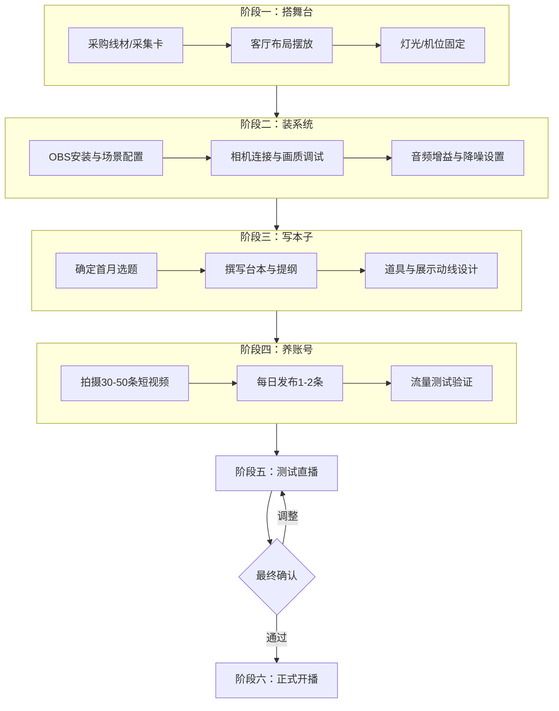

> **归档摘要**
> 
> - **原始路径**：`10_Projects/11_工作/01_操盘手骑士/03_运营/直播/`
> - **归档原因**：直播启动6阶段操作手册（硬件→软件→内容→养号→测试→开播），已执行完毕的历史流程文档
> - **内容概要**：含整体流程图（Mermaid）、21天详细排期表、里程碑速览、风险应对
> - **归档日期**：2026-07-05

### 一、 整体流程图

---

### 二、 详细时间排期表（21天计划）

| 阶段           | 任务                         | 交付物/里程碑   | 备注             |
| :----------- | :------------------------- | :-------- | :------------- |
| **阶段一：硬件搭建** | 下单采购 HDMI 线、采集卡            | 采购截图      | 采集卡可淘二手，3-5天到货 |
|              | 客厅布局：按"人物在桌后"方案摆放桌椅、道具、灯光  | 布局完成照片    | 强哥现场确认角度与氛围    |
|              | 固定机位、走线、隐藏电脑               | 线材收纳完毕    | 确保地面整洁，无绊倒风险   |
| **阶段二：软件配置** | 电脑安装 OBS，创建主场景与备用场景        | OBS 场景截图  | 可与硬件搭建并行       |
|              | 连接相机与采集卡，调试画质；设置麦克风增益与降噪   | 出画正常、收音清晰 | 录制一段1分钟测试视频    |
| **阶段三：内容准备** | 确定首月4-6期直播主题（围绕"操盘手自我修养"等） | 选题清单      | 兼顾干货与带货展示      |
|              | 撰写首期直播台本（含45分钟卖货节点、互动问答预设） | 台本 V1.0   | 可先出框架，边播边优化    |
|              | 设计道具展示动线：茶具、书籍如何自然入镜、如何展示  | 道具动线说明    | 模拟演练一次         |
| **阶段四：账号养号** | 拍摄30-50条口播短视频（1-2分钟/条）     | 视频素材库     | 每日拍3-5条，集中剪辑   |
|              | 每日发布1-2条短视频，打上垂直标签         | 账号标签建立    | 观察播放量与互动数据     |
|              | 筛选5个对标账号，测试精准投流（50-100元/条） | 投流数据反馈    | 找到最佳投放粉丝群      |
| **阶段五：测试直播** | 内部测试直播1-2场，检查画面、声音、卡顿、互动流程 | 测试问题清单    | 不对外公开，仅内部复盘    |
|              | 邀请3-5位好友观看模拟直播，收集真实反馈      | 反馈记录      | 重点：松弛感、干货密度    |
|              | 测试直播录屏及问题清单最终审核            | 审核通过      | 确认后可进入正式阶段     |
| **阶段六：正式开播** | 根据反馈微调布局、台本、灯光             | 最终定版      |                |
|              | **正式首播**                   | 开播！       |                |

---

### 三、 关键里程碑速览

| 里程碑        | 标志             |
| :--------- | :------------- |
| 硬件搭建完毕     | 相机出画、电脑隐藏、灯光就位 |
| OBS 调试完成   | 录制测试视频通过       |
| 首期台本定稿     | 强哥确认           |
| 账号发布20条短视频 | 账号标签初步形成       |
| 测试直播通过     | 强哥确认           |
| **正式首播**   | **开播！**        |

---

### 四、 风险提示与应对

| 风险点        | 应对措施                             |
| :--------- | :------------------------------- |
| 采集卡到货延迟    | 先进行台本演练与灯光测试                     |
| 短视频拍摄进度慢   | 先集中拍10条发布，后续每日补拍，保持更新频率          |
| 测试直播发现严重卡顿 | 检查网络上行带宽，改用有线连接；降低OBS码率至4000Kbps |
| 首播无人观看     | 提前预热                             |