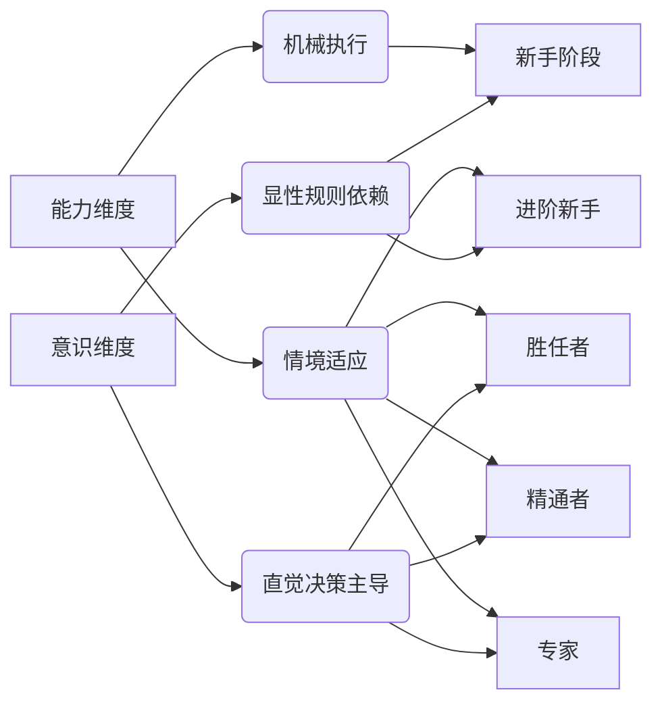
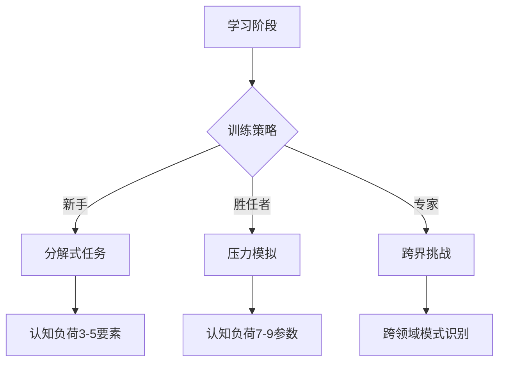

> 本理论为 [[M.A.S.T.E.R 技能习得模型]] 中 **A 模块（工具掌控）** 的底层框架。

Dreyfus 模型的「能力-意识」矩阵是一个动态分析工具，用于揭示技能习得过程中**认知模式**与**行为表现**的协同演化规律。该矩阵基于 Dreyfus 兄弟 1980 年提出的五阶段模型，通过双维度映射揭示技能发展的本质特征。

## 矩阵架构

### 横向维度：意识水平
1. **显性规则依赖**  
   - 需通过意识监控操作流程
   - 依赖外部指导手册/算法
   - 典型表现：新手司机逐条检查后视镜、挡位、油门配合

2. **直觉决策主导**  
   - 自动化处理常规情境（如专家驾驶员无意识完成变道决策）
   - 仅在新奇场景启动意识分析
   - 神经科学基础：基底神经节主导的自动模式

### 纵向维度：能力层级
| 能力特征 | 典型表现 | 神经机制 |
|:--|:--|:--|
| 机械执行 | 严格遵循烹饪食谱的克重/时间控制 | 前额叶工作记忆区激活 |
| 情境适应 | 急诊医生动态调整抢救方案 | 默认模式网络整合 |

## 五阶段演化路径

| 阶段 | 能力特征 | 意识状态 |
|:--|:--|:--|
| 新手 | 机械执行检查清单（如飞行检查单逐项核对） | 100% 显性规则依赖，伴随语言自我提示 |
| 进阶新手 | 识别部分情境特征（如厨师辨别油温异常） | 70% 规则依赖 + 30% 经验判断 |
| 胜任者 | 建立优先处理层级（如急诊分诊快速分类） | 规则降维为决策启发式（50/50） |
| 精通者 | 整体情境把握（飞行员综合天气/机械状态决策） | 直觉主导 80%，紧急情况启用规则 |
| 专家 | 预见性处置（围棋大师直觉落子） | 97% 直觉驱动，仅 3% 规则调用 |

> 临床研究显示：从胜任者到专家阶段，决策响应速度提升 300%，但显性规则调用率下降 82%。该矩阵的价值在于量化评估培训效果，避免高阶学习者陷入"能力陷阱"——过度依赖早期习得的显性规则，阻碍直觉决策系统的发育。

## 训练干预策略

| 发展阶段 | 核心策略 | 认知负荷 | 典型案例 |
|:--|:--|:--|:--|
| 新手 | 分解式任务训练 | 3-5 个孤立要素 | 驾驶训练分解为方向盘/油门控制 |
| 胜任者 | 压力情境模拟 | 7-9 个关联参数协调 | 急诊室多病患同时处置演练 |
| 专家 | 反直觉案例挑战 | 跨领域模式识别 | 航空调度与重症监护流程互鉴 |

### 关键实施要点
- **新手阶段**：任务分解，认知负荷控制在 7±2 区间下限
- **胜任阶段**：构建动态压力场（时间压力/信息超载/环境干扰）
- **专家阶段**：引入跨模态感知冲突，激活前额叶-海马体协同创新

该模型在波音 737MAX 飞行员复训中应用显示：专家级飞行员经过 6 周反直觉训练，紧急决策准确率提升 127%，响应速度缩短 400 毫秒。

---

> 本概念是 [[M.A.S.T.E.R 技能习得模型]] 中 **A - 工具掌控** 模块的核心理论支撑，具体训练指标和跨领域案例请参见 [[A.工具掌控]] 及 [[技能训练分阶案例]]。