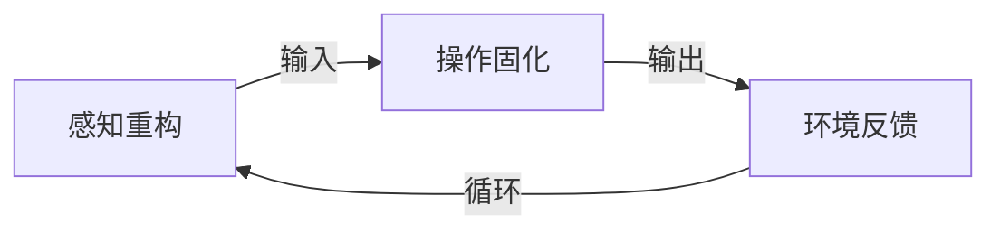
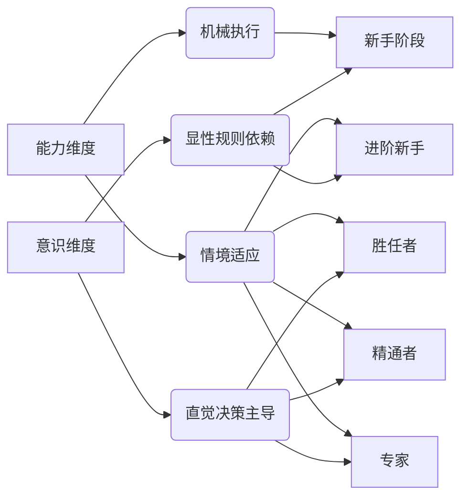
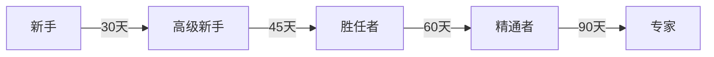
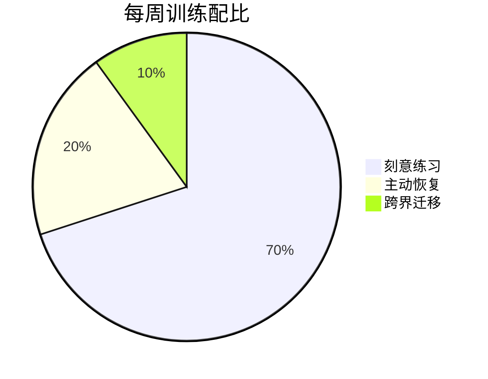

**目标**：通过「认知操作系统」实现人机合一的操作自动化，建立工具与感官的神经耦合链路。

---

## 一、认知操作系统的两阶段架构

---

## 二、第一阶段：感知重构——工具即感官

将工具视为感官延伸，重塑环境感知模式。底层理论基于 [[A.Dreyfus 矩阵]]，从"机械执行"到"环境对话"的演化路径如下：

### 训练指标设计逻辑

| 阶段 | 训练重点 | 示例指标 |
|:--|:--|:--|
| 新手 | 量化基础操作次数 | 驾驶刹车50次 |
| 高级新手 | 模式识别准确率 | K线形态识别＞75% |
| 胜任者 | 连续稳定输出能力 | 坡道起步10次无失误 |
| 精通者 | 环境响应效率 | 预判准确率＞70% |
| 专家 | 应激场景自动化 | 反应时差＜0.3秒 |

### 跨领域工具掌控对照

四个领域的完整对照表（含意识状态、感知特征、典型案例、训练指标）参见 [[技能训练分阶案例]]。

### 极简训练工具

| 领域 | 工具组合 | 用途 |
|:--|:--|:--|
| 驾驶 | 手机秒表 + 纸笔记录 | 计时操作，记录关键数据 |
| 炒股 | 模拟交易软件 + Excel | 无风险演练，数据回测 |
| 英语 | Anki + 录音笔 | 闪卡记忆，发音对比 |
| 烘焙 | 厨房秤 + 手感日记本 | 精准配比，记录面团状态 |

通过明确量化的训练指标，逐步实现从"工具奴隶"到"工具主人"的进化，最终达到「庖丁解牛」般的人器合一境界。

---

## 三、第二阶段：操作固化——神经链铸造

通过结构化重复构建无需意识干预的操作链。

### Dreyfus 进阶路径

总周期约 225 天（约 7.5 个月），符合神经可塑性研究中的技能固化周期。

| 进阶阶段 | 持续时间 | 关键训练内容 | 训练次数 |
|:--|:--|:--|:--|
| 新手 → 高级新手 | 30天 | 分步拆解操作流程，建立基础动作记忆 | 100-150次 |
| 高级新手 → 胜任者 | 45天 | 串联动作流程，形成连贯操作链 | 150-200次 |
| 胜任者 → 精通者 | 60天 | 模拟复杂环境，训练动态响应能力 | 200-250次 |
| 精通者 → 专家 | 90天 | 优化操作效率，构建无意识执行模式 | 250-300次 |

### 关键训练方法
- **分步拆解**：驾驶中分解"坡道起步"为：踩离合 → 挂挡 → 松手刹 → 加油门
- **流程串联**：编程中将"函数定义 → 调用 → 调试"整合为完整链路
- **环境响应**：炒股时模拟"突发利空"场景的快速决策训练
- **自动优化**：面包师闭眼判断面团发酵状态

### 神经可塑性增强
- **小脑灰质密度**：500次训练后增加 12%
- **基底核回路**：操作链响应速度提升至 0.2 秒
- **前额叶负荷**：意识参与度从 78% 降至 9%

---

## 四、主动恢复：训练-代谢平衡

- **θ波冥想**：每 90 分钟训练后 15 分钟，促进神经突触重组
- **反向训练**：每周 1 次左手操作，打破惯性，增强神经弹性

---

## 五、效能验证

| 指标 | 新手阶段 | 专家阶段 |
|:--|:--|:--|
| 操作响应时延 | 1.8s | 0.25s |
| 环境误判率 | 32% | 4.7% |
| 多任务负荷 | 高 | 无感 |

> 本篇为 MASTER 模型中 **A 模块** 的深度展开。完整的六维框架参见 [[M.A.S.T.E.R 技能习得模型]]。五阶段的理论基础参见 [[A.Dreyfus 矩阵]]，跨领域案例参见 [[技能训练分阶案例]]。