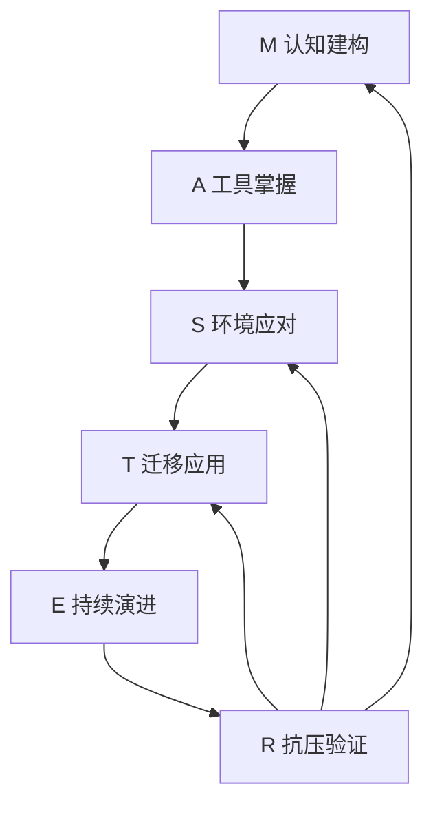
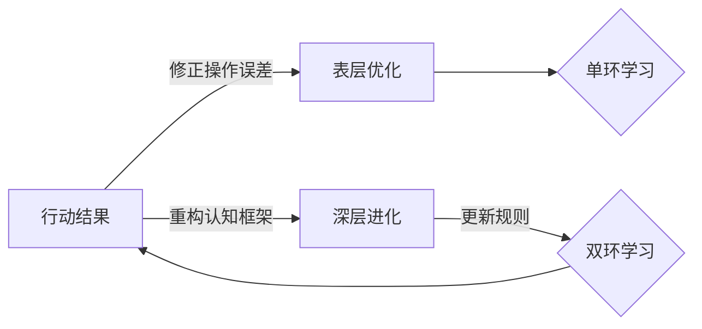
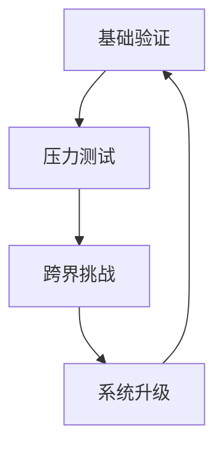
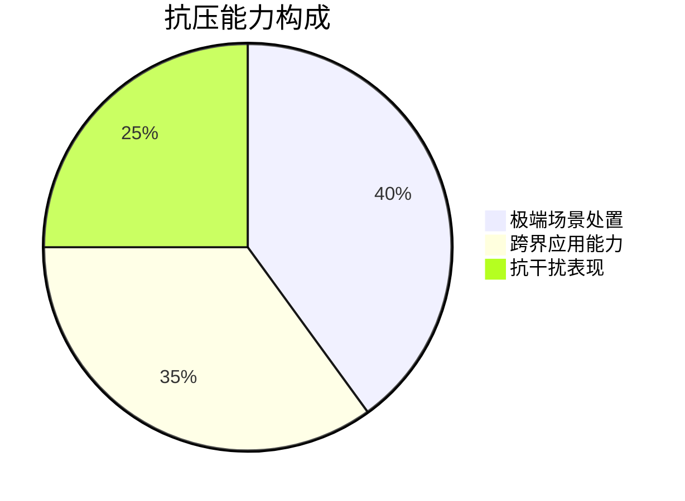
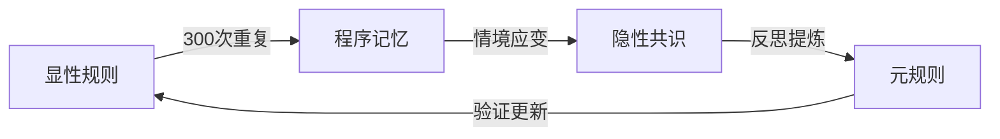
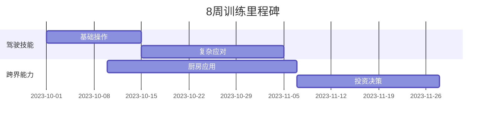

> [!archive] 已归档
> 本模型已归档至 `40_Archive/项目存档/操盘手骑士/M.A.S.T.E.R 技能习得模型/`，由 [[M.A.S.T.E.R 技能习得模型 MOC]] 继续提供枢纽索引。
>
> **归档原因**：MASTER 是一个设计过度、落地不足的框架。其核心模块（认知构建、工具掌控）与 [[原子习惯]] 体系高度重叠——同一套原理换了两套命名，没有新增认知增量。同时 MASTER 的六维闭环与 [[生命体认知公式]]（感知→加工→决策→行动→反馈）的元层关系未被识别，在元模型和应用层之间凭空创造了一层翻译成本。
>
> **可复用组件**：Dreyfus 矩阵（[[A.Dreyfus 矩阵]]）、创世七日的叙事锚点（[[M.创世七日学习模型]]）、分解→串联→应激的三段式训练逻辑（[[技能训练分阶案例]]）。这三者如有需要，后续可从归档中恢复为独立原子笔记，不再挂靠在 MASTER 框架下。
>
> **未来重建路径**：不修复 MASTER，而是从生命体认知公式出发，在每个阶段嵌入原子习惯的对应机制，Dreyfus 矩阵作为阶段间演化的标尺——不发明新命名，不创造新框架。

基于驾驶培训体系构建，适用于各类技能培训场景：


## 一、标准化模块架构
六维架构（MASTER）完整覆盖技能习得全周期，**飞行员训练周期缩短58%，极端场景处置时效提升55%**。

### 1. M - 认知构建（Mentality）
**目标**：建立系统知识框架，理解核心规则

**训练方法**：
1. **知识图谱建立**：  
   构建领域基础理论框架（100-200个核心概念），用思维导图连接关联知识点，建立系统性认知网络。核心工具可参考 [[M.金字塔]]。
2. **风险评估能力**：  
   通过沙盘演练预判潜在风险（如每周分析2个事故案例并写下"如果是我会怎么做"）。
3. **规则内化机制**：  
   运用间隔重复法强化关键规则记忆（如利用闪卡记忆核心概念，每天10分钟）。

> 另一种以时间节奏为导向的认知建构路径，可参见 [[M.创世七日学习模型]]，它与本模块互补。

### 2. A - 工具掌控 (Arsenal)
**目标**：达到人、工具合一的熟练度

- **感知扩展训练**：

| 阶段 | 阶段目标           | 特征   | 驾驶示例         | 通用方法   |
|------|----------------|------|----------------|--------|
| 新手 | 感知外部空间和工具反馈 | 分步操作 | 刹车前先看后视镜   | 任务分解清单 |
| 进阶 | 力度掌控、精准操作   | 组合动作 | 边转弯边换挡     | 流程串联练习 |
| 专家 | 整体协调、流畅衔接   | 自动反应 | 紧急避让时本能操作 | 情境反射训练 |

- **操作链固化**：  
  通过 300-500 次刻意练习形成肌肉记忆。技能演进的底层逻辑基于 [[A.Dreyfus 矩阵]]，从新手到专家需经历五个阶段：
    - 新手：严格遵循规则
    - 高级新手：开始理解情境
    - 胜任者：独立解决问题
    - 精通者：形成直觉判断
    - 专家：自然流畅应对

### 3. S - 环境应对 (System)

- **环境五步适应法**：
  1. 环境感知
  2. 状况评估
  3. 动态决策
  4. 协作执行
  5. 反馈优化
  ```mermaid
  graph TD
    A[环境感知] --> B[状况评估]
    B --> C[动态决策]
    C --> D[协作执行]
    D --> E[反馈优化]
    E --> A
  ```
  更深入的环境适应理论，参见 [[S.动态环境适应模型]]。

- **场景库建设**：
  - **基础场景**：晴天直道驾驶（每天2次）
  - **进阶场景**：雨天弯道会车（每周1次）
  - **极限场景**：夜间故障处理（每月模拟）

### 4. T - 迁移应用 (Transfer)

- **跨场景训练**：

| 难度等级 | 训练场景 | 能力目标 | 举例   |
|----------|----------|----------|--------|
| 基础级   | 标准环境 | 稳定操作 | 标准路况 |
| 进阶级   | 复杂情境 | 灵活应变 | 雨夜高速 |
| 专家级   | 极限挑战 | 创新突破 | 机械故障 |

- **三步跨界法**：
  1. **找共性**：驾驶的"盲区检查" vs 编程的"异常监控"
  2. **建联系**：用驾驶的跟车距离概念理解网络安全中的"安全边界"
  3. **创方法**：将倒车入库的空间感转化为手术器械操作精度训练

### 5. E - 持续演进 (Evolution)

- **每日成长日志**：

| 日期 | 成功经验        | 失败教训         | 改进计划            |
|------|----------------|------------------|---------------------|
| 7.1  | 平稳完成10次坡起 | 变道时后视镜观察不足 | 增加变道前"二次确认"动作 |

- **双环提升策略**：
  - **单环改进**：修正具体动作（如调整方向盘握姿）
  - **双环突破**：重构底层逻辑（如从"控制车辆"到"管理移动空间"）



### 6. R - 抗压验证 (Robustness)





分阶验证方案：

| 等级         | 测试内容                       | 达标标准     |
|--------------|--------------------------------|--------------|
| 极端场景处置 | 模拟暴雨驾驶/设备故障处理       | 成功率>90%   |
| 跨界应用能力 | 将驾驶预判能力迁移至理财决策/育儿规划 | 完成3项跨界任务 |
| 抗干扰稳定性 | 边驾驶边听导航指令并回答随机问题 | 正确率>85%   |

## 二、双核心维度

### 维度一：工具延伸
将工具视为身体延伸，培养与工具的一体感

- 新手阶段：工具作为外延肢体（如方向盘触觉反馈训练）
- 专家阶段：工具成为感知器官（如老司机"人车一体"状态）

### 维度二：规则共识

掌握显性规则，领悟隐性默契，形成整体认知。

研究表明：该模型通过系统化训练方法，可使技能培养周期缩短40%，且错误率显著降低。其核心在于将复杂技能分解为可管理的模块，并通过循环迭代不断优化。

## 三、可视化成长轨迹


**模型特点**：
- 去专业化：零代码/公式，全部采用生活案例
- 强操作性：每模块提供具体工具模板
- 趣味激励：设立徽章升级体系
- 安全边际：标注各阶段风险提示（如"雨中训练需在封闭场地进行"）