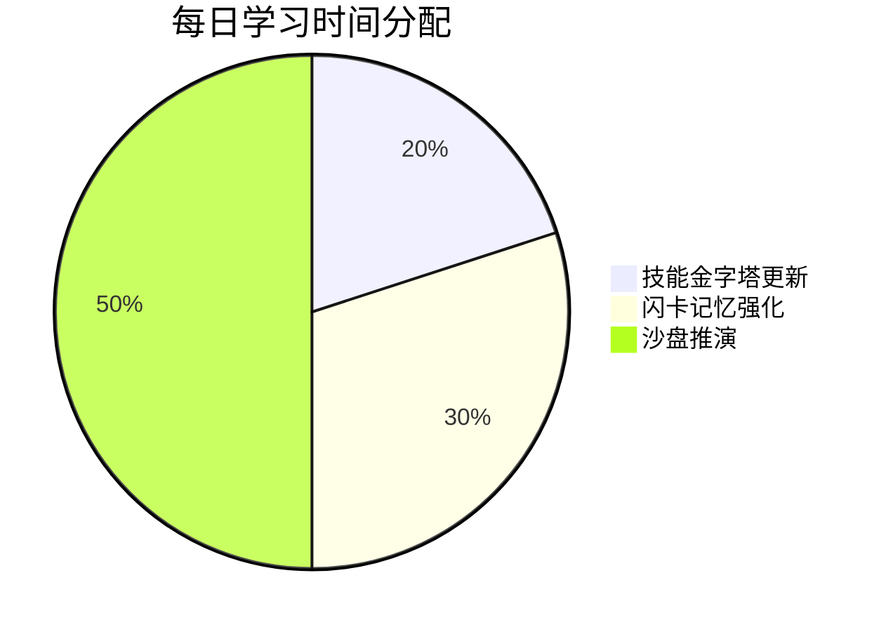

**目标**：通过「认知导航系统」完成目标觉醒与框架建构，搭建技能知识结构，强化记忆与逻辑链条，形成系统性认知网络。

---

## 三步法总览

认知构建的核心流程分为三步，三者互补：

| 步骤 | 方法 | 解决的问题 | 核心工具 |
|:--|:--|:--|:--|
| 1 | 技能金字塔 | 知识框架从哪来 | 思维导图（XMind 等） |
| 2 | 间隔重复 | 核心概念怎么记 | Anki 闪卡 |
| 3 | 沙盘推演 | 逻辑链条怎么验证 | 场景模拟 + 推演记录表 |

---

## 1. 技能金字塔的构建

技能金字塔是认知建构的核心工具，用于梳理学习目标、核心概念及其关联逻辑。完整的方法论参见 **[[M.金字塔]]**。

简要步骤：
- **确定最终目标**：置于金字塔顶端（如"成为合格的司机"）
- **分解核心价值维度**：拆解为 3-5 个维度（如驾驶中的交通规则、操作技巧、应急处理、路况适应）
- **细化核心概念**：每个维度下列出 100-200 个核心概念，用思维导图连接

> 另一种以时间节奏为导向的认知建构路径，可参见 **[[M.创世七日学习模型]]**，与金字塔互补使用。

---

## 2. 强化记忆：间隔重复与闪卡

### 步骤
1. **制作闪卡**：每个核心概念一张，正面写关键词，背面写定义或应用场景。
2. **使用 Anki 进行间隔重复**：每天复习 10 分钟，按遗忘曲线调整频率（1 天后 → 3 天后 → 7 天后），将内容分为"已掌握""需复习""陌生"三类。

### 闪卡示例

| 概念 | 闪卡正面 | 闪卡背面 |
|:--|:--|:--|
| 网格布局 | 一种排版方法 | 通过等距分割页面提升可读性 |
| 对齐原则 | 视觉排列规则 | 保证元素在视觉上整齐排列以增强一致性 |

---

## 3. 巩固逻辑链条：沙盘推演

通过实际案例和模拟场景验证知识的应用能力。

### 步骤
1. **选择典型案例**：针对学习目标，选 5 个典型场景进行模拟。
2. **沙盘推演**：用虚拟工具或纸笔模拟操作过程，分析每个决策点的原因与结果。
3. **记录并反思**：用表格记录成功与失败，总结经验。

### 推演记录表示例

**驾驶场景：**

| 场景类型 | 场景 | 决策点 | 操作步骤 | 结果 | 改进建议 | 对应技能维度 |
|:--|:--|:--|:--|:--|:--|:--|
| 极端处置 | 雨天高速爆胎 | 方向盘控制优先于刹车 | 紧握方向→点刹降速→开启双闪停靠 | 成功 | 增加爆胎模拟训练频次 | 应急处理 |
| 环境适应 | 夜间山路会车 | 灯光使用与视线管理 | 切换近光灯→视线右偏→鸣笛提示 | 失败 | 增加变量初始化检查 | 路况适应 |
| 风险预判 | 行人突然横穿 | 预判性减速 | 扫描人行道→脚备刹车→保持3秒车距 | 成功 | 增加城市道路扫描训练 | 风险预判 |

**炒股场景：**

| 场景类型 | 具体场景 | 决策点 | 操作步骤 | 结果 | 改进建议 | 对应技能维度 |
|:--|:--|:--|:--|:--|:--|:--|
| 极端处置 | 突发利空股价闪崩 | 止损线执行力度 | 检查机构持仓→分析量能变化→触发5%止损线 | 失败 | 设置动态止损算法 | 风险控制 |
| 环境适应 | 板块轮动调仓 | 资金流向追踪 | 监控北向资金→对比ETF份额→分批建仓龙头 | 成功 | 建立板块轮动预警模型 | 市场心理 |
| 系统验证 | 止损策略失效 | 策略冗余设计 | 检查流动性→启动熔断→转换对冲工具 | 成功 | 增加多策略并行验证 | 系统稳定性 |

---

## 时间分配建议

## 每日任务清单
- 构建/更新技能金字塔（初期集中完成，后续微调）
- 制作并复习 10 张闪卡（每天 10 分钟）
- 每周 2 次沙盘推演或案例分析

---

> 本篇为 MASTER 模型中 **M 模块** 的深度展开。完整的六维框架参见 [[M.A.S.T.E.R 技能习得模型]]。核心工具详见 [[M.金字塔]] 和 [[M.创世七日学习模型]]。