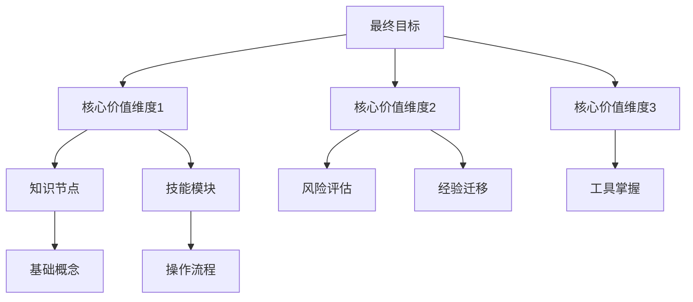

> 本工具为 [[M.A.S.T.E.R 技能习得模型]] 中 **M 模块（认知构建）** 的核心工具。

根据《金字塔思维》与 MASTER 模型的整合框架，"技能金字塔"是认知建构的核心工具，本质是通过思维导图实现目标与价值的可视化映射。

## 架构总览

## 核心要素解析

### 1. 塔尖目标层
- 满足 SMART 原则：具体、可衡量、可达成、相关、有时限
- 场景化：设定具体应用场景（如"成为自动驾驶算法专家"）
- 神经锚定：每日 10 分钟目标冥想强化神经回路

### 2. 价值维度层（3-5 个关键支撑）

| 典型维度 | 内容示例 | 神经机制 |
|:--|:--|:--|
| 知识架构 | 200 个核心概念 + 逻辑关系网 | 海马体 θ 波增强 |
| 技能体系 | 编程/数据分析/仿真等实操模块 | 基底节多巴胺释放 |
| 风险预判 | 事故案例库 + 应急决策树 | 杏仁核-前额叶协同 |
| 工具延伸 | 开发框架 + 调试工具链 | 小脑运动模式固化 |

### 3. 实施要点
- **双金字塔映射**：显性知识（概念/规则）与隐性能力（直觉/应变）形成闭环
- **动态更新机制**：每周新增 5-10 个关联节点，间隔重复强化
- **神经可视化**：用颜色标注脑区激活程度（如蓝色代表前额叶工作记忆）

## 驾驶训练案例

- 顶端：成为全地形驾驶专家
- 价值维度：
  1. 力学知识（轮胎摩擦系数/重心计算）
  2. 场景应对（沙漠陷车/冰雪打滑）
  3. 工具延伸（差速锁操作/胎压监控）
  4. 风险预判（天气突变/机械故障）

> 建议使用 XMind 等工具构建三维脑图，通过空间记忆强化海马体灰质密度。

## 在 MASTER 体系中的位置
技能金字塔主要支撑 [[M.A.S.T.E.R 技能习得模型]] 中的 **M - 认知构建** 模块，用于完成"知识图谱建立"的核心步骤。与 [[M.创世七日学习模型]] 互补——金字塔偏重空间结构，七日模型偏重时间节奏。