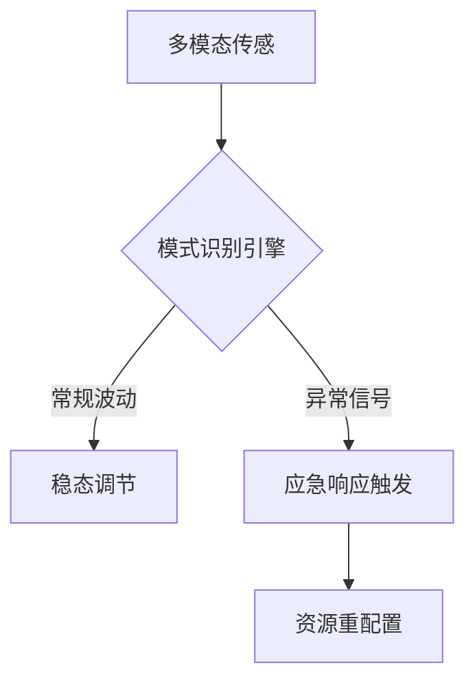
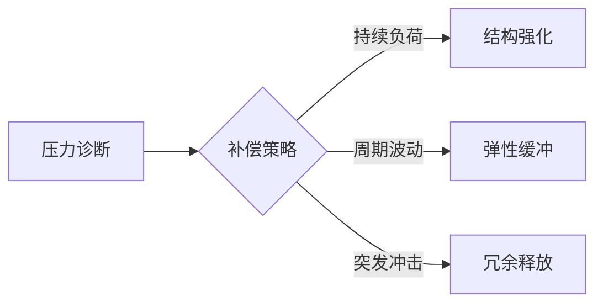

> 本概念支撑 [[M.A.S.T.E.R 技能习得模型]] 中的 **S 模块（系统交互）**，从 [[MASTER.v1 四模块版]] 的"系统交互模块"深度解析中提取并独立成篇。

动态环境适应是指在不同发展阶段或变化条件下，系统或个体通过自我调整保持功能稳定的能力。

## 三维架构

### 一、感知预警系统

- **扫描频率**：建立"3秒间隔"扫描节奏
- **噪声过滤**：区分常规波动与异常信号
- **雨天/夜间**：观察频率增加 20%

### 二、决策调节中枢

双通道处理架构：

| 通道 | 特征 | 决策耗时 | 能耗 |
|:--|:--|:--|:--|
| 经验通道 | 调用已有情景模式 | 50-80ms | 低（15%） |
| 创新通道 | 前额叶主导的试错 | 300-500ms | 高（60%） |

**动态平衡**：环境变化率 < 35% 时经验主导，> 35% 时创新激活。

### 三、执行补偿网络

决策三原则：安全优先 > 规则优先 > 效率优先。
