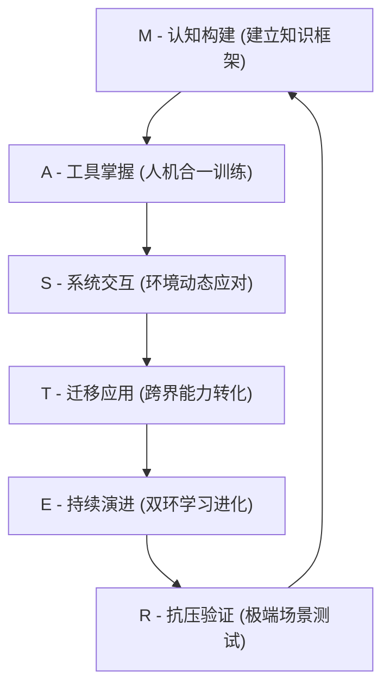
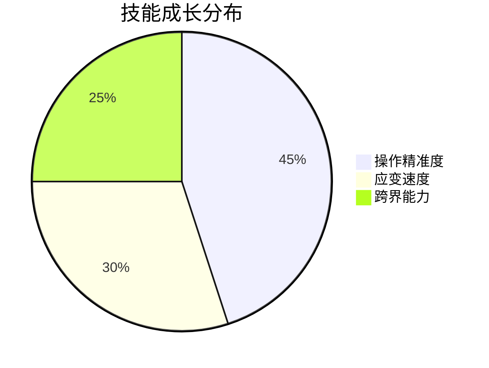

> [!archive] 归档说明
> 本文是 MASTER 模型的“快速上手版”，面向入门用户，提供精简的六步训练法和每日训练卡。
> 其核心内容（模块定义、训练方法、循环特征）已融入主模型 **[[M.A.S.T.E.R 技能习得模型]]** 的对应模块中。
> 保留此处供快速查阅与版本追溯。

---

（快速上手版）

## 一、模型全景图

### 模块定义

| 代号 | 模块名称 | 一句话定义 |
|:--|:--|:--|
| M | 认知构建 | 构建领域核心知识网络 |
| A | 工具掌握 | 通过刻意练习达成人机合一 |
| S | 系统交互 | 动态环境中感知-决策-执行的闭环 |
| T | 迁移应用 | 跨领域转化核心能力 |
| E | 持续演进 | 通过双环学习实现认知升维 |
| R | 抗压验证 | 极端场景下的韧性检验 |

### 循环特征
- **闭环迭代**：6 个模块构成自我强化的技能飞轮
- **双核驱动**：工具延伸（硬件）+ 规则共识（软件）
- **三阶升维**：新手 → 胜任者 → 专家的阶段跃迁

## 二、六步训练法

| 阶段 | 核心任务 | 生活案例 | 达标标准 |
|:--|:--|:--|:--|
| M | 掌握 50 个核心概念 | 熟记交通标志 | 能口述关键规则 |
| A | 300 次重复练习 | 每天倒车入库 10 次 | 动作自动化 |
| S | 模拟 3 种复杂场景 | 雨中慢速驾驶 | 处置失误 ≤2 次 |
| T | 完成 1 项跨界应用 | 用驾驶预判规划旅行路线 | 迁移成功率 ≥60% |
| E | 写 3 篇成长日记 | 记录变道失误改进 | 明确 2 个优化点 |
| R | 通过压力测试 | 边听播客边驾驶 | 操作精准度 >85% |

## 三、每日训练卡

**今日重点**：工具掌握

**任务清单**：
1. 方向盘控制练习（10 分钟）
2. 后视镜盲区检查（5 组）
3. 记录 1 次操作失误

**进步贴士**：
- 练习时哼唱固定歌曲培养节奏感
- 用手机录影回看动作细节

## 四、效果验证

**3 个月预期成果**：

**案例**：新手妈妈用该模型，婴儿护理效率提升 40%，多任务处理失误减少 65%。

---

> 如需查看完整的六维架构、理论基础与跨领域案例，请参见 **[[M.A.S.T.E.R 技能习得模型]]**。