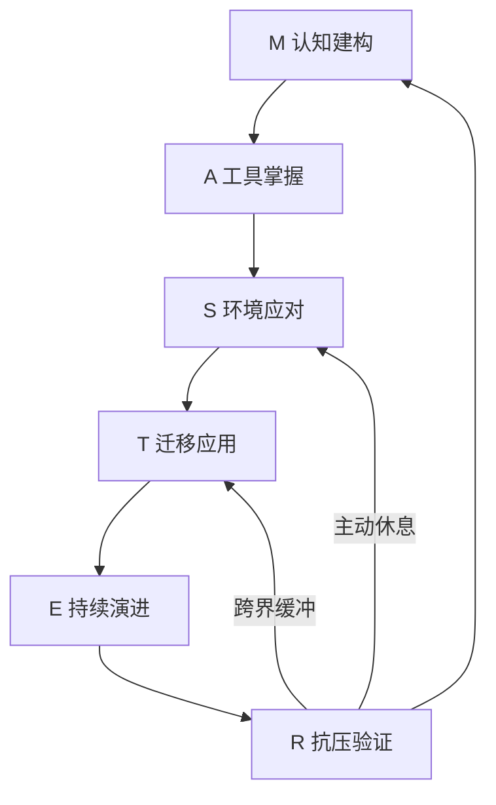
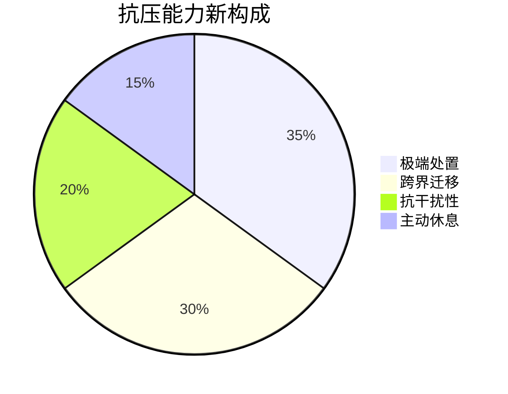

> [!archive] 归档说明
> 本文是 MASTER 模型的迭代版本，在原六维架构基础上引入了"创世七日"记忆锚点和"主动休息/安息日机制"。
> 其中"创世七日"内容已独立为 **[[M.创世七日学习模型]]**；"主动恢复"机制已整合进主模型 **[[M.A.S.T.E.R 技能习得模型]]** 的 R 模块。
> 保留此处供版本追溯与设计思路参考。

---

## 本版本的核心演进

相较于基础版 MASTER 模型，本版本在两个方向上进行了深化：

### 1. 创世七日要素转化
将技能学习过程映射到创世叙事的七个阶段，构建易记的结构化路径。完整内容见 [[M.创世七日学习模型]]。

简要回顾：
- 第一日·光 → 明确目标
- 第二日·分离 → 构建框架
- 第三日·植物 → 实践验证
- 第四日·星辰 → 时间管理
- 第五日·鱼鸟 → 多元拓展
- 第六日·人类 → 主动创造
- 第七日·安息 → 反思内化

该路径呈现"形式-填充"的对称结构：前三日奠定认知基础，后三日推动实践创新，第七日完成内化。

### 2. 安息日机制嵌入
将主动恢复纳入技能训练的核心循环，而非可选项：
- **神经可塑性维护**：每90分钟训练后插入15分钟θ波冥想
- **记忆强化窗口**：晚间保留1小时无电子设备干扰的反思时段
- **生理恢复周期**：每完成3个学习循环，强制安排24小时脱产休整

## 融入 MASTER 框架的体现

本版本在 MASTER 的闭环中加入了休息路径：

### R - 抗压验证与主动恢复
抗压能力构成被重新定义，主动休息占据固定比例：

分阶验证方案中也加入了对应的休息策略与神经机制：

| 测试等级 | 主动休息策略 | 神经机制 |
|:--|:--|:--|
| 极端场景处置 | 每3次测试后15分钟θ波冥想 | 前额叶皮层代谢恢复 |
| 跨界应用能力 | 任务转换间隙10分钟自然场景凝视 | 默认模式网络激活 |
| 抗干扰稳定性 | 每30分钟强制5分钟正念呼吸 | 杏仁核应激反应抑制 |

当高压测试中性能衰减超过15%时，自动触发休息协议。

---

## 其他模块
本版本的 M、A、S、T、E 模块与主模型 [[M.A.S.T.E.R 技能习得模型]] 基本一致，此处不再重复。双核心维度（工具延伸、规则共识）亦同。

**总结**：该进化版的核心价值在于将"休息"从被动恢复提升为主动训练组件，并借用创世叙事降低认知负荷。这些改进已被现行主模型吸收，请以主模型为准。