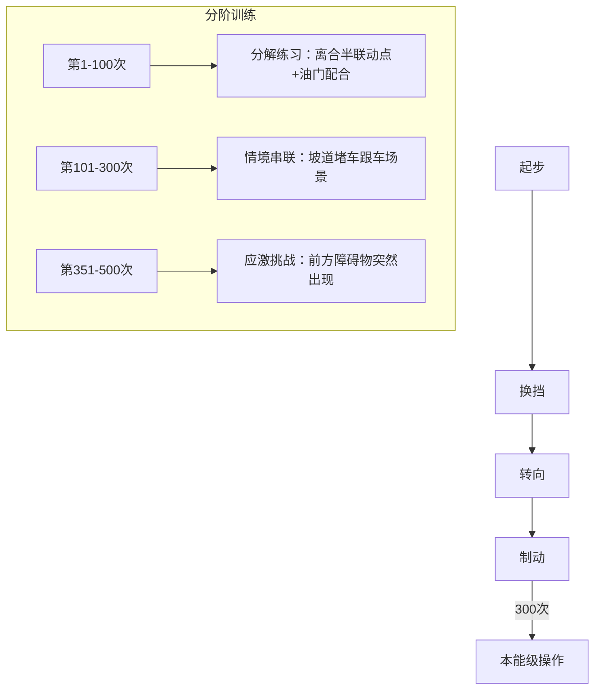
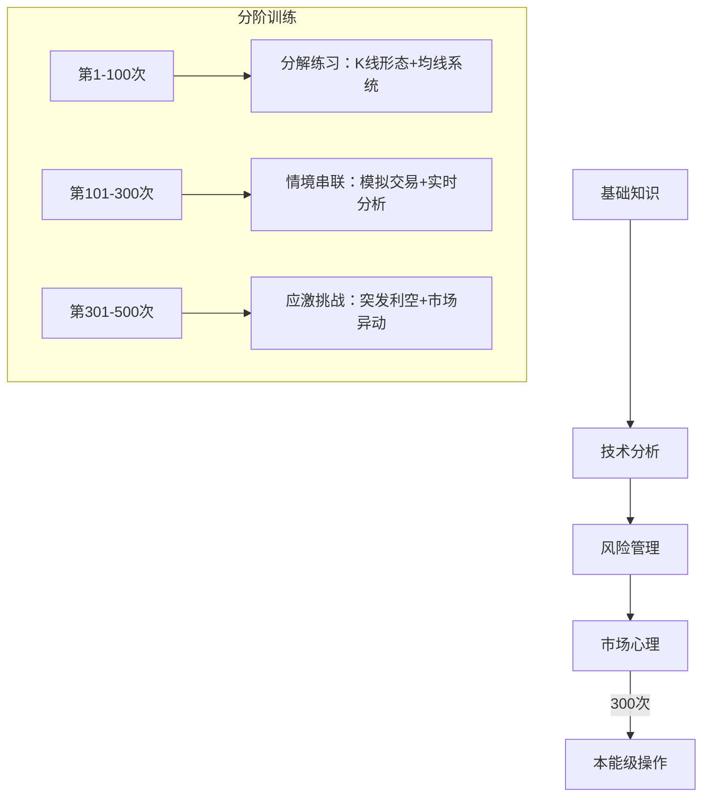
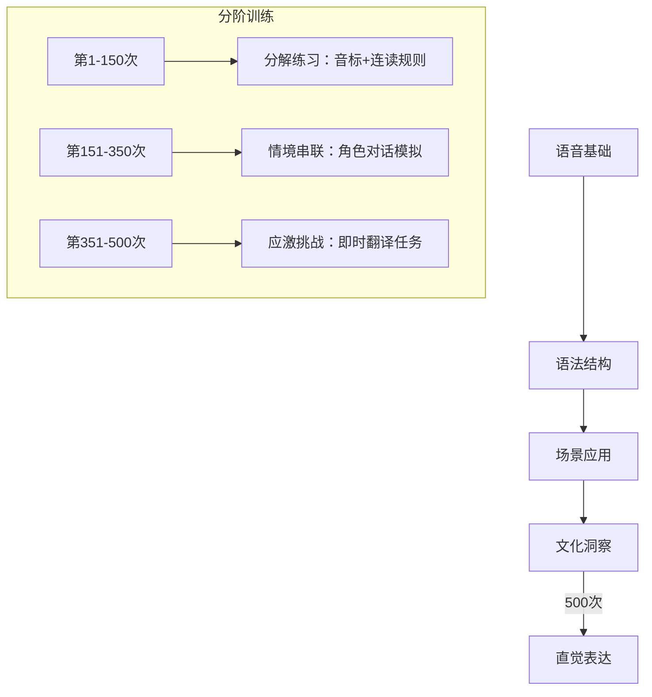
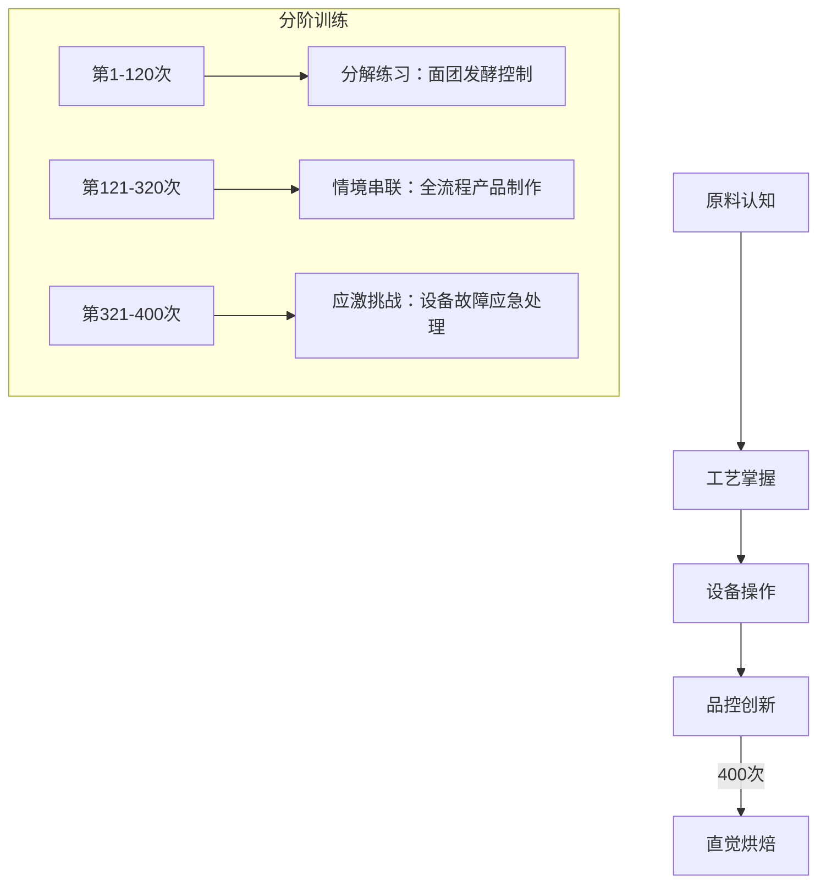

> 本篇为 [[M.A.S.T.E.R 技能习得模型]] 中 **A 模块** 的跨领域实践附录。

四个领域的技能训练分阶流程图，展示从"分解练习"到"应激挑战"的通用进阶路径。底层逻辑基于 [[A.Dreyfus 矩阵]] 的五阶段演化，对应 [[M.A.S.T.E.R 技能习得模型]] 中 **A - 工具掌控** 模块的"操作链固化"训练。

## 驾驶

## 炒股

## 英语

## 烘焙

> 各领域的训练次数为参考值，核心规律是：分解→串联→应激，对应 Dreyfus 模型中从"新手"到"专家"的五阶段跃迁。具体指标参见 [[M.A.S.T.E.R 技能习得模型]] 的 A 模块和 [[A.Dreyfus 矩阵]]。