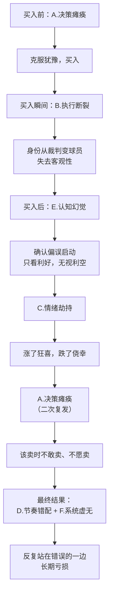
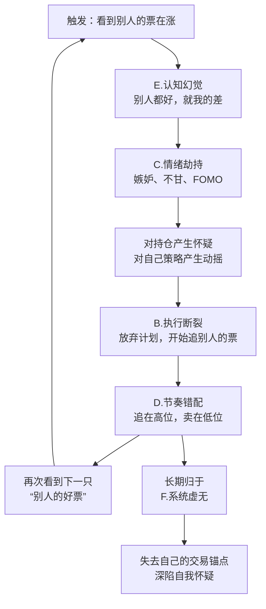
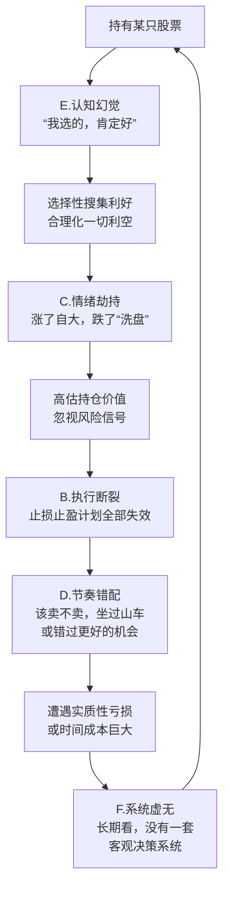
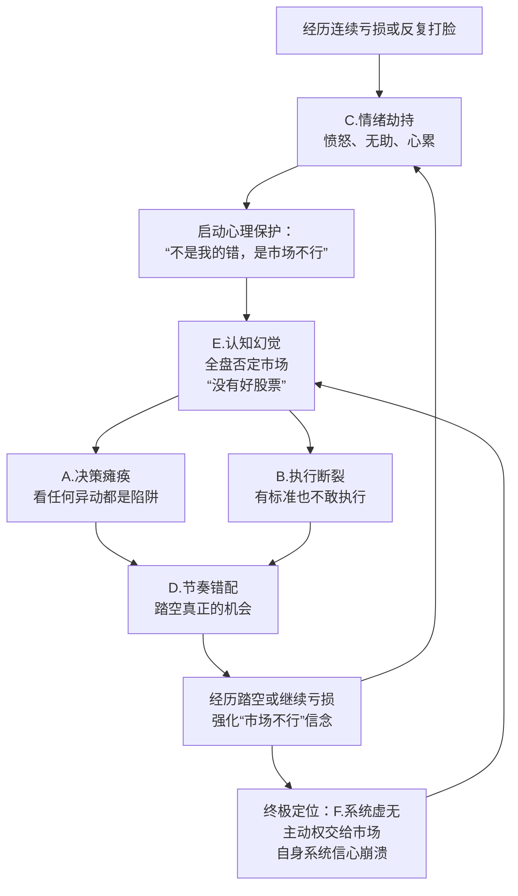
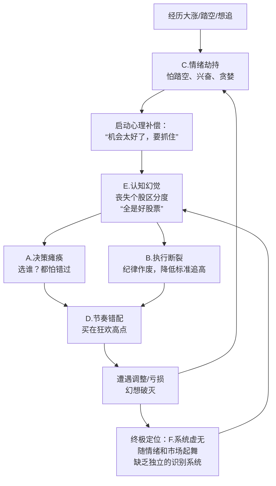

> **归档说明（2026-07-01）：**
> 本文档已归档至 `40_Archive/操盘手骑士/痛点/备查工具_待更新/`。归档理由：6个深度案例+Mermaid流程图，展示6实体模型在实战中的诊断力，仍有参考价值，但不再主动更新。放入备查区，做深度内容时可取用，待未来重新启用后需更新。
>
> **归档说明：**
> 这是“操盘手骑士”项目痛点体系的**案例实证库**。它使用《[[六实体痛点矩阵]]》的A-F六实体框架，对6个典型交易心理陷阱进行深度归因与链式拆解。每个案例按“现象→链式拆解→核心洞见→可视化→干预指引”统一封装，是6实体模型从理论到应用的关键验证。与核心模型文档配套使用：查理论去模型文档，看实证来本文档。
>
> **代号速查：** `一①`=按交易流程分类，`二①`=按频率与杀伤力排序。完整对照表见《[[交易心理的十个痛点维度（操盘手骑士）]]》。

---

## 案例一：总想买在最低点卖在最高点

**🔍 现象描述：** 投资者执着于精准择时，坚信自己能抄底逃顶，结果该买时迟疑（等更低点），该卖时贪婪（等更高点），频繁踏空或坐过山车。

**⛓️ 链式拆解：**

| 拆解成分 | 归入实体 | 原理 |
|:---|:---|:---|
| “我能精准抄底逃顶”的信念 | **E. 认知幻觉** | 对市场随机性和自身能力的根本性误判。把“妄念”当“能力”。 |
| 因等低点踏空、因等高点回撤 | **B. 执行断裂 / D. 节奏错配** | 认知幻觉的后果，高要求导致行为变形。 |
| 没买到最低的懊悔、没卖到最高的不甘 | **C. 情绪劫持** | 追求完美必然高频落空，落空后产生情绪冲击。 |

**💡 核心洞见：** “总想买在最低卖在最高”不是技术问题，是E.认知幻觉在给你画饼。你追求的是一个概率上不存在的东西。

**🗺️ 可视化传导图：**
```
E.认知幻觉（妄念）→ 行为变形（该买不买/该卖不卖）→ B.执行断裂 + D.节奏错配 → C.情绪劫持（懊悔/不甘）→ 强化下一轮妄念
```

**🔧 干预切入点：** 承认“无法精准择时”→ 用分批建仓/分批止盈替代一次性买卖。关联：仓位管理规则。


## 案例二：买入前能判断涨跌，买入后开始失准

**🔍 现象描述：** 买之前能大致判断涨跌，买了之后开始失准，潜意识搜集所有正反馈说服自己“它会涨”。

**⛓️ 链式拆解：**

- **买入前：A. 决策瘫痪 → 勉强克服。** 处于相对客观状态，但“大致判断”本身可能埋着E的种子——如果依据是“感觉要涨”，底层已是E.认知幻觉。
- **买入瞬间：B. 执行断裂悄然发生。** 买入动作将你从“分析者”切换为“持有者”。你执行了买入，但没执行“保持客观”的元指令。
- **买入后：E. 认知幻觉全面接管。** “潜意识搜集所有正反馈”是经典确认偏误。大脑自保：过滤利空，放大利好。**E让你看不见自己被E控制。**
- **验证期：C. 情绪劫持 + A. 决策瘫痪（二次复发）。** 涨了兴奋更坚信幻觉，跌了侥幸“洗盘而已”。该止损时瘫痪。
- **最终结果：D. 节奏错配 + F. 系统虚无。** 买在事后看不是买点的位置。反复发生→没有客观验证系统→盈亏全凭运气。

**🗺️ 可视化传导图：**



**💡 核心洞见：** “买前能判断，买后就失准”的本质是：你不是在买后失准，你是在买下的那一刻，就被E（认知幻觉）剥夺了判断权，而B（执行断裂）是你主动交出的枪。

**🔧 干预切入点：** 建立“买入前检查清单”（含客观验证标准），买入后立即设定条件单止损。关联：执行纪律工具。


## 案例三：总觉得别人的股票好

**🔍 现象描述：** 看别人持仓的票都在涨，自己的不动，频繁换股追涨，结果追在高位，卖掉的反而起飞。

**⛓️ 链式拆解：**

- **现象触发：E. 认知幻觉 + C. 情绪劫持。** 看到的“别人的好”是选择性展示（幸存者偏差）。触发嫉妒、不甘（FOMO）。
- **行为扭曲：B. 执行断裂。** 放弃客观判断，为换而换。执行的是情绪，不是策略。
- **结果验证：D. 节奏错配。** 换过去时已涨过一波，接在高位；刚卖掉的开始拉升。
- **长期归宿：F. 系统虚无。** 没在“自己的系统”里做过“自己的决策”，一直是别人决策的影子。

**🗺️ 可视化传导图：**



**💡 核心洞见：** “总觉得别人的好”不是你票的问题，是E.认知幻觉里把别人神化了。**你买的不是别人的票，是别人已经亮出来的底牌。而市场，专杀追底牌的人。**

**🔧 干预切入点：** 关闭盘中社交信息源，建立“持仓对比审计”习惯（仅对比自己的交易计划，不对比他人收益）。关联：信息降噪规则。


## 案例四：总觉得自己的股票好

**🔍 现象描述：** 对自己的持仓过度自信，放大一切利好，合理化一切利空。该止损不止，该止盈不止，最终坐过山车或深套。

**⛓️ 链式拆解：**

- **源头种子：E. 认知幻觉。** 买入时潜意识认定“我选的就是好的”，将主观判断升级为正面结论。
- **持仓强化：E + C. 情绪劫持。** 认知滤镜全面偏袒。涨了“我果然看对了”，跌了“市场错了，我没错”。舒适感让人拒绝反面证据。
- **关键转折：B. 执行断裂。** 止损位到了“再等等”，止盈位到了“还能更高”。计划被幻觉改写成死扛剧本。
- **结局引爆：D. 节奏错配。** 该卖不卖由盈转亏，真正机会视而不见，与市场节奏彻底脱节。
- **最终归宿：F. 系统虚无。** 支撑判断的不是交易系统，是“我自己选的”幻觉。长期亏损，不知错在哪里。

**🗺️ 可视化传导图：**



**💡 核心洞见：** “总觉得自己的好”的危险远大于“总觉得别人的好”。后者还能让你警惕，前者让你死扛到底。它是E和C共同编织的茧房，你待在里面很舒服，但市场不会陪你演戏。

**🔧 干预切入点：** 引入第三方复盘机制（交易日志/导师/社群），用外部视角打破确认偏误。关联：复盘模板。


## 案例五：市场不行，没有好股

**🔍 现象描述：** 连续受挫后产生“没有好股票，市场烂透了”的全面否定，不再看盘、不敢买入，最终踏空真正的行情。

**⛓️ 链式拆解：**

- **直接导火索：C. 情绪劫持（由痛生恨）。** 反复打脸累积愤怒、无助。大脑启动保护：把责任推到外部——“不是我的问题，是市场不行”。判断已不是分析，是C下的报复性否定。
- **认知扭曲：E. 认知幻觉。** “没有好股票”是把复杂现实压缩成情绪标语。非黑即白，是E的典型症状。
- **行为冻结：A. 决策瘫痪 + B. 执行断裂。** 任何异动都是“诱多”；有标准也不敢执行。从裁判变球员，直接跳到“连球场都不进，当观众骂街”。
- **时间验证：D. 节奏错配。** 悲观恰好踏空黄金坑、反转、新主线。几个月后回头看，已默默涨了一倍。
- **终极定位：F. 系统虚无。** 盈利仰仗行情，亏损归咎行情。主动权全部让渡给“市场好坏”，交易系统信心彻底破产。

**🗺️ 可视化传导图：**



**💡 核心洞见：** “觉得市场不行”是一种心理麻醉剂。它让你不用面对选股焦虑和止损痛苦，但也剥夺了你最宝贵的东西——**看见机会的能力**。这个痛点不是市场给的，是F.系统虚无在你心里挖的坑。

**🔧 干预切入点：** 用极小仓位（1-2%）进行“试错交易”，用实际正反馈打破全盘否定的认知扭曲。关联：小仓位验证规则。


## 案例六：全是好股票

**🔍 现象描述：** 与“市场不行”相反，在市场大涨或踏空后产生“遍地黄金，全是好股”的狂热，丧失个股区分度，追高买入后站岗。

**⛓️ 链式拆解：**

- **触发机制：C. 情绪劫持（由绝望跳转到狂热）。** 大阳线普涨，或踏空后强行告诉自己“机会还很多”。分析能力降为零。
- **认知扭曲：E. 认知幻觉。** 把大盘普涨等同于个股安全性。盲目乐观偏差：反弹当反转，出货当主升浪——丧失区分度。
- **行为冻结：A. 决策瘫痪 + B. 执行断裂。** 选谁都怕错过，大脑算力死机；纪律作废，降低标准追高。
- **时间验证：D. 节奏错配。** 克服瘫痪冲进去时，恰好站岗在山顶——狂热买入点恰是赚钱效应终点。
- **终极定位：F. 系统虚无。** 依然在用情绪扫描市场，没有识别风险与机会的滤网。眼前的一切都是情绪的投影仪。

**🗺️ 可视化传导图：**



**💡 核心洞见：** “全是好股票”是市场把刀裹上糖衣递给你，而你主动伸出了喉咙。这种“乌托邦幻觉”比悲观绝望更危险，因为它让你在狂欢中用重仓抹去所有本金。成熟股民在哀鸿遍野时能看到火种，在烈火烹油时能识别危机。

**🔧 干预切入点：** 设定仓位上限硬约束（如单票不超过总仓位20%），用制度对抗狂热。关联：仓位管理铁律。


## 案例使用协议

> **⚠️ 使用须知：**
> - 本档案用于**深度归因训练**和内部研讨，非浅层内容素材。直接引用案例做内容时，需转化为故事化语言，避免学术感过重。
> - Mermaid流程图适用于产品设计、深度课程、团队培训，不建议直接用于面向小白用户的公开内容。
> - 新增案例需严格遵循“现象→链式拆解→核心洞见→可视化→干预指引”五段式结构，并经模型一致性校验后方可录入。

---

> **关联文档速查：**
> - 查6实体定义与因果链 → 《[[六实体痛点矩阵]]》
> - 查痛点定义与用户原话 → 《[[股民痛点字典（操盘手骑士）]]》
> - 查痛点场景定位 → 《[[股民痛苦矩阵：时间线×痛苦层次（操盘手骑士）]]》
> - 查工具箱映射 → 待归档文档

## 体系索引

本文档属于 [[痛点分析体系 MOC]]，是痛点分析体系演进链的一部分。
