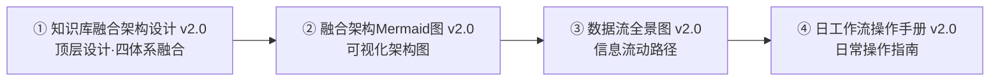

# 系统架构文档索引

> 四份核心文档从不同视角描述了知识库的融合架构。建议按以下顺序阅读。

## 阅读顺序

### ① 知识库融合架构设计
**定位**：顶层设计文档

Bullet Journal × PARA × Zettelkasten × Atomic Habits 四体系深度融合。当前目录结构 + 习惯系统映射 + 信息流 + 权威文档索引。

→ [[03_知识库融合架构设计]]

### ② 融合架构Mermaid图
**定位**：可视化参考

Vault 垂直分层、信息流与数据流向、习惯系统反馈回路，共 4 个 Mermaid 图。

→ [[03_知识库融合架构设计]]

### ③ 数据流全景图
**定位**：数据流说明

信息从外部进入知识库后的流动路径。含宏观数据流图、保鲜时限、核心规则。

→ [[11_数据流全景图]]

### ④ 日工作流操作手册
**定位**：日常操作指南

每日核心（15 分钟）、知识提炼流程、习惯追踪节奏。不是时间表，是参考路径。

→ [[12_日工作流操作手册]]

### ⑤ SOP 操作规范

| 文档 | 定位 |
|:-----|:------|
| [[旧资产处置决策框架]] | 旧模板/文档/项目残留的 4 步裁决算法与已判例 |
| [[_Raw编译触发规范]] | 人类侧编译决策启发式，4 种触发条件 + 反触发判断 |

### ⑥ 原子笔记生产规范

| 文档 | 定位 |
|:-----|:------|
| [[02_原子笔记炼金术·终局版]] | 原子笔记提炼标准与工作流（终局版）— 用户层执行规范 |
| [[13_Language Chunk 炼金术士]] | 语言组块提炼标准 — 语言学习特化分支 |
| [[06_Hermes Ingest 编译 SOP]] | Hermes Ingest 编译 SOP — 系统层编译规范（AI 自动化） |

### ⑦ 特殊素材类型规范

| 文档 | 定位 |
|:-----|:------|
| [[14_食谱编写标准]] | 食谱文件编写标准 — YAML 元数据 + 正文模块体系 + AI 协作规范 |
| [[13_Language Chunk 炼金术士]] | 语言组块提炼标准 — 词典引用 + 间隔重复卡片 + AI 协作规范 |

### ⑧ 基础设施规范

| 文档 | 定位 |
|:-----|:------|
| [[21_图床与多端同步基础设施规范]] | 图床搭建、附件管理、Remotely Save 多端同步的标准配置与操作规范 |

---

## 相关文档

| 文档 | 定位 |
|:-----|:------|
| [[HERMES|HERMES 操作规则]] | 操作最高准则 v3.0 |
| [[03_目录别名映射表|目录别名映射表]] | Areas ↔ Resources ↔ Projects 三维映射 |
| [[01_知识库统一规范总纲#directories|总纲 §目录层级标准]] | 目录结构 + 归属判断树 |
| [[40_Archive/系统文档/ZK成熟度评估与改进建议 v2.0（2026-06-28版）]] | ZK 当前状态评估 v2.0（278篇原子笔记，已归档） |
| [[01_知识库统一规范总纲#tags\|总纲 §标签体系]] | 标签系统 + 命名规范 |
| [[01_知识库统一规范总纲#metadata|总纲 §YAML 元数据规范]] | YAML 元数据标准 v3.0 |
| [[40_Archive/系统文档/知识库审阅计划·新（2026-06-26版）]] | 待处理任务清单（已归档） |

## 模板体系（v2.2 当前状态 · 2026-06-29）

### 活跃模板（v2.2 五层闭环）

| 层级 | 模板文件 | 生成落点 | 驱动方式 |
|:---|:---|:---|:---|
| 日 | `Daily Template.md` | `Bullet Journal/` | 节奏驱动 |
| 周 | `Weekly Template.md` | `Bullet Journal/` | 节奏驱动 |
| 月 | `Monthly Template.md` | `Bullet Journal/` | 节奏驱动 |
| 季 | `Quarterly Template.md` | `22_个人成长/` | 节奏驱动 |
| 年（方向） | `Annual Compass Template.md` | `22_个人成长/` | 节奏驱动 |
| 年（事件） | `Future Log Template.md` | `Bullet Journal/` | 节奏驱动 |
| 采集辅助 | `_Raw_Video_Metadata.md` | `00_Inbox/_raw/` | 事件驱动 |

### 已归档模板

| 文件 | 归档位置 | 原因 |
|:---|:---|:---|
| `季复盘模板.md` | `40_Archive/系统文档/` | 被 Quarterly Template 替代 |
| `周复盘模板.md` | `40_Archive/系统文档/` | 功能融入 Weekly Template Callout |
| `月复盘模板.md` | `40_Archive/系统文档/` | 功能融入 Monthly Template Callout |
| `T_Video_Source.md` | `40_Archive/系统文档/` | 工作流错配，由 Raw 流水线替代 |

### 设计原则
- **模板与产出物分离**：Template 在 `91_Templates/`，产出物按语义归位
- **BuJo 管理时间节奏，Areas 承载战略判断**：季复盘由 BuJo 节奏触发，产出落入 Areas 战略层
- **AH 分布式嵌入**：记分卡(Weekly)、身份投票(Quarterly)、MIT(Weekly/Monthly)、习惯调整(Monthly) 分散在各层 Callout，不作为独立模板实体
