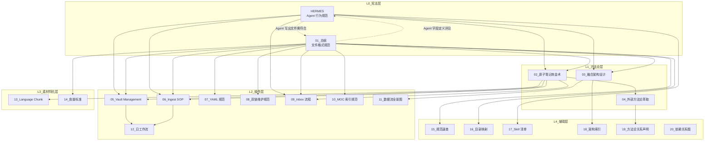

# 20_系统文档依赖关系图

> **定位**：本文件是知识库系统文档的全景依赖关系图。展示所有系统文档之间的逻辑关系、依赖方向、层级结构。
>
> **版本**：v1.0.0
> **生效日期**：2026-07-11
>
> **真值源声明**：本文档描述系统文档之间的依赖关系与更新触发规则。跨文档引用的完整规范以 [[01_知识库统一规范总纲#系统文档跨文档引用规范]] 为准。

---

## 一、分层架构总览

```
┌─────────────────────────────────────────────────────────────────┐
│                    L0 · 宪法层（双核规范）                        │
│                                                                  │
│  HERMES ←───────────────────────────────→ 01_总纲               │
│  Agent 行为规范                           文件格式规范            │
│  （Agent 宪法）                           （文件宪法）            │
└────────────────────┬──────────────────────────┬─────────────────┘
                     │                          │
                     ▼                          ▼
┌─────────────────────────────────────────────────────────────────┐
│                    L1 · 方法论层                                 │
│                                                                  │
│  02_原子笔记炼金术    03_融合架构设计    04_外部方法论萃取        │
│  （知识生产哲学）      （知识库结构）      （方法论萃取）          │
└────────────────────┬──────────────────────────┬─────────────────┘
                     │                          │
                     ▼                          ▼
┌─────────────────────────────────────────────────────────────────┐
│                    L2 · 操作层（8 份 SOP）                        │
│                                                                  │
│  05_Vault Management  06_Ingest SOP  07_YAML 规范               │
│  （人工操作）          （AI 操作）      （格式校准）               │
│                                                                  │
│  08_双链维护规范       09_Inbox 流程   10_MOC 索引规范           │
│  （双链维护）          （素材处理）     （索引维护）               │
│                                                                  │
│  11_数据流全景图       12_日工作流                               │
│  （信息流动）          （日常操作）                               │
└────────────────────┬──────────────────────────┬─────────────────┘
                     │                          │
                     ▼                          ▼
┌─────────────────────────────────────────────────────────────────┐
│                    L3 · 素材特化层                               │
│                                                                  │
│  13_Language Chunk 炼金术士    14_食谱编写标准                   │
│  （语言组块 ← 继承 02）         （独立素材类型）                   │
└─────────────────────────────────────────────────────────────────┘

┌─────────────────────────────────────────────────────────────────┐
│                    L4 · 辅助层（6 份索引/速查）                   │
│                                                                  │
│  15_规范速查   16_目录映射   17_Skill 清单   18_架构索引         │
│  19_方法论关系声明   20_依赖关系图（本文档）                       │
└─────────────────────────────────────────────────────────────────┘
```

---

## 各层准入标准

### L0 · 宪法层
- **准入范围**：定义知识库最高规则的文件
- **依赖方向**：不依赖任何上层文档
- **禁止收录**：操作流程、方法论讨论、索引工具
- **跨层约束**：本层规则是所有下层文档的强制约束

### L1 · 方法论层
- **准入范围**：定义系统底层哲学、知识生产逻辑、外部理论融合规则
- **依赖方向**：仅可依赖 L0 宪法层
- **禁止收录**：操作 SOP、素材处理规范、索引文档
- **跨层约束**：禁止反向修改 L0 宪法规则

### L2 · 操作层
- **准入范围**：定义可执行操作流程的 SOP 文档
- **依赖方向**：可依赖 L0 宪法 + L1 方法论
- **禁止收录**：方法论哲学讨论、素材类型专属规范
- **跨层约束**：禁止反向定义 L1 方法论；不得作为规范的唯一真值源

### L3 · 素材特化层
- **准入范围**：针对特定素材类型的特化规范
- **依赖方向**：继承 L1 对应方法论 + L0 宪法
- **禁止收录**：通用操作流程、方法论哲学
- **跨层约束**：豁免的是字段数量，不是格式规范；新增领域须在总纲备案

### L4 · 辅助层
- **准入范围**：规则速查、映射台账、架构索引与裁决文档
- **三类子分类**：
  1. **规则速查类**（15_规范速查）：核心规则浓缩版，不一致时以宪法为准
  2. **映射/台账类**（16_目录映射、17_Skill 清单）：结构化映射，陈旧信息视为系统故障
  3. **架构/依赖/裁决类**（18_架构索引、19_方法论声明、20_依赖关系图）：描述规则间关系，不定义新规则
- **禁止收录**：操作流程（→L2）、方法论定义（→L1）、素材规范（→L3）
- **跨层约束**：禁止作为业务操作规则的唯一真值源

---

## 二、详细依赖关系图



---

## 三、依赖矩阵

| 文档 | 依赖上游 | 被下游依赖 |
|:---|:---|:---|
| **HERMES** | 无 | 全部（Agent 行为边界） |
| **01_总纲** | 无 | 全部（文件格式标准） |
| **02_原子笔记炼金术** | HERMES, 01_总纲 | 04, 05, 06, 09, 13 |
| **03_融合架构设计** | HERMES, 01_总纲 | 11, 18 |
| **04_外部方法论萃取** | 02_炼金术 | 19 |
| **05_Vault Management** | HERMES, 01_总纲, 02_炼金术 | 12 |
| **06_Ingest SOP** | HERMES, 01_总纲, 02_炼金术 | 12 |
| **07_YAML 规范** | 01_总纲 | 全部（YAML 校准） |
| **08_双链维护规范** | 01_总纲 | 全部（重命名/断链） |
| **09_Inbox 流程** | HERMES, 01_总纲, 02_炼金术 | 06 |
| **10_MOC 索引规范** | 01_总纲 | 全部（MOC 维护） |
| **11_数据流全景图** | 03_融合架构设计 | 12 |
| **12_日工作流** | 05, 06, 11 | 无 |
| **13_Language Chunk** | 02_炼金术 | 无 |
| **14_食谱标准** | 01_总纲 | 无 |
| **15_规范速查** | 01_总纲 | 无 |
| **16_目录映射** | 01_总纲 | 无 |
| **17_Skill 清单** | HERMES | 无 |
| **18_架构索引** | 03_融合架构设计 | 无 |
| **19_方法论关系声明** | 04_外部方法论萃取 | 无 |
| **20_依赖关系图** | 全部 | 无 |

---

## 四、阅读路径推荐

### 路径一：新用户入门（自顶向下）

```
HERMES（了解 Agent 边界）
    ↓
01_总纲（了解文件规范）
    ↓
03_融合架构设计（了解知识库结构）
    ↓
02_原子笔记炼金术（学习知识生产方法）
    ↓
12_日工作流（开始日常操作）
```

### 路径二：原子笔记生产（聚焦核心）

```
02_原子笔记炼金术（方法论）
    ↓
09_Inbox 流程（素材处理）
    ↓
06_Ingest SOP（AI 编译）
    ↓
05_Vault Management（归档维护）
```

### 路径三：系统维护（运维视角）

```
01_总纲（格式标准）
    ↓
07_YAML 规范（YAML 校准）
    ↓
08_双链维护规范（引用维护）
    ↓
10_MOC 索引规范（索引维护）
```

### 路径四：方法论研究（深度学习）

```
02_原子笔记炼金术（本系统方法论）
    ↓
04_外部方法论萃取（如何萃取外部方法论）
    ↓
19_方法论关系声明（来源 vs 实现的分野）
```

---

## 五、更新触发矩阵

|| 触发事件 | 需要更新的文档 |
|:---|:---|
| **HERMES 升级** | 全部（Agent 行为边界变化） |
| **01_总纲升级** | 全部（文件格式规范变化） |
| **02_炼金术升级** | 04, 05, 06, 09, 13 |
| **新增素材类型** | 新建 L3 文档 + 更新 06_Ingest SOP |
| **新增操作流程** | 新建 L2 文档 + 更新 12_日工作流 |
| **目录结构调整** | 03, 16, 18 |
| **重命名笔记** | 08_双链维护规范 |
| **总纲 META/NAMING/TAG/DIR 规则变更** | 15_规范速查、16_目录映射表 |
| **系统文档编号或分层结构调整** | 18_架构索引、20_依赖关系图 |
| **Skill 绑定关系或系统文档依赖变更** | 17_Skill 清单、20_依赖关系图 |

### 循环依赖红线

**本规则仅适用于 L0-L4 系统文档层级**，约束规范的上下位从属关系。
普通原子笔记的双向对话链接不受此限（这是 ZK 的正常对话模式）。

所有系统文档禁止出现循环依赖（A → B → A）。新增文档或修改 `related` 字段时，人工核对依赖矩阵：若新增依赖关系会导致环路，须通过拆分文档或重新定义归属解决，不得以「相互引用」绕过。

### 操作协议与数据模型的边界判例

以下为已裁决的灰色地带判例，后续类似场景参照处理：

1. **Agent 自动生成 Callout 区块**（首次写入协议的 `[!note]` 头部提醒、`## 🤖 Hermes 补充` 追加区块）→ **不视为僭越数据模型**。理由：这些区块是 Agent 写入协议的组成部分，不影响人类对正文的主权。

2. **Agent 在语言组块笔记中插入 `## 词典查证` 等标准化标题** → **视为数据模型，须经总纲备案**。理由：这定义了 L3 特化笔记的结构标准，属于文件格式规范。

**判例库维护规则**：
- 当某类判例累计出现 ≥ 3 次，应提炼为正式规则写入 HERMES 或总纲，并从判例库移除
- 判例库总量上限为 10 条，超出时强制触发「判例晋升/淘汰」审计

---

## 六、Skill 与系统文档映射

| Skill | 对应系统文档 | 关系 |
|:---|:---|:---|
| `atomic-note-extraction` | 02_原子笔记炼金术, 09_Inbox 流程, 19_方法论关系声明 | 规则在文档，执行在 Skill |
| `vault-management` | 05_Vault Management, 08_双链维护规范, 10_MOC 索引规范 | 规则在文档，执行在 Skill |
| `obsidian-yaml-spec` | 07_YAML 规范 | 规则在文档，执行在 Skill |
| `language-chunk-alchemy` | 13_Language Chunk 炼金术士 | 规则在文档，执行在 Skill |
| `recipe-writing-standard` | 14_食谱编写标准 | 规则在文档，执行在 Skill |

---

## 七、版本矩阵索引

完整的版本信息见：[[SOP/系统文档版本矩阵]]

---

## 变更日志

| 版本 | 日期 | 变更内容 |
|:---|:---|:---|
| v1.0.0 | 2026-07-11 | 首次发布。建立全系统文档依赖关系图。 |