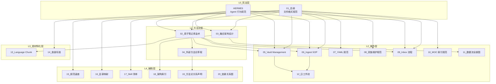

# 系统文档版本矩阵

> **定位**：本文件维护所有系统文档的版本信息、依赖关系、变更记录。
>
> **版本**：v4.1.0
> **最后更新**：2026-07-12

---

## 一、L0 · 宪法层（双核规范）

> **关键声明**：HERMES 与 01_总纲是**平行关系**，各有管辖范围，互不隶属。
>
> **命名铁律**：HERMES 永远不加编号、不加前缀、不加后缀，因为是宪法。

|| 编号 | 文档 | 当前版本 | 最后更新 | 管辖范围 | 适用主体 |
|:---|:---|:---|:---|:---|:---|
| **宪法级** | — | **HERMES** | v3.3 | 2026-07-11 | Agent 行为规范 | Agent（AI） |
| **宪法级** | 01 | **知识库统一规范总纲** | v3.0.1 | 2026-07-10 | 文件格式规范 | 文件（.md） |

**关系说明**：
- HERMES 定义 Agent 能做什么、不能做什么
- 总纲定义文件应该长什么样
- 两者交叉引用，互为支撑

---

## 二、L1 · 方法论层

|| 编号 | 文档 | 当前版本 | 最后更新 | 定位 | 依赖 |
|:---|:---|:---|:---|:---|:---|
| 02 | **原子笔记炼金术·终局版** | v2.6.0 | 2026-07-11 | 知识生产方法论 | L0 |
| 03 | **知识库融合架构设计** | v2.0 | 2026-07-10 | 四体系顶层设计 | L0 |
| 04 | **外部方法论萃取与执行规范** | v3.0 | 2026-07-11 | 方法论萃取执行 | L0 + 02 |

**层级说明**：
- 02_炼金术：定义"什么是原子笔记"和"如何提炼"
- 03_融合架构：定义知识库的物理结构（PARA×ZK×BuJo×AH）
- 04_方法论萃取：定义"如何从外部方法论中萃取可执行规范"

---

## 三、L2 · 操作层

|| 编号 | 文档 | 当前版本 | 最后更新 | 定位 | 依赖 |
|:---|:---|:---|:---|:---|:---|
| 05 | **Vault Management 操作规范** | v1.1.0 | 2026-07-11 | 归档/校准/清理（人工操作） | L0 + L1 |
| 06 | **Hermes Ingest 编译 SOP** | v2.7.0 | 2026-07-11 | AI 自动化编译 | L0 + L1 |
| 07 | **YAML FrontMatter 规范** | v1.1.0 | 2026-07-11 | YAML 校准 | L0 |
| 08 | **双链维护规范** | v1.0.0 | 2026-07-11 | 双链/Wikilink 维护 | L0 |
| 09 | **Inbox 编译与归档流程** | v1.1.0 | 2026-07-11 | 素材处理流水线 | L0 + L1 |
| 10 | **MOC 索引维护规范** | v1.1.0 | 2026-07-11 | MOC 创建与维护 | L0 |
| 11 | **数据流全景图** | v2.0 | 2026-07-10 | 信息流动路径 | L0 + 03 |
| 12 | **日工作流操作手册** | v2.0 | 2026-07-10 | 日常操作指南 | L0 + 05 + 06 |
| 21 | **图床与多端同步基础设施规范** | v1.0.0 | 2026-07-12 | 图床/附件/同步配置 | L0 + 05 |

**层级说明**：
- 05_Vault Management：人工操作规范（人类主导）
- 06_Ingest SOP：AI 操作规范（AI 主导）
- 07-10：专项操作规范（YAML、双链、Inbox、MOC）
- 11-12：流程指南（数据流、日常操作）

---

## 四、L3 · 素材特化层

|| 编号 | 文档 | 当前版本 | 最后更新 | 定位 | 依赖 |
|:---|:---|:---|:---|:---|:---|
| 13 | **Language Chunk 炼金术士** | v1.1 | 2026-07-11 | 语言组块提炼 | L0 + 02 |
| 14 | **食谱编写标准** | v1.1 | 2026-07-11 | 食谱文件格式 | L0 |

**层级说明**：
- 13_Language Chunk：继承 02_炼金术，针对语言学习素材
- 14_食谱标准：独立素材类型，有特定格式要求

---

## 五、L4 · 辅助层

|| 编号 | 文档 | 当前版本 | 最后更新 | 定位 |
|:---|:---|:---|:---|:---|
| 15 | **知识库规范速查** | v3.0.0 | 2026-07-10 | 核心规则摘要 |
| 16 | **目录别名映射表** | v1.0.0 | 2026-07-09 | 目录中英对照 |
| 17 | **Hermes Agent Skill 清单** | — | 2026-07-11 | Skill 索引 |
| 18 | **系统架构文档索引** | — | 2026-07-11 | 架构导航 |
| 19 | **外部方法论关系声明规范** | v1.0.0 | 2026-07-11 | 来源 vs 实现的分野 |
| 20 | **系统文档依赖关系图** | v1.1.0 | 2026-07-12 | 全系统逻辑关系图 |

---

## 六、依赖关系图

完整的依赖关系矩阵见：[[20_系统文档依赖关系图]]

---

## 七、版本升级记录

|| 日期 | 文档 | 旧版本 | 新版本 | 变更说明 |
|:---|:---|:---|:---|:---|:---|
| 2026-07-11 | HERMES | v3.2 | **v3.3** | 系统文档优化：新增系统文档 YAML 标准、跨文档引用规范、交叉引用校验、废弃前置校验、受众分层、90_System MOC、长文档导航方案 |
| 2026-07-11 | 01_知识库统一规范总纲 | v3.0.2 | **v3.0.3** | 新增跨文档引用规范、受众分层原则 |
| 2026-07-11 | 07_YAML FrontMatter 规范 | v1.1.1 | **v1.1.2** | 新增 5 个系统文档字段（doc_level/version/last_sync/related_docs/dependent_skills） |
| 2026-07-11 | 05_Vault Management 操作规范 | — | — | 新增系统文档废弃流程章节 |
| 2026-07-11 | 20_系统文档依赖关系图 | — | — | 新增真值源声明 |
| 2026-07-11 | 90_System.md | — | **v1.0.0** | 新建系统文档总览 MOC |
| 2026-07-11 | 09_Inbox 编译与归档流程 | v1.0.0 | **v1.1.0** | 新增素材入口统一化规则（冷静期机制、分流标记、入站提醒） |
| 2026-07-11 | 07_YAML FrontMatter 规范 | v1.0.0 | **v1.1.0** | 新增溯源字段标准化（source数组、extraction_context、多源素材规范） |
| 2026-07-11 | 10_MOC 索引维护规范 | v1.0.0 | **v1.1.0** | 新增MOC自动聚合方案（Dataview被动涌现） |
| 2026-07-11 | 06_Hermes Ingest 编译 SOP | v2.6.0 | **v2.7.0** | 新增流程中断与恢复快照机制 |
| 2026-07-11 | 05_Vault Management 操作规范 | v1.0.0 | **v1.1.0** | 新增项目向导快照复用规则 |
| 2026-07-11 | Daily Template | — | — | 新增习惯打卡格式、周报种子 |
| 2026-07-11 | Weekly/Monthly/Quarterly Template | — | — | 新增「提炼与行动校准」Callout |
| 2026-07-11 | Habit Scorecard | — | — | 重构为Dataview自动聚合看板 |
| 2026-07-11 | 全部系统文档 | — | — | 重构编号体系：按 L0-L4 分层排序，新增 20_依赖关系图 |
| 2026-07-11 | 20_系统文档依赖关系图 | — | v1.0.0 | 新增：全系统逻辑关系图 |
| 2026-07-11 | 19_外部方法论关系声明规范 | — | v1.0.0 | 新增：来源 vs 实现的分野规范 |
| 2026-07-11 | 10_MOC 索引维护规范 | — | v1.0.0 | 新增：MOC 创建与维护规范 |
| 2026-07-11 | 09_Inbox 编译与归档流程 | — | v1.0.0 | 新增：素材处理流水线规范 |
| 2026-07-11 | 08_双链维护规范 | — | v1.0.0 | 新增：双链/Wikilink 维护规范 |
| 2026-07-11 | 07_YAML FrontMatter 规范 | — | v1.0.0 | 新增：从 obsidian-yaml-spec Skill 提取 YAML 校准规范 |
| 2026-07-11 | 05_Vault Management 操作规范 | — | v1.0.0 | 新增：从 vault-management Skill 提取核心操作规范 |
| 2026-07-11 | HERMES | v3.0 | v3.0 | 修正与总纲的关系：删除"上级规范"，改为"相关规范"，声明为平行关系 |
| 2026-07-11 | 01_知识库统一规范总纲 | v3.0.1 | v3.0.1 | 新增相关规范声明，明确与 HERMES 的平行关系 |
| 2026-07-11 | 06_Hermes Ingest 编译 SOP | v2.6.0 | v2.6.0 | 吸收 13/14 的内容，统一 Ingest 流程 |
| 2026-07-11 | 13_Language Chunk 炼金术士 | v1.0 | v1.1 | 吸收 Ingest SOP 的 AI 协作规范 |
| 2026-07-11 | 14_食谱编写标准 | v1.0 | v1.1 | 吸收 Ingest SOP 的 AI 协作规范 |

---

## 八、文档状态说明

| 状态 | 含义 |
|:---|:---|
| **active** | 现行有效，正在使用 |
| **draft** | 草稿，尚未定稿 |
| **deprecated** | 已废弃，不再使用 |
| **archived** | 已归档，仅供参考 |