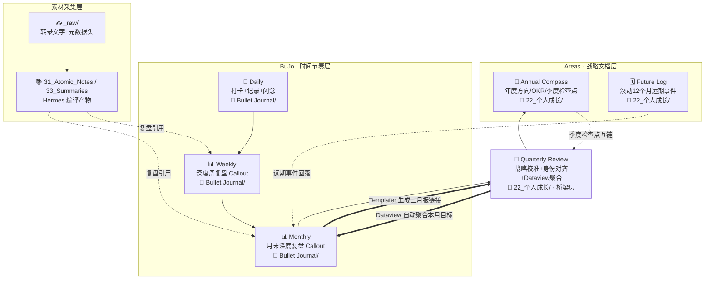

# 知识库融合架构设计 v2.0

> **规范引用**：完整编码、命名、标签、目录、元数据规范详见 [[01_知识库统一规范总纲|总纲 v3.0]]，本文档仅为专项流程补充，不替代总规范。

> **Bullet Journal × PARA × Zettelkasten × Atomic Habits** 四体系深度融合。
> 本文是顶层设计概览，具体操作规则以 `HERMES.md` v3.0 为准，目录映射以 `03_目录别名映射表` 为准。

---

## 一、四体系融合逻辑

| 方法论 | 解决的核心问题 | 在库中的对应位置 |
|--------|---------------|-----------------|
| **Bullet Journal** | "我现在该做什么？" | `22_个人成长/Bullet Journal/`（每日日记 + 未来日志） |
| **PARA** | "这个信息放哪里？" | `10_Projects/` → `20_Areas/` → `30_Resources/` → `40_Archive/` |
| **Zettelkasten** | "这个知识如何生长？" | `31_Atomic_Notes/`（原子笔记）→ `32_MOCs/`（索引层） |
| **Atomic Habits** | "我如何成为那样的人？" | `31_Atomic_Notes/个人成长/概念/`（方法论）+ `22_个人成长/Habit Tracking/`（执行层） |

### 冲突解决方案

| 冲突点                          | 决策                                                 | 理由                         |
| :--------------------------- | :------------------------------------------------- | :------------------------- |
| **BJ vs PARA：Daily Log 放哪？** | 归入 `20_Areas/22_个人成长/Bullet Journal/`              | 日记是持续维护的领域责任，不是有终点的项目      |
| **ZK vs PARA：同一条信息归哪？**      | 可行动→PARA，纯知识→ZK                                    | 操作手册参考 HERMES.md Ingest 规则 |
| **AH vs BJ：习惯打分嵌入哪里？**       | 每日记在日记模板顶部，趋势汇总在 `22_个人成长/Habit Tracking/Habit Scorecard.md` | 执行层靠近行动，分析层归入领域责任区         |

---

## 项目产出内容归属裁决规则（PARA + ZK 冲突仲裁）

当在项目执行中产生一段思考时，按以下优先级判定存放位置：

1. **纯项目专属**：该内容脱离当前项目上下文即无复用价值
   → 存放 `10_Projects/对应项目目录/`

2. **通用可复用**：该内容提炼出一个独立概念/模型/方法，可跨项目、跨领域复用
   → 提炼为原子笔记存入 `31_Atomic_Notes/`，项目内用双链引用

3. **边界模糊**：暂时无法判定通用性
   → 先存入项目目录。项目结项归档阶段统一复审、拆分提炼

**核心兜底原则**：永久原子层不承载项目专属临时信息。宁可后置提炼，不前置塞入资源库造成信息混杂。

---

## 结项归档的强制萃取检查点

当项目状态变更为 `archived` 时，以下步骤为归档前置条件：

**触发机制**：
1. 人类在对话中显式指令"归档项目 X"时，Agent 必须先执行萃取扫描
2. 每月 Lint 健康检查时，若发现 `10_Projects/` 下存在 `status: archived` 但无 `extraction_decision` 字段的项目主文档，列入待办提醒清单

**扫描流程**：
1. Agent 扫描该项目全部 `.md` 文件，提取：
   - 标题中含"原则""方法论""复盘""教训""模型"的笔记
   - 正文中超过 200 字的独立论述段落
   - 被其他项目或原子笔记引用 ≥ 2 次的文件

2. Agent 输出 Top 5 建议清单。清单末尾固定附加：
   "📋 另有 N 条候选项未展示。如需查看，请回复'展开萃取清单'。"

3. 人类逐项标记决策，结果写入项目主文档 YAML：
   ```yaml
   extraction_decision: ["extracted: 笔记A", "project_only: 文件C", "pending: 文件D"]
   ```
   未决策项不阻塞归档。

4. 提炼出的原子笔记在 YAML 中增加可选字段：
   ```yaml
   extraction_context: "项目复盘发现：核心功能做完了但用户不买账，提炼此模型用于未来需求验证阶段"
   ```

5. 归档后保留追溯链：未提炼的项目笔记保留在 `40_Archive/` 中，不删除。

---

## 二、Vault 分层结构

```
00_Inbox/              ← 信息入口
├── _raw/              ← Ingest 原料（只读不删）

10_Projects/           ← 有终点的项目（PARA）
├── 11_工作/
│   └── 01_操盘手骑士
└── 12_个人/
    ├── 01_知→行→进化
    ├── 02_百词百篇
    ├── 03_大脑盲盒
    └── 04_Active Listening

20_Areas/              ← 持续维护的领域（PARA）
├── 21_工作
├── 22_个人成长
│   ├── Bullet Journal/    ← BJ 体系（日记 + 未来日志）
│   ├── Habit Tracking/          ← AH 执行层（习惯记分卡）
│   ├── 传统文化/
│   ├── 写作素材/
│   ├── 心理学/
│   └── 知识管理/
├── 23_生活与健康
├── 24_关系
├── 25_财务与资产
└── 26_技术

30_Resources/          ← 兴趣与知识（PARA + ZK）
├── 31_Atomic_Notes/   ← ZK 体系（273篇，8领域×4类型）
│   ├── 个人成长/概念/模型/实践/批判
│   ├── 心理学/概念/模型
│   ├── 知识管理/概念/模型/实践
│   ├── 生活/概念/模型
│   ├── 工作/概念/模型/实践
│   ├── 关系/概念/模型/实践/批判
│   ├── 国际政治/概念
│   └── 科学/概念
├── 32_MOCs/           ← ZK 索引层（15个MOC）
├── 33_Summaries/
├── 34_Synthesis/
└── Attachments/

40_Archive/            ← 冷存储（PARA）
├── 个人成长/ 关系/ 技术/ 生活/ 猫行为学/...
├── 系统文档/          ← 已归档的旧版设计文档
└── 日记存档/          ← 旧日记（12篇）

90_System/             ← 系统运行规则
├── HERMES.md          ← 操作最高准则（v2.2）
├── 领域映射表         ← Areas ↔ Resources 映射
├── 91_Templates/      ← 日记/复盘/项目模板
├── 92_Attachments/
├── 93_Copilot/        ← AI 调度模板
├── Worklogs/
├── 记忆交接快照/
└── audit/
```

---

## 三、信息流

```
外部输入 ──→ 00_Inbox/_raw/
                 │
                 ▼ (Ingest)
          31_Atomic_Notes/  +  33_Summaries/
                 │
                 ▼ (链接 + 提炼)
          32_MOCs/  (索引层)
                 │
                 ▼ (日常使用)
          20_Areas/  +  10_Projects/
                 │
                 ▼ (冷却)
          40_Archive/
```

---

## 四、习惯系统（Atomic Habits）的当前形态

5 个概念文件已从独立的 `60_Habits/` 目录归入 `31_Atomic_Notes/个人成长/概念/`：

| 概念 | 当前路径 | 角色 |
|:-----|:---------|:-----|
| 身份认同 | `31_Atomic_Notes/个人成长/概念/身份认同.md` | 系统价值观底座 |
| 习惯记分卡 | `31_Atomic_Notes/个人成长/概念/习惯记分卡.md` | 方法论原理 |
| 执行意图 | `31_Atomic_Notes/个人成长/概念/执行意图.md` | 行为编程工具 |
| 习惯堆叠 | `31_Atomic_Notes/个人成长/概念/习惯堆叠.md` | 行为锚定工具 |
| 环境设计 | `31_Atomic_Notes/个人成长/概念/环境设计.md` | 行为触发器设计 |

**执行层**：`22_个人成长/Habit Tracking/Habit Scorecard.md`（空白追踪表，待第14天启动后填充）

---

## 五、权威文档索引

| 你要找什么 | 去看哪个文件 |
|:-----------|:------------|
| 操作规则 | `HERMES.md` v3.0 |
| 目录映射 | `03_目录别名映射表` |
| ZK 当前状态 | `40_Archive/系统文档/ZK成熟度评估与改进建议 v2.0.md` |
| 待处理任务 | `40_Archive/系统文档/知识库审阅计划·新.md` |
| 所有文档导航 | `06_系统架构文档索引.md` |

---

## 六、v2.2 补录设计原则（2026-06-29）

### BuJo 管理时间节奏，Areas 承载战略判断
BuJo 文件夹的语义是"时间轴上的连续记录"，仅收容节奏驱动的日志文件（Daily/Weekly/Monthly）。战略判断类文档（Annual Compass/Future Log/Quarterly Review）归入 Areas 层（`22_个人成长/`）。季复盘是二者的桥梁——用 BuJo 的节奏触发，产出的是 Areas 的战略文档。

### AH 分布式嵌入，不作为独立实体
原子习惯的四组件已溶解在 BuJo 各层 Callout 中：习惯记分卡(Weekly)、身份投票(Quarterly §3)、MIT(Weekly/Monthly)、习惯系统调整(Monthly)。不存在独立的"AH 复盘模板"。季复盘是这些分布式组件的校准汇聚点，而非独立容器。

### 模板与产出物分离
模板文件统一存放于 `91_Templates/`（享受一键生成待遇），产出物根据语义归属落入不同目录：日/周/月产出 → `Bullet Journal/`（时间节奏），季/年产出 → `22_个人成长/`（战略文档）。这避免了 BuJo 目录被非日志文件污染，同时保证五层闭环中每一层都有模板支撑。


---

## 附录：融合架构 Mermaid 图

