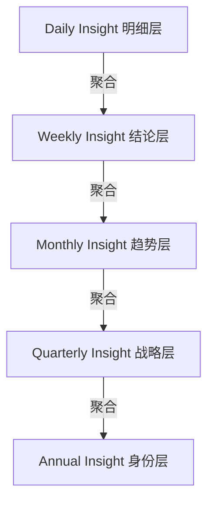

# Insight 周期复盘体系标准

> **版本**：v2.1.0（终审定稿）
> **生效日期**：2026-07-26
> **替代**：`洞察系统与热力图可视化规范 v1.1.0`（已归档至 `40_Archive/`）
> **适用范围**：Hermes Agent 周期洞察生成、Obsidian 模板配置、Dataview 可视化渲染
> **关联 Skill**：`hermes-daily-insight`


## 一、体系定位与边界

### 1.1 分层定位

| 体系 | 层级 | 核心职责 | 关注点 |
|:---|:---|:---|:---|
| **BuJo 周期复盘** | 执行层 | 记录执行细节、待办流转、事项完成情况 | **事的维度**（做了什么） |
| **Insight 周期洞察** | 系统层 | 知识库健康度、习惯稳定性、认知模式、战略对齐 | **系统/身份的维度**（运转得怎么样） |

> **原则**：两者互补，互不重复。Insight 从 BuJo、Tracker、Resources 中拉取数据做全局分析，**不重复搬运原始日记内容**。

### 1.2 数据继承链

数据流向遵循 **自底向上聚合，自顶向下沉淀** 原则。



**规则**：
- 底层周期保存原始明细数据。
- 高层周期只沉淀结论与趋势。
- **承诺机制**：Daily 提取 → Weekly 选定 → Monthly 审计 → Quarterly 校准 → Annual 定义。

### 1.3 兜底规则

当对应周期下层 Insight 文件缺失时：
- 高层周期可有限范围扫描原始数据作为临时兜底
- 必须在文档内标注：`⚠️ 下层周期数据缺失，采用直接扫描兜底，建议补齐下层 Insight 以遵循标准架构`
- 此标注同时写入该维度区块末尾，提醒人工补齐


## 二、目录与命名规范

### 2.1 目录结构

所有 Insight 产物统一存放于 `20_Areas/A2_能力接口/Insight/` 目录下：

```
20_Areas/A2_能力接口/
└── Insight/
    ├── Daily/               → YYYY-MM-DD-Insight.md
    ├── Weekly/              → YYYY-WXX-Insight.md
    ├── Monthly/             → YYYY-MM-Insight.md
    ├── Quarterly/           → YYYY-QX-Insight.md
    └── Annual/              → YYYY-Insight.md
```

> 路径中 `Insight/` 仅出现一次，无多余嵌套。体系说明文档中的路径描述已同步更新。

### 2.2 模板存放

模板统一存放于 `90_System/91_Templates/Insight/` 目录：

| 周期 | 模板文件名 |
|:---|:---|
| Daily | `Insight · Daily.md` |
| Weekly | `Insight · Weekly.md` |
| Monthly | `Insight · Monthly.md` |
| Quarterly | `Insight · Quarterly.md` |
| Annual | `Insight · Annual.md` |

### 2.3 文件命名规范

| 周期 | 命名格式 | 示例 |
|:---|:---|:---|
| Daily | `YYYY-MM-DD-Insight.md` | `2026-07-26-Insight.md` |
| Weekly | `YYYY-WXX-Insight.md` | `2026-W30-Insight.md` |
| Monthly | `YYYY-MM-Insight.md` | `2026-07-Insight.md` |
| Quarterly | `YYYY-QX-Insight.md` | `2026-Q3-Insight.md` |
| Annual | `YYYY-Insight.md` | `2026-Insight.md` |


## 三、七维框架标准

### 3.1 标准维度

所有 Insight 模板必须严格遵循以下七维框架结构，**顺序固定不可调换**：

| 序号 | 维度 | 含义 | Dataview 支持 | 适用周期 |
|:---:|:---|:---|:---:|:---|
| 1 | **🌐 观全局** | 核心指标大盘 + 身份宣言 | ✅ 进度条 | 全周期 |
| 2 | **🌊 察潜流** | 趋势/模式识别 + 习惯演化 | ❌ 纯文字 | 全周期 |
| 3 | **🪸 拂遗珠** | 被忽略的存量 + 体系变更记录 | ✅ 列表/聚合 | 全周期 |
| 4 | **🔦 照暗面** | 问题/阻力分析 + 根因追溯 | ❌ 纯文字 | 全周期 |
| 5 | **🍃 辨风势** | 知识结构分布 + 战略校准 | ✅ 进度条 | 全周期 |
| 6 | **🌡️ 测热力** | 活跃度分布 Heatmap | ✅ 热力图 | 全周期 |
| 7 | **🎯 践一诺** | 唯一承诺 | ❌ 手动选定 | 全周期 |

### 3.2 高层级加法原则

高层级模板在七维基础上 **做加法，不做减法**：

| 扩展模块 | Daily | Weekly | Monthly | Quarterly | Annual |
|:---|:---:|:---:|:---:|:---:|:---:|
| 习惯稳定性审计 | ❌ | ❌ | ✅ | ✅ | ✅ |
| Areas 领域活跃度 | ❌ | ❌ | ✅ | ✅ | ✅ |
| 体系变更记录 | ❌ | ❌ | ✅ | ✅ | ✅ |
| OKR 红绿灯 | ❌ | ❌ | ❌ | ✅ | ✅ |
| 身份对齐评估 | ❌ | ❌ | ❌ | ✅ | ✅ |
| 年度身份宣言 | ❌ | ❌ | ❌ | ❌ | ✅ |


## 四、承诺竞争机制

### 4.1 聚合路径

上层周期的承诺从下层周期的承诺池中筛选产生：

| 周期 | 聚合来源 | 聚合逻辑 |
|:---|:---|:---|
| **Weekly** | 7 篇 Daily | 聚合 `daily_promise` YAML 字段 |
| **Monthly** | 4 篇 Weekly | 聚合「🎯 践一诺」模块内容 |
| **Quarterly** | 3 篇 Monthly | 聚合「🎯 践一诺」模块内容 |
| **Annual** | 4 篇 Quarterly | 聚合「🎯 践一诺」模块内容 |

### 4.2 筛选与标注规则

- **Daily**：YAML 中记录 `daily_promise` 字段（1 条）
- **Weekly/Monthly/Quarterly**：从聚合候选池中，人工选定 1 条核心承诺
- **Annual**：基于全年承诺提炼身份级承诺
- 若下层周期缺失或承诺为空，上层周期必须标注：
  > `📌 下层承诺数据缺失，候选池不足，需要人工补充候选`
  不允许直接留白


## 五、YAML 元数据标准

### 5.1 通用 YAML 字段

所有 Insight 文件必须包含以下字段：

```yaml
---
title: "Insight · [周期名]"
date: "{{date:YYYY-MM-DD}}"
period_type: daily/weekly/monthly/quarterly/annual
period_range: "[周期起止范围]"
status: active
fit_content_type: insight_report
tags: [洞察, 系统文档]
related:
  - "[[上期链接]]"
  - "[[Habit Tracker]]"
  - "[[A2_能力接口/Bullet Journal/_MOC]]"
---
```

### 5.2 字段说明

| 字段 | 类型 | 说明 |
|:---|:---|:---|
| `title` | string | 固定格式 `Insight · {Period}` |
| `date` | string | 生成日期，ISO 格式 |
| `period_type` | enum | `daily/weekly/monthly/quarterly/annual` |
| `period_range` | string | 覆盖时间范围（**仅用于人眼识别**，所有 Dataview 逻辑不读取此字段） |
| `status` | enum | 固定 `active` |
| `fit_content_type` | string | 固定 `insight_report` |
| `tags` | array | 固定 `[洞察, 系统文档]` |
| `daily_promise` | string | **仅 Daily 必填**，用于周度候选池聚合 |
| `related` | array | 上下期导航 + 固定引用 |

> ⚠️ `period_range` 中的 Templater 变量（如 `{{monday:YYYY-MM-DD}}`）可能不被替换为有效值。这不影响功能——所有 Dataview 逻辑使用 `genDate` 对象计算边界，**不依赖此字段**。


## 六、技术实现规范

### 6.1 核心函数：renderGreenBar v1.0

所有模板中的进度条必须使用统一版本函数。

**版本约束**：修改时必须同步更新全部 5 份 Insight 模板中的 **所有 `renderGreenBar` 调用块**。

```javascript
/* ========== renderGreenBar v1.0 | 统一基准版本 ========== */
/* 修改此函数时，必须同步更新全部 5 份 Insight 模板中所有调用块 */
function renderGreenBar(label, pctOrRank, displayText = null, useRankMode = false) {
    let barColor = "#F4FCF6";
    let targetVal = pctOrRank;
    if (useRankMode) {
        if (targetVal > 0.8) barColor = "#196127";
        else if (targetVal > 0.6) barColor = "#2e8840";
        else if (targetVal > 0.4) barColor = "#49af5d";
        else if (targetVal > 0.2) barColor = "#7bc96f";
        else barColor = "#c6e48b";
    } else {
        if (targetVal <= 15) barColor = "#c6e48b";
        else if (targetVal <= 30) barColor = "#7bc96f";
        else if (targetVal <= 45) barColor = "#49af5d";
        else if (targetVal <= 60) barColor = "#2e8840";
        else barColor = "#196127";
    }
    let rightText = displayText !== null ? displayText : `${pctOrRank}%`;
    return `<div style="display: flex; align-items: center; gap: 12px; margin-bottom: 10px;">
        <span style="min-width: 150px; font-size: 13px; color: #4B5563; flex-shrink: 0; text-align: right;">${label}</span>
        <div style="flex: 1; max-width: 460px; height: 8px; background-color: #F3F4F6; border-radius: 99px; overflow: hidden;">
            <div style="width: ${useRankMode ? (targetVal * 100) : targetVal}%; height: 100%; border-radius: 99px; background-color: ${barColor};"></div>
        </div>
        <span style="min-width: 30px; font-size: 13px; font-weight: 600; color: #4B5563; text-align: right; white-space: nowrap; flex-shrink: 0;">${rightText}</span>
    </div>`;
}
/* ================================================================ */
```

**调用规则**：
- **普通模式** (`useRankMode=false`)：观全局、注意力分布，传百分比值 (0-100)
- **排名模式** (`useRankMode=true`)：辨风势，传排名系数 (0-1)

**配色说明**：热力图配色与进度条配色均使用绿色系，视觉上保持统一。如需精确匹配色值，可在 Heatmap Calendar 插件中自定义配色组并引用。

### 6.2 防御性编程

所有 Dataview 代码块必须包含两重防御：

1. **模板预览防御**：检测 `genDate` 是否有效
2. **空数据防御**：检测查询结果 `pages.length === 0`

```javascript
const genDate = dv.date("{{date:YYYY-MM-DD}}");
if (!genDate || !genDate.isValid) {
    dv.paragraph("📌 模板预览模式 — 生成文件后 Dataview 将自动渲染。");
} else {
    // ... 查询逻辑 ...
    if (pages.length === 0) {
        dv.paragraph("⚠️ 本周期无记录。");
    } else {
        // ... 渲染逻辑 ...
    }
}
```

### 6.3 防穿透原则与例外

**原则**：Quarterly 和 Annual 层级**禁止**直接全库扫描原始笔记文件内容，必须优先聚合下层 Insight 的沉淀结论。

**例外**：
- **热力图查询**：允许全库扫描 `file.day` 元数据。该查询仅读取文件元信息，不加载文件正文，性能开销可控。
- **Annual 拂遗珠**：允许针对 `30_Resources/31_Atomic_Notes` 和 `00_Inbox/_raw` 进行定向统计查询，**仅输出统计数量 + 文件清单预览**，不做深度遍历。

**其他所有指标统计、笔记类型聚合、素材盘点，严格禁止无边界全库扫描。**

### 6.4 代码块分区与写入约束

模板内使用标准化注释区分区块：

```markdown
<!-- === 自动数据区块：Dataview自动渲染，请勿手动编辑内容 === -->
<!-- === 人工分析区块：允许填写定性复盘、判断、结论 === -->
```

**写入约束**：
- 人工分析区块内填写的定性结论、风险判断、承诺、叙事文本，**Hermes 自动生成流程不会覆盖**
- 自动数据区块由 Dataview 实时动态渲染，**禁止人工手动填入统计数字**，刷新后会被覆盖


## 七、核心模块实现细则

### 7.1 热力图

| 项目 | 规格 |
|:---|:---|
| **插件** | Heatmap Calendar v0.7.1 |
| **调用方式** | 必须通过 DataviewJS 调用 `renderHeatmapCalendar` |
| **配色参数** | 推荐 `"default"`（绿色系） |
| **异常降级** | `⚠️ Heatmap Calendar 插件未启用` |
| **禁用语法** | ❌ 原生 ` ```heatmap ` 代码块（插件未注册处理器） |
| **禁用配色** | ❌ `rgba()` 格式颜色（会导致渲染引擎挂掉） |

### 7.2 Monthly 测热力

Monthly 模板的「🌡️ 测热力」区块必须包含两部分：

1. **Heatmap 热力图**：展示本月活跃度分布
2. **习惯稳定性审计表**：判定习惯是否降级

### 7.3 Annual 拂遗珠

Annual 模板的「🪸 拂遗珠」维度必须包含 Dataview 聚合块：

- 全年未被引用的孤立笔记数量（仅统计，不遍历正文）
- 超过 180 天未处理的 `_raw` 条目数量
- 全年未触达的 Areas 透镜

**约束**：仅输出统计数量 + 文件清单预览（≤5 条），不做深度遍历。


## 八、触发时机

| 周期 | 触发时机 | 执行者 |
|:---|:---|:---|
| Daily | 每日 | 手动/自动 |
| Weekly | 每周日 21:00 | Hermes Agent |
| Monthly | 每月最后一天 21:00 | Hermes Agent |
| Quarterly | 每季度最后一天 21:00 | Hermes Agent |
| Annual | 每年 12 月 31 日 21:00 | Hermes Agent |


## 九、首页嵌入方式（永久封板）

首页通过固定入口文件嵌入，放在 `[!faq]-` 折叠 Callout 内：

```markdown
## 🪞 洞 · 以见烛幽 <span class="section-en">Insight</span>

> [!faq]- 洞微 · **烛幽** · 破局
>
> ![[20_Areas/A2_能力接口/Insight/Daily/Insight · Daily — 今日]]
>
> 📜 [[A2_能力接口/Insight/Weekly|本周洞察]] ｜ 📜 [[A2_能力接口/Insight/Monthly|本月洞察]] ｜ 📜 [[A2_能力接口/Insight/Quarterly|季度洞察]]
```

**不可变更的设计决策**：
- `##` 一级标题保留，与行/知/系统模块同层级
- Callout 标题用 `洞微 · **烛幽** · 破局`
- `[!faq]-` 默认折叠
- 嵌入时 CSS 隐藏 `.markdown-embed-title`
- `.homepage` 命名空间 CSS **不会穿透**到嵌入内容中
- Daily 双写：归档文件 + 今日入口文件（`Insight · Daily — 今日.md`），内容完全一致


## 十、异常降级预案

| 异常场景 | 降级方案 |
|:---|:---|
| Heatmap Calendar 插件未安装 | 捕获异常，输出统一提示文案 |
| Templater 变量未替换 | 预览模式提示，不执行查询 |
| 对应周期无下层洞察数据 | 输出空状态提示，标注兜底警告 |
| 文件夹路径变更导致查询为空 | 输出路径异常提醒，触发体系变更记录 |
| 函数版本不一致 | 以 v1.0 基准版为准，批量同步所有模板 |


## 十一、版本变更日志

| 版本 | 日期 | 修改内容 | 生效范围 | 修改人 |
|:---|:---|:---|:---|:---|
| 1.0.0 | 2026-07-18 | 初始版本（七维框架 + Daily 模板） | Daily | — |
| 1.1.0 | 2026-07-18 | 终审定稿：踩坑修正、配色迭代 | 全部模板 | — |
| 2.0.0 | 2026-07-25 | 五级周期体系 + 数据继承链 + 承诺竞争机制 | 全部模板 | — |
| 2.1.0 | 2026-07-26 | 裁决修正：Annual 拂遗珠补聚合块、目录路径统一、renderGreenBar 版本同步说明、承诺聚合路径显式化、热力图例外说明、配色注释、兜底规则、版本日志、period_range 说明、首页嵌入章节补回、文件命名统一为连字符 | 全部模板 + 本文档 | 系统侧高参 + Hermes |
| 2.2.0 | 2026-07-26 | 合并 Insight体系说明、编号 04、更新 aliases/related | 本文档 | Hermes |


## 十二、关联文件清单

| 文件 | 作用 |
|:---|:---|
| `01_知识库统一规范总纲` | 顶层规范依据 |
| `Habit Tracker` | 习惯数据核心数据源 |
| `A2_能力接口/Bullet Journal/_MOC` | 执行层数据入口 |
| `洞察系统与热力图可视化规范 v1.1.0` | 旧版规范（已归档） |
| `90_System/91_Templates/Insight/` | 五级模板存放目录 |
| `hermes-daily-insight` Skill | Insight 自动生成技能 |


*本文档为 Insight 周期复盘体系的最高规范，所有 Insight 模板与生成流程均以此为准。*
```