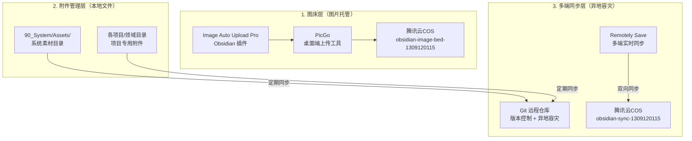

# 09_图床与多端同步基础设施规范

> **定位**：本文件定义知识库的图床（图片托管）、附件管理、多端同步三大基础设施的标准配置与操作规范。
>
> **版本**：v1.0.0
> **生效日期**：2026-07-12
>
> **真值源声明**：本文档描述基础设施层面的配置规范。日常操作流程以 [[05_Vault Management 全流程操作规范]] 为准，附件目录归属以 [[01_知识库统一规范总纲#directories|总纲 §目录层级标准]] 为准。

---

## 一、架构总览

### 1.1 三层基础设施



### 1.2 职责分工

| 层 | 功能 | 主工具 | 数据落点 |
|:---|:-----|:-------|:---------|
| **图床层** | 笔记图片托管（公开访问） | PicGo + 腾讯云COS + Obsidian 插件 | 远程 COS 桶 |
| **附件管理层** | 本地文件组织与归档 | 文件系统 + Obsidian | `90_System/Assets/` + 项目目录 |
| **多端同步层** | 版本控制 + 设备间同步 | Git + Remotely Save | 远程 Git 仓库 + COS 同步桶 |

---

## 二、图床层规范

### 2.1 资源配置

| 配置项 | 值 |
|:-------|:---|
| **云厂商** | 腾讯云（Tencent Cloud） |
| **主账号 APPID** | `100023203758` |
| **图床桶** | `obsidian-image-bed-1309120115`（ap-guangzhou） |
| **访问权限** | 公有读私有写 |
| **子账号** | `picgo-uploader`（仅 PutObject + GetObject 权限） |
| **SecretId** | `$TENCENT_SECRET_ID`（环境变量） |
| **SecretKey** | `$TENCENT_SECRET_KEY`（环境变量） |

### 2.2 上传链路

```
Obsidian 粘贴图片
  → Image Auto Upload Pro 插件（或 obsidian-image-auto-upload-plugin）
  → PicGo Server（127.0.0.1:36677）
  → 腾讯云 COS（公有读私有写）
  → 公网 CDN URL（公开可访问）
```

### 2.3 插件配置

| 插件                                | 作用               | 状态                                    |
| :-------------------------------- | :--------------- | :------------------------------------ |
| **Image Auto Upload Pro**         | 剪贴板图片自动上传到 PicGo | ✅ 启用（主上传插件）                           |
| **Paste Image Rename**            | 粘贴前重命名图片文件       | ✅ 启用（命名模板：`{{date:YYYYMMDD-HHmmss}}`） |
| obsidian-image-auto-upload-plugin | 同上功能（与 Pro 版重复）  | ⚠️ 冗余，建议禁用                            |
| obsidian-image-uploader           | 手动上传工具           | ⚠️ 冗余，建议禁用                            |

### 2.4 图片 URL 格式

```
https://obsidian-image-bed-1309120115.cos.ap-guangzhou.myqcloud.com/{文件名}
```

**规范**：
- 文件名无中文（PicGo 中文路径存在乱码问题）
- 建议设 PicGo 存储路径前缀 `obsidian/` 以分类（当前未启用，桶根目录）
- URL 不带签名参数（如 `?Expires=`），确保长期可访问

### 2.5 安全策略

- 图床子账号 `picgo-uploader` 仅授权 `cos:PutObject` + `cos:GetObject`
- 策略 JSON 限定资源范围仅为图床桶
- 不使用主账号密钥直接操作
- 存储桶不开启公共列表权限（单文件可读，目录不可遍历）

---

## 三、附件管理层规范

### 3.1 目录结构

| 附件类型 | 存放位置 | 说明 |
|:---------|:---------|:-----|
| **系统素材**（通用） | `90_System/Assets/` | 所有系统级图片/素材 |
| **项目专用** | `10_Projects/{项目名}/Assets/` | 仅该项目使用的附件 |
| **领域专用** | `20_Areas/{领域名}/Assets/` | 仅该领域使用的附件 |

### 3.2 附件迁移原则

- 新附件默认归入 `90_System/Assets/`（统一管理）
- 项目/领域专用附件可放在对应目录下
- 迁移后需同步更新所有引用链接
- 已迁移源目录可删除（确认无其他引用后）

### 3.3 当前状态

- `90_System/Assets/` 现有 18 个文件（png/jpg/webp）
- 遗留问题：`笔记同步助手/images/` 下的 28 张图片尚未迁移（wikilink 引用未更新）

---

## 四、多端同步层规范

### 4.1 双轨同步架构

| 同步方式 | 用途 | 数据落点 | 频率 |
|:---------|:-----|:---------|:-----|
| **Git 版本控制** | 版本历史 + 异地容灾 | GitHub/GitLab 私有仓库 | 每次 commit 后 push |
| **Remotely Save** | 多端实时同步 | 腾讯云 COS 同步桶 | 实时双向同步 |

**两者互补**：Git 管版本/容灾，Remotely Save 管多端同步。

### 4.2 Git 版本控制

详见 [[05_Vault Management 全流程操作规范#Git 版本控制]]。

**当前状态**：
- ✅ 本地仓库已初始化（1395 文件）
- ✅ `.gitignore` 已配置（排除 Obsidian 缓存、插件 data.json、备份目录、超大媒体文件）
- ⏳ 远程仓库待创建（需人类在 GitHub/GitLab 创建私有仓库）
- ⏳ 首次推送待执行（`git remote add origin <地址>` → `git push -u origin main`）

### 4.3 Remotely Save 多端同步

#### 资源配置

| 配置项 | 值 |
|:-------|:---|
| **同步桶** | `obsidian-sync-1309120115`（ap-guangzhou，**私有读写**） |
| **与图床桶关系** | 物理隔离（图床桶公有读，同步桶私有读写） |
| **子账号** | `obsidian-sync`（仅同步桶读写权限） |
| **插件** | Remotely Save（Obsidian 社区插件） |

#### 同步策略

| 场景 | 策略 |
|:-----|:------|
| **首次接入新设备** | 冲突解决设为「云端优先覆盖本地」，全量拉取后恢复双向 |
| **日常同步** | 实时双向同步，按文件修改时间戳判断 |
| **离线修改冲突** | Remotely Save 生成带时间戳的冲突副本 `.conflict.md` |
| **灾难恢复** | 优先从 Git 远程仓库恢复，Remotely Save 作为辅助 |

#### 配置步骤

1. 腾讯云 COS 创建同步桶 `obsidian-sync-1309120115`（**私有读写**）
2. 创建子账号 `obsidian-sync`，关联 `QcloudCOSDataReadWrite` 策略（或自定义策略限定仅同步桶）
3. Obsidian 安装 Remotely Save 插件
4. 配置 S3 兼容存储：桶名、地域、Access Key / Secret Key
5. 其他设备重复步骤 3-4，首次同步选「云端优先」

#### 安全要点

- 同步桶**绝对不设为公有读**（图床桶才公有读）
- 同步子账号仅授权同步桶，不授权图床桶
- 定期检查同步桶是否有异常文件

---

## 五、故障排查

### 5.1 图床故障

| 现象 | 原因 | 解决 |
|:-----|:-----|:-----|
| 粘贴后无反应 | PicGo 未运行或图床未切到 COS | 打开 PicGo，确认上传器为「腾讯云 COS」 |
| 上传 403 | 子账号密钥权限不对 | 检查策略 JSON 中的桶名和地域 |
| URL 带签名参数 | 存储桶不是「公有读私有写」 | 去 COS 控制台修改桶权限 |
| 中文文件名上传失败 | PicGo 中文路径乱码 | 文件名用英文/拼音/日期，避免中文 |
| 图片显示 403 | 桶权限被误改 | 确认桶权限为「公有读私有写」 |

### 5.2 多端同步故障

| 现象 | 原因 | 解决 |
|:-----|:-----|:-----|
| 同步失败，提示认证错误 | 子账号密钥有误或过期 | 重新生成子账号密钥 |
| 文件冲突频繁 | 多设备同时编辑同一文件 | 确认工作流：主设备编辑，其他设备只读 |
| 同步桶文件异常 | 权限配置不当 | 检查同步桶是否为私有读写 |
| 新设备同步后文件不全 | 首次同步未选「云端优先」 | 临时切换为云端优先，全量拉取后再改回 |

### 5.3 附件管理故障

| 现象 | 原因 | 解决 |
|:-----|:-----|:-----|
| 图片无法显示（断链） | 附件路径变更未更新引用 | 全库搜索断链，修复引用路径 |
| 重复附件 | 多次导入同一文件 | 按文件 hash 去重，合并引用 |
| 附件过大影响 Git | 超 100MB 媒体文件被 Git 追踪 | 加入 `.gitignore`，改用图床托管 |

---

## 六、维护周期

| 任务 | 频率 | 执行者 |
|:-----|:-----|:-------|
| 检查图床 URL 可访问性 | 每月 | AI 提醒 |
| 检查同步桶空间使用量 | 每季 | 人类 |
| 检查子账号密钥有效性 | 每半年 | AI 提醒 |
| 清理 Assets 中无引用的文件 | 每季 | AI 扫描 + 人类确认 |
| 恢复演练（从 Git 远程恢复） | 每季 | 人类执行 + AI 验证 |

---

## 附录 A：相关文档

| 文档                                              | 关系                       |              |
| :---------------------------------------------- | :----------------------- | ------------ |
| [[05_Vault Management 全流程操作规范#Remotely Save 多端同步]] | 操作层：Remotely Save 日常操作流程 |              |
| [[18_外部方法论萃取与关系声明规范#附件与图床分流管理]]                   | 规范层：附件与图床分流规则            |              |
| [[01_知识库统一规范总纲#directories]]                    | 总纲 §目录层级标准               | 宪法层：附件目录归属规则 |
| [[图床搭建教程（丁萌定制版）]]                               | 操作层：图床搭建的分步教程（无编号引用文件）   |              |
| [[16_系统文档总索引]]                                 | 索引层：所有系统文档索引             |              |
| [[16_系统文档总索引]]                                | 依赖层：文档间依赖关系              |              |

---

## 附录 B：变更记录

| 日期 | 版本 | 变更内容 |
|:-----|:-----|:---------|
| 2026-07-12 | v1.0.0 | 初始版本。整合图床搭建、附件管理、Remotely Save 多端同步规范 |
